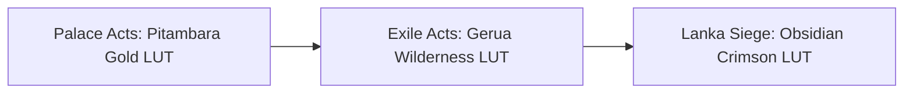

# Clothing: The Color System & Dyes Bible

*   **Asset Category:** Color Palettes & Post-Processing Look-Up Tables (LUTs)
*   **GDD Integration:** Guides texture dyeing pipelines and camera grading across narrative arcs.

---

## 1. Unified Dye Color Palette

The colors worn by characters in **Ram-G** represent their moral alignment (*Guna*), spiritual status, and the current emotional atmosphere of the game campaign:

| Color / Dye Name | Hex Code | HSL Values | Mythological Representation & Emotion | Character Assignment |
| :--- | :--- | :--- | :--- | :--- |
| **Saffron & Ochre (Gerua)** | `Hex #F28C28` | `HSL(30°, 88%, 55%)` | Renunciation, absolute truth, spiritual focus, and purity. | Sages, Rama/Lakshmana/Sita (Exile) |
| **Solar Yellow (Pitambara)** | `Hex #FFD700` | `HSL(51°, 100%, 50%)` | Divine light, cosmic order, justice, and absolute glory. | Lord Rama (Royal State), Vishnu Summons |
| **Asuric Crimson** | `Hex #A01212` | `HSL(0°, 80%, 35%)` | Raw passion, chaotic violence, pride, and blood magic. | Ravana, Indrajit, Asuric Commanders |
| **Obsidian Black** | `Hex #1A1A1A` | `HSL(0°, 0%, 10%)` | Illusion, ultimate darkness, sorcery (*Maya*), and decay. | Ravana's Throne, Shadow Minions |
| **Laxman Green** | `Hex #2E8B57` | `HSL(146°, 50%, 36%)` | Fierce loyalty, growth, active youth, and guardian vigor. | Lakshmana (Royal Accents) |

---

## 2. Emotional Tone & Post-Processing (LUT Integration)

### A. Pitambara Gold LUT Profile (Acts 1, 2, and 10)
*   **Camera Color Correction:** Shadows are slightly warmed with gold tint; highlights are brightened.
*   **Narrative Goal:** Evoke a sense of an absolute Golden Age of peace, harmony, and celestial order in royal capitals.
*   **Engine Setting:** Lift: `(1.0, 0.98, 0.9)`, Gamma: `(1.0, 1.0, 0.95)`.

### B. Gerua Wilderness LUT Profile (Acts 3 to 6)
*   **Camera Color Correction:** Desaturates artificial palatial golds and purples. Amplifies organic forest greens and warm saffron fabrics. Lowers shadow contrast to emphasize misty riverbed settings.
*   **Narrative Goal:** Convey the humble, simple life of exile, focusing on connection with nature and inner peace.
*   **Engine Setting:** Saturation: `0.85`, Saffron Channel Gain: `+12%`.

### C. Obsidian Crimson LUT Profile (Acts 7 to 9)
*   **Camera Color Correction:** High contrast. Shadows are crushed into obsidian black; crimson glows and fire highlights are highly bloomed.
*   **Narrative Goal:** Instill a feeling of dread, colossal power, and high stakes within the volcanic citadel of Lanka.
*   **Engine Setting:** Contrast: `1.3`, Bloom Threshold: `0.7` (glowing orange/crimson emissions).
