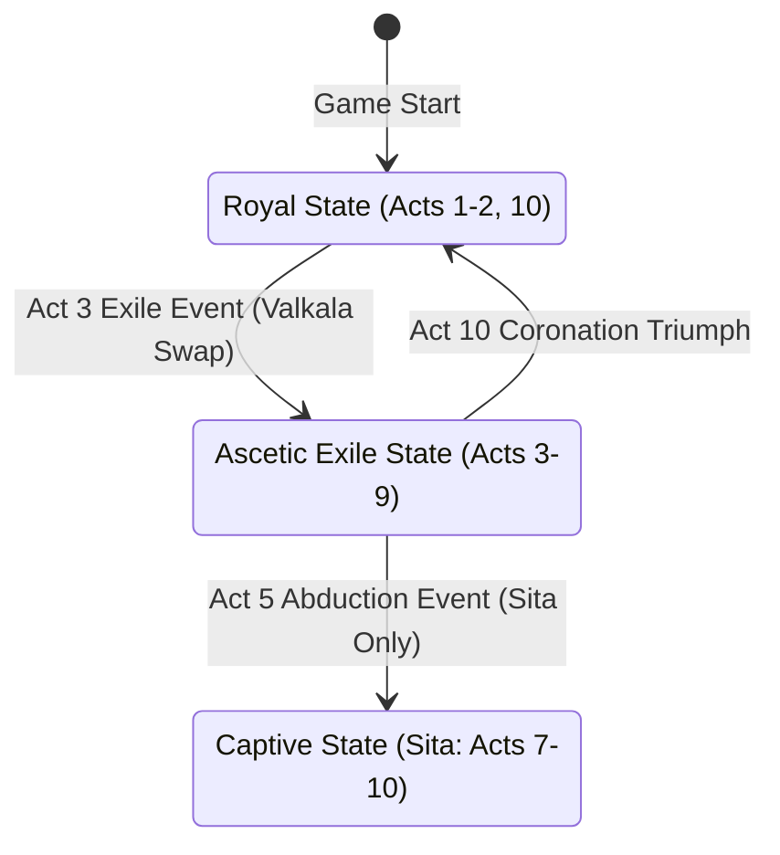

# Clothing: Visual Character Transformations

*   **Asset Category:** 3D Mesh Swaps, UI Portrait Profiles, & Stat Locks
*   **GDD Integration:** Automates model changes and UI states based on story progression.

---

## 1. Character State Machine & Model Swaps

As the narrative of **Ram-G** shifts from palatial abundance to forest exile, the core characters undergo complete visual transformations. These changes are represented in-engine as **3D Mesh Swaps** and **UI portrait switches**, accompanied by permanent structural mechanical nerfs or buffs.

---

## 2. Character-Specific Transformation Specifications

### A. Lord Rama (Rāmachandra)

#### State 1: Royal State (Acts 1, 2, and 10)
*   **Visual Assets:**
    *   *3D Character Model:* `SK_Rama_Royal.fbx`
    *   *Costumes:* Yellow royal silk dhoti (*Kauseya*), high polished gold chest plate (*Uraschhada*), royal ruby crown (*Kirita*), and double strand pearl necklaces.
    *   *Equipped Visual Aura:* Gentle golden solar glow (*Prana* rays) emanating from his chest.
*   **Mechanical Properties:**
    *   *Armor Rating:* `80` (High damage reduction).
    *   *Health Multiplier:* `2.0` (Max HP: 1,000).
    *   *Weapon Capability:* Full access to equipped physical bow quivers and locked divine *Astras*.

#### State 2: Ascetic State (Acts 3 to 9)
*   **Visual Assets:**
    *   *3D Character Model:* `SK_Rama_Ascetic.fbx`
    *   *Costumes:* Saffron tree-bark dhoti (*Valkala*), bare chest with a diagonal deerskin (*Ajina*) shoulder sling, simple wooden forearm guards, and hair tied into a high, compact bun (*Jata-mukuta*). No jewelry.
*   **Mechanical Properties (The Forest Nerf):**
    *   *Armor Rating:* `0` (Zero passive damage reduction).
    *   *Health Multiplier:* `1.0` (Max HP capped at 500).
    *   *Forest Camouflage:* `+25%` stealth bonus when crouched in foliage.
    *   *Spiritual Regeneration:* `+50%` Prana/Aura recharge rate from natural environment checkpoints.

---

### B. Princess Sita (Janaki)

#### State 1: Princess State (Acts 2 and 3)
*   **Visual Assets:**
    *   *3D Character Model:* `SK_Sita_Princess.fbx`
    *   *Costumes:* Fine red and gold silk saree, elaborate emerald-encrusted tiaras, matching necklaces, and gold armlets.
*   **Mechanical Properties:**
    *   *Support Aura Radius:* `8.0 meters` (Provides active health/stamina regen to Rama/Lakshmana).
    *   *Movement Speed:* Normal.

#### State 2: Exile State (Acts 3 to 6)
*   **Visual Assets:**
    *   *3D Character Model:* `SK_Sita_Exile.fbx`
    *   *Costumes:* Single draped orange tree-bark garment (*Valkala*). Hair tied into a simple, single neat braid. No ornaments, except her high-tier hidden hair-gem (*Chudamani*).
*   **Mechanical Properties:**
    *   *Support Aura Radius:* Reduced to `4.0 meters`.
    *   *Active Buff:* Invulnerable to minor environmental jungle traps (e.g. poison thorns, slippery shale).

#### State 3: Captive State (Acts 7 to 10)
*   **Visual Assets:**
    *   *3D Character Model:* `SK_Sita_Captive.fbx`
    *   *Costumes:* Faded, dirt-stained orange bark-cloth. Disheveled, loose hair framing her face. Bare feet. The character model sits on the ground, leaning against an Ashoka tree trunk.
*   **Mechanical Properties:**
    *   *Absolute Sanctuary:* In this state, Sita is non-playable but can cast a massive circular protective forcefield (**Bhumija Ward**) to shield Rama during combat phases in her proximity, blocking 100% of Asuric projectile damage.

---

### C. Prince Lakshmana (Saumitri)

#### State 1: Royal State (Acts 1 and 2)
*   **Visual Assets:**
    *   *3D Character Model:* `SK_Lakshmana_Royal.fbx`
    *   *Costumes:* White silk dhoti with light-green diagonal sash (*Laxman Green*), silver chest guard, and silver armlets.
*   **Mechanical Properties:**
    *   *Base Stamina:* `200` (Enables longer melee sword slashes).
    *   *Movement Speed:* `1.2x` base.

#### State 2: Exile State (Acts 3 to 9)
*   **Visual Assets:**
    *   *3D Character Model:* `SK_Lakshmana_Exile.fbx`
    *   *Costumes:* Simple brown tree-bark wrap, diagonal quiver strap, bare chest, and simple wooden leather arm-bracers.
*   **Mechanical Properties:**
    *   *Immunity:* `100%` immune to sleep status effects (*Nidra-Shakti*), reflecting his vow to never sleep during the 14-year exile.
    *   *Passive Threat Generation:* Attracts enemy aggro away from Rama during companion combat segments.
