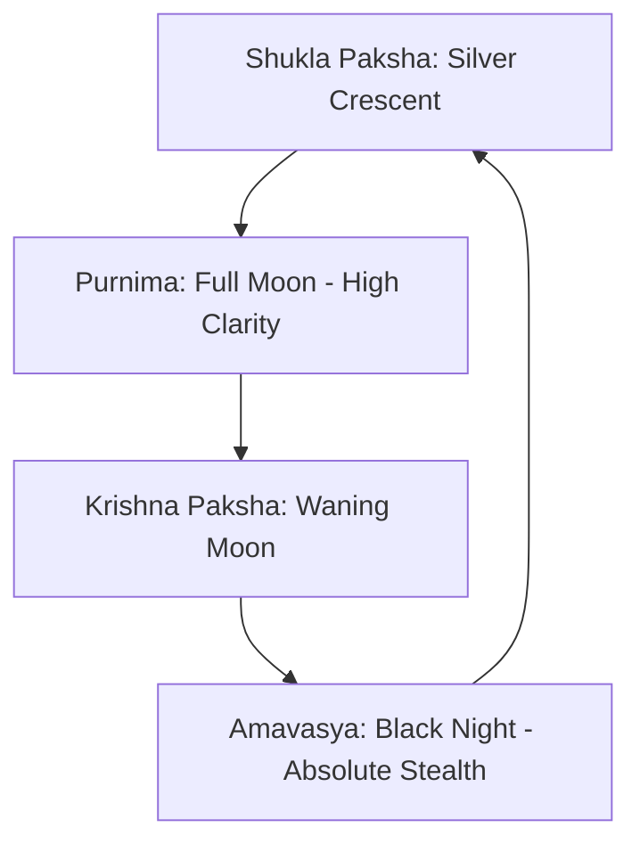

# Cosmology: Moon & Night System

*   **Database Directory:** `Docs/Environment_Elements/Cosmology/`
*   **Engine Blueprint Class:** `A_DirectionalNightLight` / `PostProcessVolume` (Night Environment Controller)

---

## 1. Lunar Light Specifications & Visual Phases

The moon cycle and night skybox in **Ram-G** dictate stealth opportunities, visual clarity, and ambient threat factors:

| Phase Name | Lunar Light Color | Lux Intensity | Stealth Modifier | Primary Aesthetic Role |
| :--- | :--- | :--- | :--- | :--- |
| **Purnima (Full Moon)** | `Hex #EAEDED` / Silver | `2.5 Lux` | `+10%` | High visibility forest traversal, glowing white river ripples. |
| **Amavasya (New Moon)** | `Hex #0E0F11` / Deep Grey | `0.1 Lux` | `+50%` | Ultimate palace/citadel infiltration, pitch-black stealth corridors. |
| **Asuric Chandra (Lanka)** | `Hex #C0392B` / Crimson Red | `1.2 Lux` (Volcanic Glow) | `0.0%` (Hostile Exposure) | Volcanic storm skies, reflecting Ravana's iron-clad grip and sorcery. |

---

## 2. Gameplay Mechanics: Night-Stealth & Terror

### A. Silver Moonlight Paths (Chandra Gati)
*   **Mechanic:** During the `Purnima` phase, the moon projects **silver light-paths** on calm water surfaces (such as Pampa Lake).
*   **Refraction Shader:** Walking along these shimmering light paths reveals hidden underwater stepping stones, allowing players to traverse water hazards without swimming.

### B. Volcanic Red Moonlight (Lanka Climax)
*   **Mechanic:** Lanka’s night is dominated by a volcanic crimson moon, applying the **"Asuric Frenzy" status**:
    *   *Asuric Foe Buff:* Increases enemy attack speed by `20%` and armor by `10%`.
    *   *Player Terror Meter:* Player stamina recovery is slowed down by `15%` unless they stand near warm camp fires or holy altar lights.

### C. Shadow Camouflage
*   *Stealth Value:* Absolute blackness allows players to execute stealth takedowns (tickling or non-lethal binding).

---

## 3. GDD Integration & Relative Mapping

The lunar settings are mapped directly to their locations and scene environments:

| Entity Name | Primary Location Link | Scene Placement | Connected Characters |
| :--- | :--- | :--- | :--- |
| **Purnima (Full Moon)** | [Kishkindha (LOC_KISHKINDHA)](../../Locations/Kishkindha.md) | [Enchanted Canopy (SCENE_ENCHANTED_CANOPY)](../../Scenes/Scene_5_Enchanted_Canopy.md) | [Sita](../../Characters/Sita.md) / [Maricha](../../Characters/Maricha.md) |
| **Amavasya (New Moon)**| [Ayodhya (LOC_AYODHYA)](../../Locations/Ayodhya.md) | [Palace Anger (SCENE_PALACE_ANGER)](../../Scenes/Scene_3_Palace_Anger.md) | [King Dasharatha](../../Characters/King_Dasharatha.md) / [Lakshmana](../../Characters/Lakshmana.md) |
| **Asuric Chandra** | [Lanka (LOC_LANKA)](../../Locations/Lanka.md) | [Stormy Stratosphere (SCENE_STORMY_STRATOSPHERE)](../../Scenes/Scene_6_Stormy_Stratosphere.md) | [Ravana](../../Characters/Ravana.md) / [General Indrajit](../../Characters/General_Indrajit.md) |

---

## 4. Acoustic & Audio Profile

*   **Moonlight Serenade:** Hauntingly beautiful string notes based on **Raga Darbari Kannada** scale loops, conveying depth and celestial mystery.
*   **Night Crickets:** Ambient cricket sound systems that automatically scale in volume based on light occlusion (louder in dark shadows).
*   **Volcanic Crimson Night:** A low, constant volcanic bass rumble and crackling electric storms that amplify combat tension.
