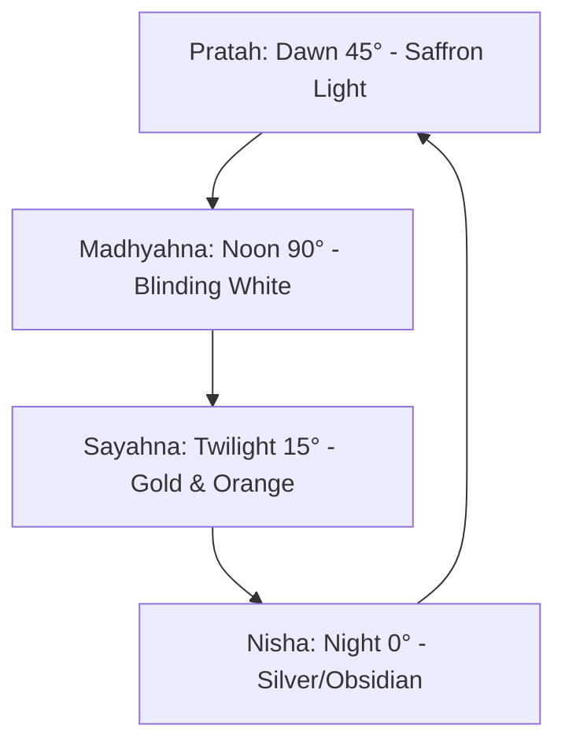

# Cosmology: Sun & Light System

*   **Database Directory:** `Docs/Environment_Elements/Cosmology/`
*   **Engine Blueprint Class:** `A_DirectionalLightManager` / `SkyLight` (Dynamic Day-Night Cycle)

---

## 1. Solar Light Specifications & Timelines

The daylight cycle in **Ram-G** operates under a dynamic chronological calendar, altering the visual color palette and shifting shadow directions to simulate realistic high-fidelity celestial movement:

| Phase Name | Solar Angle | Light Color (Hex / HSL) | Volumetric Shaft Density | Primary Aesthetic Role |
| :--- | :--- | :--- | :--- | :--- |
| **Pratah (Dawn)** | `30° - 45°` | `Hex #F39C12` / `HSL(38°, 90%, 52%)` | `0.18` (High Scattering) | Sunrise over Sarayu, golden sandstone warm reflections. |
| **Madhyahna (Noon)**| `80° - 90°` | `Hex #FFFFFF` / `HSL(0°, 0%, 100%)` | `0.05` (Clear Beams) | Sharp stone shadows, maximum visibility, spiritual temple clarity. |
| **Sayahna (Twilight)**| `10° - 20°` | `Hex #D35400` / `HSL(18°, 90%, 41%)` | `0.25` (Dense Dust Glow) | Blazing orange palatial coronation scenes, reflecting exile sorrow. |

---

## 2. Gameplay Mechanics: The Solar Shielding System

### A. Asuric Weakening (Surya-Kirana Effect)
*   **Mechanic:** Asuras are creatures of darkness and illusion (*Tamas*). Under direct, vertical high-noon sunlight (`Madhyahna` phase), Asuric enemies suffer a permanent **"Sun-Struck" debuff**:
    *   *Attack Speed:* Reduced by `25%`.
    *   *Illusion Evasion:* Shape-shifters (such as Maricha's decoys) lose their transparency layer, glowing with a telltale white tracking outline.
*   **Archery Charging (Kodanda solar infusion):** Firing arrows facing towards the rising Sun charges the player's *Prana* meter `2.0x` faster.

### B. Dynamic Shadow Volume Mechanics
*   **Stealth Tracking:** Shadow zones cast by colossal mountains, Sal trees, and palatial structures are treated as **stealth paths**. Standing in shadow blocks Asuric sniper vision locks.

---

## 3. GDD Integration & Relative Mapping

The solar settings are mapped directly to their locations and scene environments:

| Entity Name | Primary Location Link | Scene Placement | Connected Characters |
| :--- | :--- | :--- | :--- |
| **Pratah (Dawn)** | [Ayodhya (LOC_AYODHYA)](../../Locations/Ayodhya.md) | [Sumeru Stratosphere (SCENE_SUMERU_STRATOSPHERE)](../../Scenes/Scene_0_Sumeru_Stratosphere.md) | [Hanuman](../../Characters/Hanuman.md) / [Lord Rama](../../Characters/Lord_Rama.md) |
| **Madhyahna (Noon)** | [Mithila (LOC_MITHILA)](../../Locations/Mithila.md) | [Siddhashrama Altar (SCENE_SIDDHASHRAMA_ALTAR)](../../Scenes/Scene_1_Siddhashrama_Altar.md) | [Sage Vishwamitra](../../Characters/Sage_Vishwamitra.md) |
| **Sayahna (Twilight)** | [Lanka (LOC_LANKA)](../../Locations/Lanka.md) | [Enchanted Canopy (SCENE_ENCHANTED_CANOPY)](../../Scenes/Scene_5_Enchanted_Canopy.md) | [Sita](../../Characters/Sita.md) / [Jatayu](../../Characters/Jatayu.md) |

---

## 4. Acoustic & Audio Profile

*   **Sunrise Fanfare (Dawn):** Dynamic acoustic integration triggering rising flute scales and a singular brass shell (*Shankha*) note when the sun breaks the horizon.
*   **Noon Echo:** High heat causes a dry sound profile, reducing reverb times by `15%` to simulate intense heat.
*   **Twilight Solitude:** High crickets and fading bird calls overlaying the quiet, meditative flutes of **Raga Yaman**.
