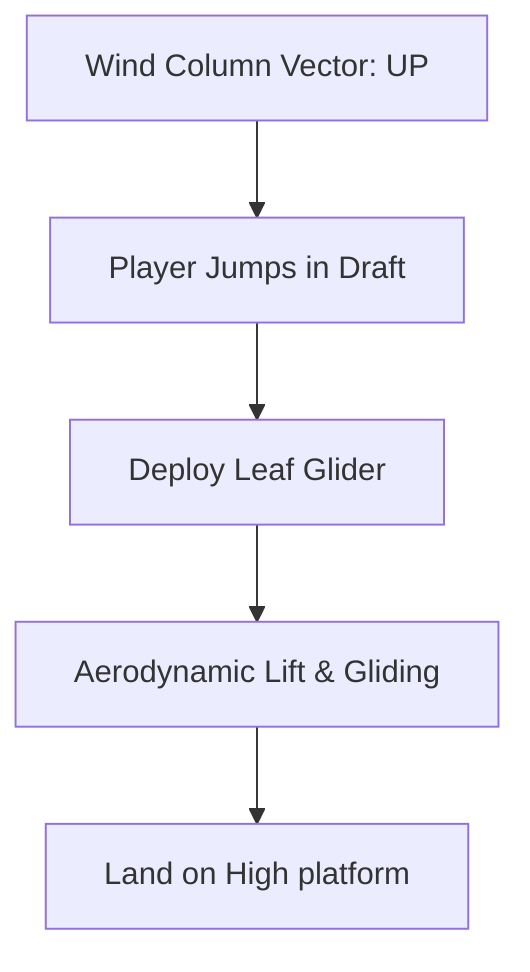

# Cosmology: Wind Physics & Air Currents

*   **Database Directory:** `Docs/Environment_Elements/Cosmology/`
*   **Engine Blueprint Class:** `A_WindDirectionalSource` / `PhysicsVolume` (Fluid Dynamics Wind System)

---

## 1. Wind Force & Vector Specifications

The wind physics system in **Ram-G** operates under direct computational vector fields, defining foliage movement, cloth flutter, and player flight/glide momentum:

| Altitude Layer | Wind Speed Vector | Turbulence Coeff | Drag Multiplier | Primary Traversal Role |
| :--- | :--- | :--- | :--- | :--- |
| **Ground Layer (Forest)** | `2m/s - 5m/s` | `0.1` | `1.0` | Gentle leaf rustling, smoke dispersal, simple sailing. |
| **Mountain Updrafts** | `15m/s` (Vertical) | `0.4` | `0.6` | Thermal wind columns lifting Hanuman and glider leaf pads. |
| **Upper Stratosphere** | `45m/s - 65m/s` | `0.8` | `0.2` | Supersonic jet-stream flight tracks (Jatayu dogfight acts). |

---

## 2. Dynamic Gameplay Mechanics

### A. Vayu's Thermal Updrafts (Vayu Gati)
*   **Mechanic:** Dynamic cylindrical wind columns generated near cliffsides.
*   **Interactive Controls:** Entering a wind column volume automatically triggers a upward force. If the player deploys their **Leaf Glider** (crafted from Sal leaves), they ascend slowly, steering with standard directional controls.
*   **Physics Settings:** Upward acceleration: `9.8m/s²` (perfectly offsets standard gravity).

### B. Cyclones & Dispersal Hazards (Vayavyastra Columns)
*   **Mechanic:** Swirling, high-intensity tornado columns triggered by the player firing the **Vayavyastra** cyclone storm arrow.
*   **Active Purge:** Any active Asuric fog, black locust swarms, or toxic gases in an `8.0m` radius are instantly swept upward and dissolved by the tornado, cleaning the combat scene.

---

## 3. GDD Integration & Relative Mapping

The wind settings are mapped directly to their locations and scene environments:

| Entity Name | Primary Location Link | Scene Placement | Connected Characters |
| :--- | :--- | :--- | :--- |
| **Mountain Updraft** | [Kishkindha (LOC_KISHKINDHA)](../../Locations/Kishkindha.md) | [Sumeru Stratosphere (SCENE_SUMERU_STRATOSPHERE)](../../Scenes/Scene_0_Sumeru_Stratosphere.md) | [Hanuman](../../Characters/Hanuman.md) / [Vayu Summon](../../Weapons/Vayavyastra.md) |
| **Upper Stratosphere**| [Lanka (LOC_LANKA)](../../Locations/Lanka.md) | [Stormy Stratosphere (SCENE_STORMY_STRATOSPHERE)](../../Scenes/Scene_6_Stormy_Stratosphere.md) | [Jatayu](../../Characters/Jatayu.md) / [Sampati](../../Characters/Sampati.md) |
| **Forest Breeze** | [Dandakaranya (LOC_DANDAKARANYA_PANCHAVATI)](../../Locations/Dandakaranya_Panchavati.md) | [Enchanted Canopy (SCENE_ENCHANTED_CANOPY)](../../Scenes/Scene_5_Enchanted_Canopy.md) | [Sita](../../Characters/Sita.md) |

---

## 4. Acoustic & Audio Profile

*   **Jungle Breeze Ambient:** Soft rustling leaf loops and low whistling woodwind notes playing dynamically under moderate wind speeds.
*   **High-Altitude Whistle:** High-pitch, clean rushing wind shear sound effects that adjust in pitch based on Jatayu's flight speed.
*   **Tornado Roar:** A deep, roaring sonic rumble (`80Hz - 250Hz`) that overrides ambient sounds when the Vayavyastra cyclone is active, creating an intense, high-impact battle feel.
