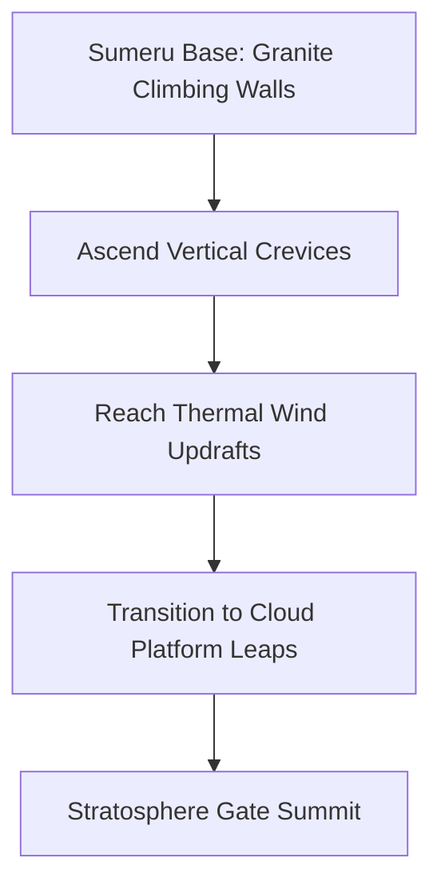

# Geography: Mountains & Terrain Database

*   **Database Directory:** `Docs/Environment_Elements/Geography/`
*   **Engine Blueprint Class:** `A_TerrainMesh` / `Landscape` (Tessellated Heightfield Shader)

---

## 1. Mountain Terrain Specifications & Material Properties

The mountainous landscapes in **Ram-G** use detailed collision meshes and surface shaders to regulate climbing physics, landslide hazards, and vertical traversal routes:

| Mountain Name | Regional Context | Surface Material | Friction Coeff | Max Climbing Height |
| :--- | :--- | :--- | :--- | :--- |
| **Mount Sumeru** | Heavenly Valleys | White Granite & Gold Veins | `0.85` (Excellent grip) | `1,200 meters` (High-ground leap) |
| **Rishyamukha Hill** | Kishkindha Wilds | Sun-bleached Limestone | `0.60` (Cracking stone) | `600 meters` (Platform cave chains)|
| **Trikuta Mountain** | Lanka Volcanic Peak | Black Obsidian & Basalt | `0.15` (Slippery/Glassy) | `900 meters` (Fortified ramparts) |

---

## 2. Interactive Level Design & Traversal Systems

### A. Mount Sumeru Granite Walls
*   **Aesthetics:** Shining white granite rock faces shot through with golden veins that glow softly under solar light.
*   **Gameplay Mechanics:** Large vertical cracks and handhold ledges allow players to scale massive rock cliffs. Climbing triggers the **Handhold Match** mechanic: timing jumps perfectly reduces stamina consumption by `30%`.

### B. Rishyamukha Limestone Caves
*   **Aesthetics:** Dusty orange-grey limestone pillars, narrow ledges, and deep, cool subterranean cave hollows.
*   **Environmental Hazards:**
    *   *Loose Shale:* Slopes covered in dry limestone pebbles. Walking on shale triggers a slide animation, forcing players to steer and jump before falling off ledges.
    *   *Rope Bridge Anchors:* Stamped iron and wood rings embedded in rock faces, serving as dynamic attachment points for suspension bridges.

### C. Trikuta Volcanic Obsidian Tubes
*   **Aesthetics:** Polished, ultra-slick black obsidian walls reflecting lava light. Subterranean corridors are heated by volcanic thermal vents.
*   **Gameplay Mechanics:** Standard climbing is impossible on glassy obsidian surfaces. The player must use grapple arrows to hook onto iron scaffolding and ceiling chains to cross molten pools.

---

## 3. GDD Integration & Relative Mapping

The mountainous terrains are connected directly to corresponding Acts, Scenes, and Characters:

| Entity Name | Primary Location Link | Scene Placement | Connected Characters |
| :--- | :--- | :--- | :--- |
| **Mount Sumeru** | [Kishkindha (LOC_KISHKINDHA)](../../Locations/Kishkindha.md) | [Sumeru Stratosphere (SCENE_SUMERU_STRATOSPHERE)](../../Scenes/Scene_0_Sumeru_Stratosphere.md) | [Hanuman](../../Characters/Hanuman.md) / [Vayu Voice](../../Weapons/Vayavyastra.md) |
| **Rishyamukha Hill**| [Kishkindha (LOC_KISHKINDHA)](../../Locations/Kishkindha.md) | [Enchanted Canopy (SCENE_ENCHANTED_CANOPY)](../../Scenes/Scene_5_Enchanted_Canopy.md) | [King Sugriva](../../Characters/King_Sugriva.md) / [King Vali](../../Characters/King_Vali.md) |
| **Trikuta Mountain**| [Lanka (LOC_LANKA)](../../Locations/Lanka.md) | [Stormy Stratosphere (SCENE_STORMY_STRATOSPHERE)](../../Scenes/Scene_6_Stormy_Stratosphere.md) | [Ravana](../../Characters/Ravana.md) / [Titan Kumbhakarna](../../Characters/Titan_Kumbhakarna.md) |

---

## 4. Acoustic & Audio Profile

*   **Sumeru High Valleys:** High-altitude mountain silence, wind whispers, and crystal-clear acoustic resonances.
*   **Rishyamukha Cave Echo:** Deep, damp cavern echoing (`Reverb time: 4.5s`, `Damping: 35%`) which amplifies distant drops of water and pebble falls.
*   **Trikuta Volcanic Caves:** Constant subterranean bass rumbles, heavy tectonic shifts, and the high-pitch hiss of venting steam valves.
