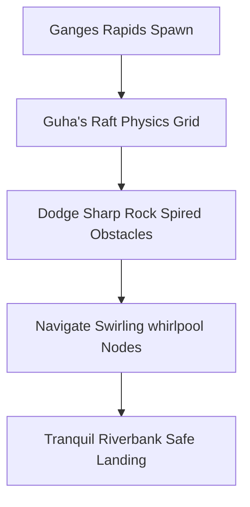

# Geography: Rivers & Waterbodies Database

*   **Database Directory:** `Docs/Environment_Elements/Geography/`
*   **Engine Blueprint Class:** `A_WaterBody` / `FluidSimulation` (Dynamic Wave Displacement solver)

---

## 1. Water Body Specifications & Physics Profiles

The waterbodies in **Ram-G** use dynamic fluid physics, determining buoyancy factors, flow velocity vectors, and interactive water displacement:

| Waterbody Name | Location / Region | Flow Velocity Vector | Buoyancy Coeff | Primary Gameplay Role |
| :--- | :--- | :--- | :--- | :--- |
| **Sarayu River** | Kosala Plains | `1.5m/s` (Eastward) | `1.1` (Calm, stable) | Tutorial ferry crossing, scenic reflections, boundary block. |
| **Ganges River** | Kosala Border | `8.5m/s` (Turbulent rapids) | `0.9` (Sinking hazards) | High-speed rafting action, dodging rock spires, Guha's raft quest. |
| **Godavari River** | Panchavati Valley | `3.0m/s` | `1.0` | Sages' ritual cleaning checkpoints, wet mossy climbing walls. |
| **Pampa Lake** | Kishkindha Foothills| `0.0m/s` (Still mirror) | `1.2` (Lotus pads float) | Shimmering moonlight puzzle tracks, lotus climbing platform puzzles. |
| **Southern Ocean** | Lanka Border | `18.0m/s` (Violent storms) | `0.7` (Extreme drag) | Dynamic bridge building acts, battling giant sea-monsters. |

---

## 2. Dynamic Level Mechanics

### A. Ganges Crossing Rapids (Guha's Act 3 Quest)
*   **Mechanic:** The Ganges crossing is a high-speed river traversal sequence.
*   **Interactive Raft Physics:** The player is on a wooden raft guided by the boatman chief Guha. The raft acts as a physics grid. The player must run side-to-side on the raft to balance it, using bow shots to break approaching driftwood debris and steering logs.

### B. Lotus Platforms of Pampa Lake
*   **Mechanic:** The lake surface contains giant, floating **Sahasra-Patra Lotuses**.
*   **Climbing Nodes:** These massive leaves act as soft climbing platforms. If the player stays on a lotus leaf for more than 4.0 seconds, it slowly sinks under their weight, forcing fast, rhythmic jumping traversal across the lake.

### C. Southern Ocean Bridge Construction (Ram-Setu)
*   **Mechanic:** Dynamic stone placement grids. The player must coordinate Vanara units to drop floating stone boulders into the highlighted ocean nodes. Once aligned, the stones are locked by Nala's structural engineering script, creating a permanent pathway to Lanka.

---

## 3. GDD Integration & Relative Mapping

The waterbodies are mapped directly to their GDD locations, scenes, and characters:

| Entity Name | Primary Location Link | Scene Placement | Connected Characters |
| :--- | :--- | :--- | :--- |
| **Sarayu River** | [Ayodhya (LOC_AYODHYA)](../../Locations/Ayodhya.md) | [Sumeru Stratosphere (SCENE_SUMERU_STRATOSPHERE)](../../Scenes/Scene_0_Sumeru_Stratosphere.md) | [Lord Rama](../../Characters/Lord_Rama.md) / [King Dasharatha](../../Characters/King_Dasharatha.md) |
| **Ganges Rapids** | [Ayodhya (LOC_AYODHYA)](../../Locations/Ayodhya.md) | [Palace Anger (SCENE_PALACE_ANGER)](../../Scenes/Scene_3_Palace_Anger.md) | [Guha](../../Characters/Guha.md) |
| **Godavari River** | [Dandakaranya (LOC_DANDAKARANYA_PANCHAVATI)](../../Locations/Dandakaranya_Panchavati.md) | [Dandaka Wilds (SCENE_DANDAKA_WILDS)](../../Scenes/Scene_4_Dandaka_Wilds.md) | [Lakshmana](../../Characters/Lakshmana.md) / [Sita](../../Characters/Sita.md) |
| **Pampa Lake** | [Kishkindha (LOC_KISHKINDHA)](../../Locations/Kishkindha.md) | [Enchanted Canopy (SCENE_ENCHANTED_CANOPY)](../../Scenes/Scene_5_Enchanted_Canopy.md) | [Sabari](../../Characters/Sabari.md) / [King Sugriva](../../Characters/King_Sugriva.md) |
| **Southern Ocean** | [Lanka (LOC_LANKA)](../../Locations/Lanka.md) | [Stormy Stratosphere (SCENE_STORMY_STRATOSPHERE)](../../Scenes/Scene_6_Stormy_Stratosphere.md) | [Samudra Deva](../../Characters/Samudra_Deva.md) / [Ravana](../../Characters/Ravana.md) |

---

## 4. Acoustic & Audio Profile

*   **Sarayu River Calm:** Quiet, gentle water lapping loops (`Water_Lapping_Peaceful.wav`) with light wind flutes.
*   **Ganges Rapids Roar:** Booming rushing water noise, crushing wave splashes, and wood splinter rumbles.
*   **Southern Ocean Storms:** Apocalyptic ocean wind howling combined with giant crashing wave thuds (`Impact SFX: Ocean_Storm_Crashing.wav`) and deep underwater rumbles.
