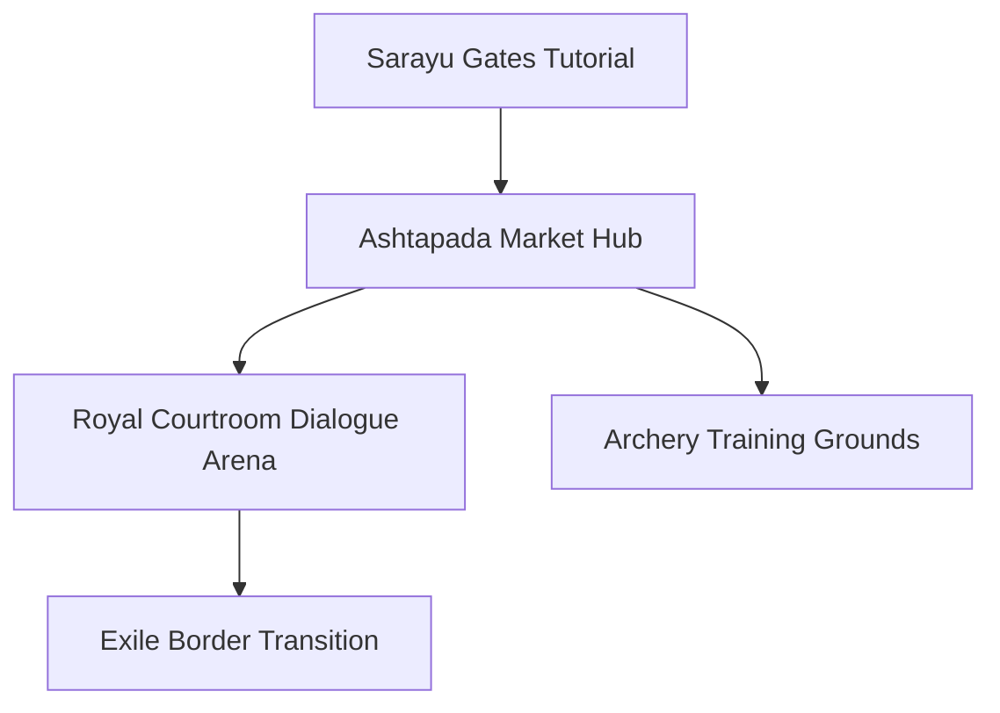

# Location: Ayodhya (The Radiant Capital)

*   **Location ID:** `LOC_AYODHYA`
*   **Narrative Era:** Acts 1, 2, 3, and 10 (Royal & Coronation Periods)
*   **Primary Aesthetic:** Sun-Drenched Sandstone & White Marble

---

## 1. Visual & Atmospheric Specifications

| Parameter | GDD Specification & Rendering Engine Value |
| :--- | :--- |
| **Skybox Shader** | Dynamic solar angles (`45°` morning, `15°` golden twilight). High scattering coefficients for saffron-infused light. |
| **Volumetric Lighting** | Solar volumetric shafts filtering through grand temple archways. Directional light color: `Hex #FDB813` (Solar Gold). |
| **Atmospheric Fog** | Low density (`0.02`), turning into a warm morning mist near the river banks. |
| **Color Palette** | Main: `Hex #E6C280` (Sandstone), Accent: `Hex #FAF6EE` (Marble), Royal: `Hex #D95D39` (Saffron Red). |

### Aesthetic & Mood
A city radiating cosmic order (*Dharma*), imperial prosperity, and absolute security. The environment feels clean, grand, and highly symmetrical, projecting the golden authority of the Solar Dynasty (*Surya-Vamsha*).

---

## 2. Geographic Setting & Boundaries

*   **Regional Topography:** Flat fertile alluvial plains of Kosala, bordered by lush ancient Sal tree forests.
*   **Natural Boundaries:** Located on the northern banks of the deep, tranquil, and sacred **Sarayu River**.
*   **Coordinate Bounds (Engine Units):** `X: -1000m` to `X: 1500m`, `Z: -2000m` to `Z: 1000m`. The southern boundary triggers a transition event to the Ganges ferry crossing.

---

## 3. Level Design & Sub-Zones

### A. Symmetrical City Hub (Ashtapada Grid)
*   **Layout:** Symmetrical, grid-like streets designed to resemble a traditional gaming board (*Ashtapada*). The avenues are wide, dustless, and lined with high-tiered houses.
*   **NavMesh Settings:** High-density NPC navigation paths. Obstacles include flower-strewn street carts, public water fountains, and ornamental pillars.

### B. Fortified Battlements & Gatehouses
*   **Defensive Assets:** High stone fortress walls surrounded by deep water moats fed by the Sarayu.
*   **Mechanical Hazards:** Spiked weapon-launchers (**Shataghnini** — "hundred-slayers") lining the battlements. Interactive levers allow players to aim and fire these massive ballistas during defense acts.
*   **Climbing Bounds:** The exterior walls are treated as non-climbable (high friction / frictionless shader) to funnel invaders into the massive iron-gated gatehouses.

### C. Royal Palace & Sarayu Terraces
*   **Aesthetics:** White marble pillars carved with lotus patterns, draped with saffron silk banners and fresh jasmine garlands.
*   **Interactive Elements:** The royal arena for archery training, hidden garden chambers, and reflective water pools.

---

## 4. Gameplay Role & Level Mechanics

*   **Combat Archetype:** Shielded city defense, archery target tracking, and high-stakes non-lethal dialogue duels.
*   **Archery Training Arena:** An interactive mini-game where the player (Rama) learns precision targeting, release timing, and arrow trajectory adjustments.
*   **Palace Siege Phase (Act 10):** High-intensity siege combat where the player must coordinate city guards, fire ballistas from the battlements, and repel elite Rakshasa airborne infiltrators.

---

## 5. Acoustic & Audio Design

### Theme Ragas & Melodic Tracks
*   **Morning / Peaceful State:** **Raga Yaman** (Twilight devotion and peace) played on high flutes and deep sitars. Tempo: Slow (`75 BPM`).
*   **Imperial / Royal State:** **Raga Bilawal** (Triumphant, majestic) featuring copper horns and heavy twin *Mridangam* percussion.
*   **Grief / Exile State (Act 3):** **Raga Darbari** (Deep majestic grief) played on solo *Sarangi* and slow, echoing wooden flutes.

### Sound Effects (SFX) & Resonance
*   **Ambient Soundscapes:** Bustling bazaar chatter, fluttering silk flags, horse hooves on polished stone, and the low, constant rush of the Sarayu water currents.
*   **Voice Filter Resonance:** Palace chambers utilize a high-reverberation room profile (`Reverb time: 2.4s`, `Damping: 30%`), giving a booming, divine echo to all spoken dialogue.
