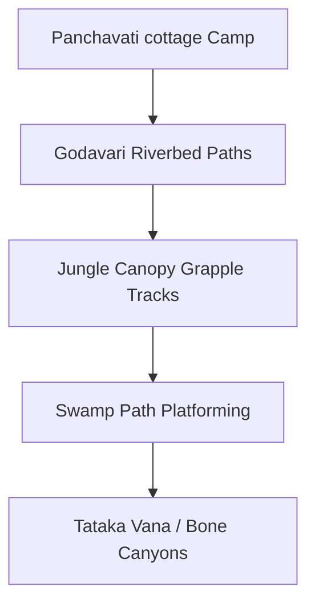

# Location: Dandakaranya & Panchavati (The Exile Wilds)

*   **Location ID:** `LOC_DANDAKARANYA_PANCHAVATI`
*   **Narrative Era:** Acts 4 and 5 (Exile, Forest Dwellings, and Golden Illusion)
*   **Primary Aesthetic:** Deep Prehistoric Jungle & Mystical Ashrams

---

## 1. Visual & Atmospheric Specifications

| Parameter | GDD Specification & Rendering Engine Value |
| :--- | :--- |
| **Skybox Shader** | Heavy jungle canopy leaf filtering. Rays of light (*Komal Kiran*) piercing the dense trees. Midnight deep emerald-blue skies. |
| **Volumetric Lighting** | High-density green-tinged light beams (*Dappled Light*). Golden dust motes dancing in sunbeams. |
| **Atmospheric Fog** | Dense volumetric forest fog (`0.15`), rising from swamps and riverbeds. |
| **Color Palette** | Main: `Hex #1E3F20` (Forest Emerald), Accent: `Hex #556B2F` (Olive Green), Danger: `Hex #E0C93C` (Enchanted Gold). |

### Aesthetic & Mood
Mysterious, ancient, and highly primeval. An endless jungle where natural beauty clashes with dark Asuric threats. Hermitages glow with clean, warm light, while the deep forest undergrowth feels suffocating, shadowed, and alive.

---

## 2. Geographic Setting & Boundaries

*   **Regional Topography:** Steep, rugged rock ravines, limestone cave structures, muddy wetlands, and colossal, towering ancient trees (*Sal* and *Banyan*).
*   **Natural Boundaries:** Bisected by the wide, rapid-flowing, and rocky **Godavari River**.
*   **Coordinate Bounds (Engine Units):** `X: -3000m` to `X: 3000m`, `Z: -3000m` to `Z: 3000m`. Massive sprawling open-world layout.

---

## 3. Level Design & Sub-Zones

### A. The Panchavati Cottage (Mini-Camp Hub)
*   **Layout:** A peaceful, circular clearing on a elevated bank overlooking the Godavari. Features a simple cottage built of leaves, mud, and split wood.
*   **Gameplay Utility:** Serve as the player’s main camp, where they can craft herbal remedies, clean weapon gears, and check dialogue logs. The zone has a **permanent holy ward** that blocks all hostile spawn types.

### B. The Jungle Canopy & Swamps (High Verticality)
*   **Platforming Paths:** Interlocking giant branches and thick forest vines that act as grapple tracks and rope bridges.
*   **Interactive Hazards:** 
    *   *Carnivorous Plants:* Explode in acid spores if stepped on.
    *   *Toxic Swamps:* Green swamp water that applies a slow-movement debuff and deals poison damage over time unless purified by Sita’s *Ganga-Jal*.
    *   *Shifting Shadows:* Illusion pockets generated by Maricha’s prisms.

### C. Hermitage Sanctuaries (Ashrams of the Sages)
*   **Aesthetics:** Small, clean wooden temples surrounded by flowering shrubs.
*   **Gameplay Function:** Sages provide specialized active quests, weapon modifications (e.g. elemental arrow tips), and dialogue options.

---

## 4. Gameplay Role & Level Mechanics

*   **Beast Tracking:** The player tracks targets (e.g., the Golden Deer) by examining disturbed leaves, broken twigs, and glowing gold pollen residue left on stone surfaces.
*   **14,000 Demon Horde (Act 4):** A major combat phase where Rama must defend Panchavati from wave attacks, using high-ground tree branches for sniping and fire arrows to trigger swamp gas explosions.
*   **Valkala Movement Penalty:** The players are locked into Valkala bark-cloth, meaning they have lower defense ratings but gain a `+25%` stealth bonus when crouched in tall fern clumps.

---

## 5. Acoustic & Audio Design

### Theme Ragas & Melodic Tracks
*   **Daytime Exploration:** **Raga Lalit** (Deep primeval mystery, dawn) played on solo bamboo flutes and low, slow hand-percussion.
*   **Hermitage Peace:** **Raga Bhairavi** (Absolute devotion, morning prayer) featuring high-pitch sitars and clean classical choral humming.
*   **Night Chase (Golden Deer):** **Raga Abhogi** (Restless chase, forest tension) using high-tempo string ostinatos (`130 BPM`) and organic wooden beats.

### Sound Effects (SFX) & Resonance
*   **Ambient Soundscapes:** Echoing forest birds, howling wind through hollow bamboo trunks, distant roaring Godavari rapids, rustling fern leaves, and eerie, low Asuric whispers in dark zones.
*   **Reverberation Profile:** Open jungle canopy has a flat, dry acoustic environment, but inside limestone caves it shifts to a highly wet, bouncing echo (`Reverb time: 3.5s`, `Damping: 60%`).
