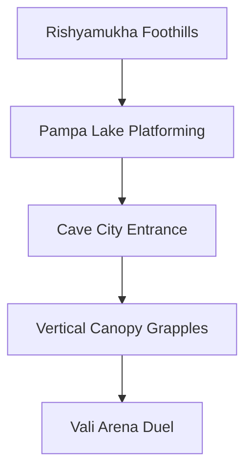

# Location: Kishkindha (The Mountain Kingdom)

*   **Location ID:** `LOC_KISHKINDHA`
*   **Narrative Era:** Act 6 (The Forest Alliance & The Duel of Vali)
*   **Primary Aesthetic:** Rough-Hewn Caves & Sun-Dappled Rocky Peaks

---

## 1. Visual & Atmospheric Specifications

| Parameter | GDD Specification & Rendering Engine Value |
| :--- | :--- |
| **Skybox Shader** | Dynamic high-altitude skybox with fast-moving cirrus clouds. Intense, blazing orange-red mountain sunsets. |
| **Volumetric Lighting** | Warm golden noon rays breaking through giant mountain crevices. |
| **Atmospheric Fog** | Low density (`0.01`), with thick volumetric spray layers near major waterfalls. |
| **Color Palette** | Main: `Hex #8E7C62` (Granite Brown), Accent: `Hex #5DADE2` (Cascade Blue), Flora: `Hex #27AE60` (Vibrant Jungle Vine). |

### Aesthetic & Mood
Kinetic, vertical, and rugged. Architecture is carved directly into the living mountain sides rather than constructed, presenting a fusion of primitive wood carpentry and colossal natural rock formations. Multi-layered waterfalls roar down cliffsides, keeping the air moist and fresh.

---

## 2. Geographic Setting & Boundaries

*   **Regional Topography:** Sheer granite cliffs, deep valleys, natural rock arches, and massive volcanic hollows.
*   **Natural Boundaries:** Encircled by the pristine, sacred waters of **Pampa Lake** and the towering ridges of **Rishyamukha Hill**.
*   **Coordinate Bounds (Engine Units):** `X: -2000m` to `X: 2000m`, `Z: -1500m` to `Z: 3000m`. Focuses heavily on vertical level bounds (`Y: -200m` to `Y: 1200m`).

---

## 3. Level Design & Sub-Zones

### A. The Cave City (Guha-Nagara)
*   **Layout:** A massive hollowed-out mountain interior featuring tiered stone balconies, suspension bridges, and wooden huts clinging to vertical cliffs.
*   **NavMesh:** Complex, multi-layered vertical paths. Minor Vanara NPCs leap between platforms, while traders operate on wooden bridges.

### B. High-Altitude Traversal Tracks
*   **Aesthetics:** Thick, leafy jungle vines, hemp ropes, and shaky wooden suspension bridges crossing bottomless canyons.
*   **Interactive Mechanics:** 
    *   *Grapple Anchors:* Green mossy rock rings that allow players to hook their primal tails (as Hanuman) or grappling arrows (as Rama) to swing across chasms.
    *   *Slippery Slopes:* Wet stone slides near waterfalls that require timing jumps to avoid falling off the map.

### C. Rishyamukha Hermitage & Foothills
*   **Aesthetics:** Dry, sun-bleached sandstone rocks, scrub vegetation, and calm lake shores where Sugriva’s exiled band camps.
*   **Gameplay Utility:** Serve as a safe zone for preparing for the Vali arena challenge.

---

## 4. Gameplay Role & Level Mechanics

*   **Vertical Momentum Loop:** The traversal focuses on momentum. Jumping off vine swings at the peak of their arc grants speed boosts, allowing the player to cover huge horizontal distances.
*   **Vali Duel Mechanics (Act 6):** The battle arena is a giant stone fighting pit surrounded by high trees.
    *   *Vali Aura:* Anyone facing Vali directly has `50%` of their physical attack power siphoned.
    *   *Combat Tactics:* The player must hide behind thick stone columns and perform stealth archery from high tree canopies, targeting Vali when his back is turned to Sugriva.

---

## 5. Acoustic & Audio Design

### Theme Ragas & Melodic Tracks
*   **High-Altitude Traversal:** **Raga Hamsadhwani** (Bright, soaring energy) featuring high-tempo bamboo flutes, energetic classical violins, and vibrant wooden percussion.
*   **Mountain Twilight:** **Raga Marwa** (Restless tension, exile sorrow) using slow, haunting solo flutes and echoes.
*   **Vali Battle:** **Raga Hindol** (Intense combat momentum) incorporating rapid copper drums, booming tribal horns, and fast *Tabla* cycles (`140 BPM`).

### Sound Effects (SFX) & Resonance
*   **Ambient Soundscapes:** Booming cascade waterfalls, mountain wind whistling through narrow stone slits, creaking wooden bridge ropes, monkey calls, and pebbles sliding down shale slopes.
*   **Cave Acoustics:** Cave zones use an echo filter (`Reverb time: 5.0s`, `Damping: 20%`), giving combat yells a high, booming, and spacious echo.
