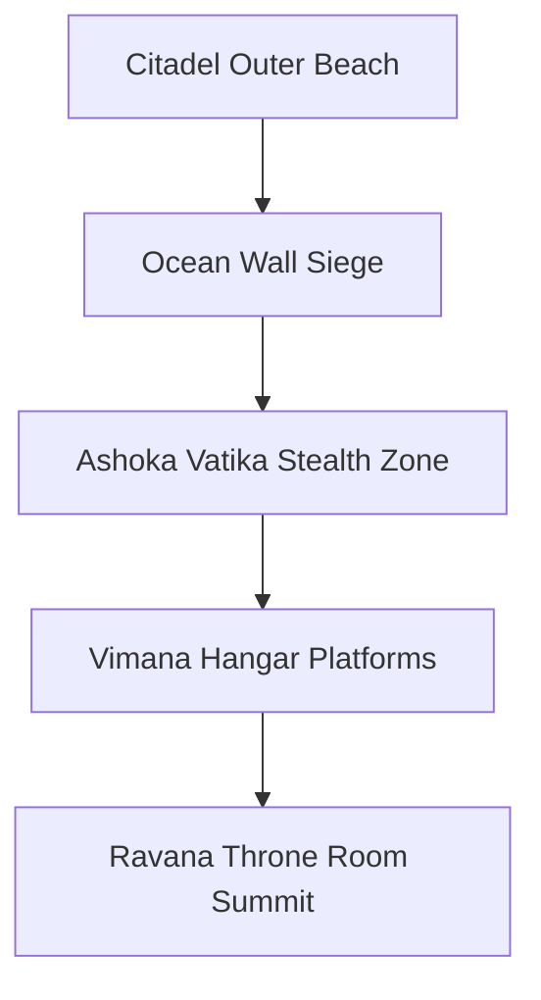

# Location: Lanka (The Golden Citadel)

*   **Location ID:** `LOC_LANKA`
*   **Narrative Era:** Acts 7, 8, 9, and 10 (Infiltration, Siege, and Final Triumph)
*   **Primary Aesthetic:** Golden Architecture & Black Obsidian Stone

---

## 1. Visual & Atmospheric Specifications

| Parameter | GDD Specification & Rendering Engine Value |
| :--- | :--- |
| **Skybox Shader** | Turbulent dark storm skies with active lightning flashes. Crimson-solar twilight. Heavy smoke plumes from volcanic vents. |
| **Volumetric Lighting** | Harsh crimson torchlight beams and golden ambient glares reflecting off polished walls. |
| **Atmospheric Fog** | Moderate volumetric ocean spray fog (`0.08`), mixing with black carbon smoke. |
| **Color Palette** | Main: `Hex #D4AF37` (Imperial Gold), Accent: `Hex #111111` (Obsidian Black), Glow: `Hex #E74C3C` (Demonic Crimson). |

### Aesthetic & Mood
Opulent, intimidating, and technologically advanced. An island citadel that represents the absolute peak of material wealth and sorcery-driven engineering. The golden buildings contrast sharply with raw black volcanic rock, heavy iron chains, and burning fire cauldrons.

---

## 2. Geographic Setting & Boundaries

*   **Regional Topography:** A steep, towering volcanic peak (**Trikuta Mountain**) rising directly out of the ocean, surrounded by jagged black sand beaches.
*   **Natural Boundaries:** Encircled on all sides by the turbulent, shark-infested **Southern Ocean** (*Mahodadhi*).
*   **Coordinate Bounds (Engine Units):** `X: -2500m` to `X: 2500m`, `Z: -2000m` to `Z: 3500m`. Focuses on vertical citadel siege layers (`Y: 0m` to `Y: 900m`).

---

## 3. Level Design & Sub-Zones

### A. Ashoka Vatika (Sita's Prison Orchard)
*   **Layout:** A once-beautiful palace garden now overgrown and guarded. Features golden Ashoka trees, weeping willows, and quiet stone ponds.
*   **Interactive Hazard:** Guarded by grotesque Rakshasi guards. The player (Hanuman in stealth state) must use vertical branches to bypass detection loops and find Sita without triggering alarms.
*   **Aesthetic Contrast:** Natural beauty (white jasmines) locked behind dark iron cages, reflecting Sita's confinement.

### B. Fortified Citadel Battlements & Vimana Hangars
*   **Level Design:** Giant, golden stone fortress walls lined with heavy spiked barriers, flame-throwing gargoyles, and iron gates.
*   **Interactive Asset:** Floating launch pads for *Pushpaka Vimana* (flying wooden gliders). The player can hijack these gliders to traverse high citadel towers during the siege acts.
*   **Defenses:** Giant mechanical ballistas that launch venomous *Nagapasha* nets at attackers.

### C. Ravana’s Throne Room & Summit Arena
*   **Interior Design:** Colossal crystal pillars reflecting the glow of molten gold channels flowing along the floor. At the center is a massive throne carved out of a single black diamond.
*   **Summit Arena:** The high open-air terrace of the palace, situated above the clouds. The ultimate battleground where Rama fights Ravana, surrounded by crackling storm clouds.

---

## 4. Gameplay Role & Level Mechanics

*   **Infiltration Stealth Loop:** Playing as Hanuman, the player must utilize shadow cover and tree canopies to infiltrate Ashoka Vatika, collecting clues and locating Sita's hidden courtyard.
*   **Grand Siege Combat:** Cooperative combat segments where the player commands squads of Vanaras to ram golden gates, sabotage Vimana turbines, and climb defensive obelisks.
*   **Navel-Nectar Strike (Act 10 Climax):** The final arena mechanic. Ravana’s heads regenerate instantly unless the player destroys the golden core on his chest and hits his navel nectar, requiring precise, synchronized bow shots followed by invoking the *Brahmastra*.

---

## 5. Acoustic & Audio Design

### Theme Ragas & Melodic Tracks
*   **Stealth & Infiltration:** **Raga Darbari Kannada** (Royal, majestic dark energy) played on heavy low-pitched *Veena* and echoing sitar drone lines.
*   **Siege & Battle:** **Raga Bhairav** (Fierce apocalyptic battle) incorporating thundering war drums (*Nagadas*), intense bronze trumpet blasts, and fast Sanskrit battle chants.
*   **Climax Coronation (Act 10 Outro):** **Raga Kedara** (Divine celebration, light) played on uplifting flutes, santoors, and bright, joyful choral melodies.

### Sound Effects (SFX) & Resonance
*   **Ambient Soundscapes:** Roaring ocean waves crashing against volcanic cliffs, clanging of iron gates, crackling fire torches, sizzling of lava, and deep rhythmic chants of the demonic guard battalions.
*   **Citadel Acoustics:** The grand throne room uses a spacious, dry hall echo (`Reverb time: 3.0s`, `Damping: 10%`), giving a sharp, metallic ring to sword clashes and footsteps.
