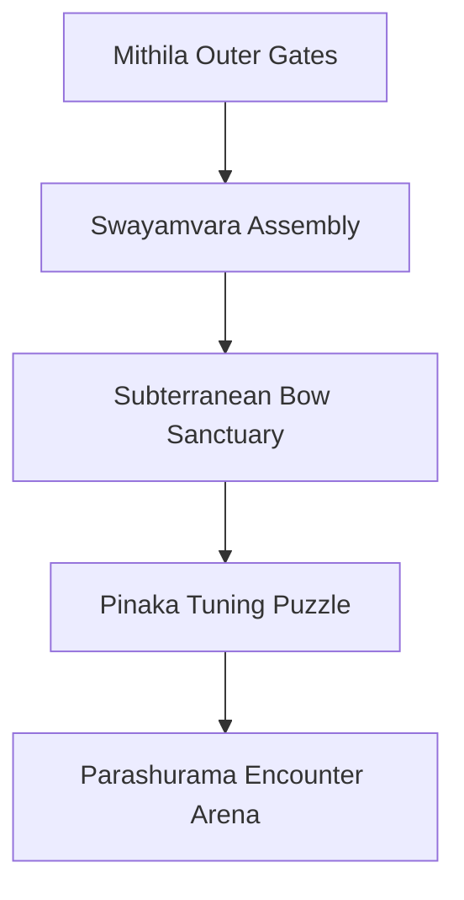

# Location: Mithila (The Kingdom of Scholars & Mystics)

*   **Location ID:** `LOC_MITHILA`
*   **Narrative Era:** Act 2 (The Bow of Shiva & The Swayamvara)
*   **Primary Aesthetic:** Terracotta Temples & Engraved Stone Reliefs

---

## 1. Visual & Atmospheric Specifications

| Parameter | GDD Specification & Rendering Engine Value |
| :--- | :--- |
| **Skybox Shader** | Pure white mid-day sun transitioning to a soft lavender and rose twilight skybox. High atmospheric clarity. |
| **Volumetric Lighting** | Sharp, silver-white light beams cutting through high temple clerestories. |
| **Atmospheric Fog** | Near-zero density (`0.005`), emphasizing sharp architectural silhouettes. |
| **Color Palette** | Main: `Hex #D35400` (Terracotta Red), Accent: `Hex #7F8C8D` (Granite Grey), Ritual: `Hex #FFFFFF` (Pure White Banners). |

### Aesthetic & Mood
Spiritual, intellectual, and deeply serene. The visual language favors ancient stone masonry, terracotta tile relief walls depicting historical sages, and open-air pavilions overflowing with sacred lotuses. White flags representing truth (*Satya*) flutter slowly in the wind.

---

## 2. Geographic Setting & Boundaries

*   **Regional Topography:** Vast green alluvial plains, dotted with tranquil mirror-like lakes and low-lying blue hills in the distance.
*   **Natural Boundaries:** Bordered by rich farmland and spiritual hermitages.
*   **Coordinate Bounds (Engine Units):** `X: -800m` to `X: 800m`, `Z: -1000m` to `Z: 1000m`.

---

## 3. Level Design & Sub-Zones

### A. The Grand Swayamvara Hall
*   **Layout:** Colossal circular open-air courtyard surrounded by concentric stone seating tiers.
*   **Interactive Asset:** The central wedding altar, heavily decorated with marigold garlands. During the Swayamvara, this area becomes the primary arena where global kings fail to budge the heavy cart of Shiva's Bow.

### B. Subterranean Pinaka Sanctuary (The Bow Vault)
*   **Aesthetics:** Polished white marble floors with inlaid emerald paths representing geological ley-lines.
*   **Level Elements:** A series of heavy stone doors operated by physical weight plates and rotating light-refraction crystals.
*   **Atmosphere:** Dark, subterranean coldness, with glowing green roots tracing the ceiling and lighting up the corridors.

### C. Terracotta Temple Altar
*   **Aesthetics:** Concentric red brick basins housing sacred sacrificial pits (*Yajna Kundas*).
*   **Gameplay Utility:** Active checkpoint buffers that purge player debuffs and recharge Spiritual/Prana reserves.

---

## 4. Gameplay Role & Level Mechanics

*   **Tuning Puzzles:** The player must solve the **Ley-Line Prism puzzle** to focus spiritual energy into the floor runes, neutralizing the Pinaka bow's absolute gravity seals and enabling it to be pushed.
*   **Swayamvara QTE Event:** A cinematic event where the player must coordinate button presses to grip the massive Bow of Shiva, lift it, pull back the heavy iron string, and eventually shatter the colossal wooden arch.
*   **Axe Boss Arena:** The court becomes an active battlefield. The player must run between stone pillars, using Sita's earth shields to block Parashurama's devastating shockwave shockwaves.

---

## 5. Acoustic & Audio Design

### Theme Ragas & Melodic Tracks
*   **Exploration State:** **Raga Yaman Kalyan** (Spiritual purity, peaceful intellect) played on classical *Veena* and slow hand-drums (*Tabla*).
*   **Swayamvara Tension:** **Raga Kedara** (Ethereal anticipation, holy light) with soaring flute scales and quiet, building percussion.
*   **Parashurama Battle:** **Raga Bhairav** (Fierce divine anger) using heavy brass instruments, dramatic choir chants, and intense *Pakhawaj* drums.

### Sound Effects (SFX) & Resonance
*   **Ambient Soundscapes:** Echoing copper bells, low rhythmic chanting of Vedic hymns by court priests, rustling of sacred dry grass, and water trickling into stone lotus ponds.
*   **Subterranean Acoustics:** The Pinaka vault uses a long, damp echo profile (`Reverb time: 4.2s`, `Damping: 45%`), amplifying the deep rumble of moving stone pillars.
