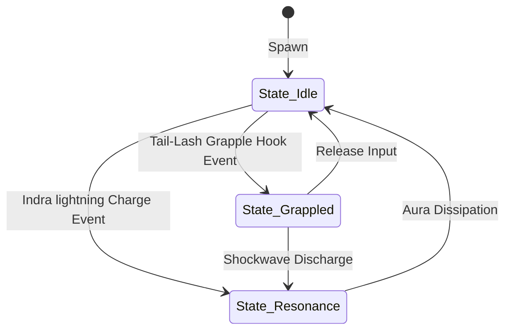

# Object: Airavat's Tusks

*   **Object ID:** `OBJ_AIRAVAT_TUSKS`
*   **Classification:** Interactive Environmental Platform, Dynamic Grapple Anchor & Destructible Boss Hazard

---

## 1. Physical Properties & Material Composition

| Parameter | Specification & Value |
| :--- | :--- |
| **Physical Dimensions** | Length: 25.0 meters (per tusk). Base Diameter: 2.8 meters tapering to 0.1 meters at tips. |
| **Volumetric Size & Weight** | Bounding Box: `[4.0m, 25.0m, 4.0m]`. Total Mass: 12,000 kg (per tusk). |
| **Material Composition** | Celestial Ivory (highly dense organic ivory matrix infused with divine *Amrita* nectar), creating self-regenerating crystalline outer shells. |
| **Structural Durability** | Core Durability: Infinite (cannot be destroyed by physical player attacks). Crystalline Armor Coating: 5,000 HP. |
| **Damage Resistances** | 95% Blunt Impact resistance, 100% Fire immunity. Vulnerable only to high-voltage electric/lightning (Vajra) energy resonance. |

### Mythological & Lore Context
Derived directly from the Vedic epics, the ivory tusks of *Airavat*—the four-tusked celestial white elephant born from the churning of the cosmic ocean (*Samudra Manthan*)—are symbols of absolute royal authority. Ridden by Lord Indra, Airavat acts as the guardian of the East direction (*Diggaja*), using his colossal tusks to pierce the dark rain-clouds and tear through Asuric fortresses.

---

## 2. Behavioral Mechanics & State Machine

### A. States Description
*   **State_Idle:** The tusks actively follow the neck rotation animations of the Airavat boss, sweeping across coordinate bounds. Colliding with the player inflicts 250 kinetic damage and high knockback.
*   **State_Grappled:** Playable Kid Hanuman latches onto the tusk using his Primal Tail hook. In this state, Hanuman's coordinates are bound as a child to the tusk bone animations, allowing him to swing and ascend Airavat's neck.
*   **State_Resonance:** The tusks are charged with Lord Indra's celestial Deva lightning. Any player in contact takes 80 electric damage per second and suffers controls lock (stun) unless they perform a quick release.

### B. Colliders & Physics Profile
*   **Collision Layer:** `Layer_Static_Hazard` & `Layer_Grapple_Target`.
*   **Physics Profile:** Custom cylindrical skeletal meshes with active physics assets, allowing dynamic collision calculations during swings.

---

## 3. Audio-Visual & Aesthetic Feedback

### A. Visual Effects (VFX)
*   **Passive Aura:** Cold white, translucent GPU particle trails radiating from the ivory pores, trailing behind tusk movement vectors.
*   **Active Resonance:** Expanding cyan lightning arches wrapping around the ivory grooves, using a scrolling noise texture on the emissive material channel.
*   **Impact Vfx:** Burst of glowing ivory-shards and gold dust sparks when the player attacks or grapples the tusk.

### B. Audio Feedback (SFX)
*   **Idle Sweeps:** Low-frequency air tearing wind sound (center frequency: 120Hz).
*   **Grapple Impact:** High-pitched rope whip snap followed by a metallic ring resonance note.
*   **Vajra Charge:** High-frequency electrical humming and cracking lightning sparks (center frequency: 8000Hz).
