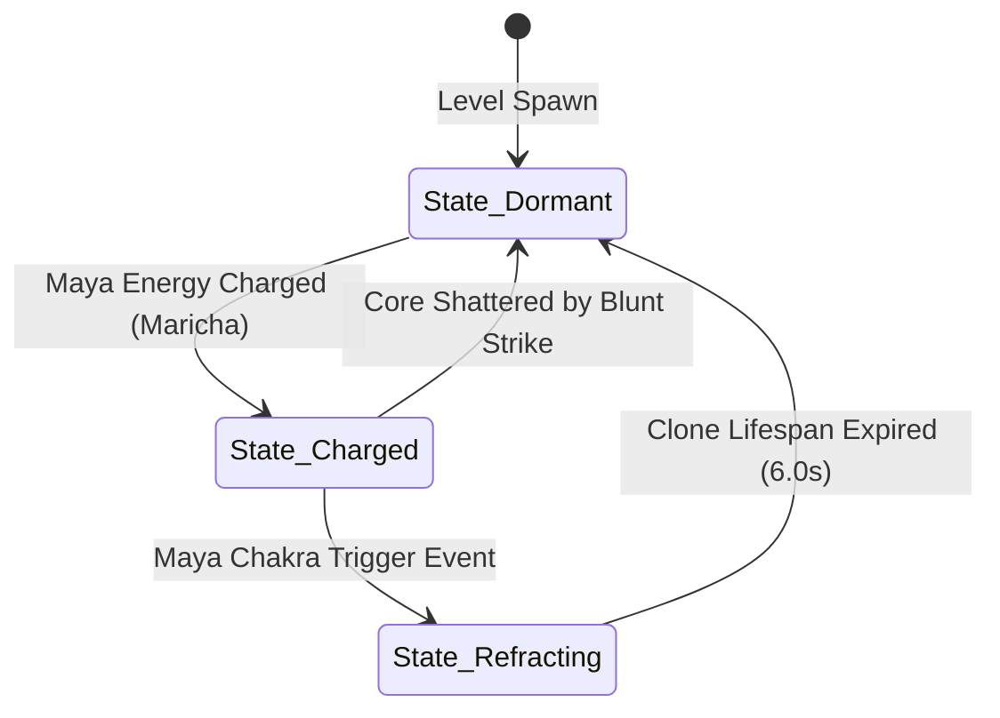

# Object: Decoy Prism

*   **Object ID:** `OBJ_DECOY_PRISM`
*   **Classification:** Static Interactive Puzzle Anchor, Illusion Refractor & Decoy Generator

---

## 1. Physical Properties & Material Composition

| Parameter | Specification & Value |
| :--- | :--- |
| **Physical Dimensions** | Base Diameter: 1.0 meter. Height: 3.8 meters. |
| **Volumetric Size & Weight** | Bounding Box: `[1.0m, 1.0m, 3.8m]`. Total Mass: 1,800 kg. |
| **Material Composition** | High-purity Crystalline Quartz Geode, naturally grown in a hexagonal pillar structure, mounted on a copper-banded soapstone pedestal. |
| **Structural Durability** | Base Pedestal HP: 4,000. Quartz Geode HP: 1,000. |
| **Damage Resistances** | 100% Magic/Illusion immunity. 80% Acid resistance. Highly vulnerable to blunt physical strikes (war maces/club weapons). |

### Mythological & Lore Context
Found in the mystical, high-energy groves of Dandakaranya, these crystalline geological structures resonate strongly with Asuric illusion sorcery (*Maya-Shakti*). Able to bend light and refract physical forms, they are utilized by the demon sorcerer Maricha to amplify his *Swarna-Mriga* (Golden Deer) illusion, helping him baffle the trackers of Ayodhya and escape Prince Rama's seeking arrows.

---

## 2. Behavioral Mechanics & State Machine

### A. States Description
*   **State_Dormant:** The crystal geode lies dull and transparent, reflecting only mundane sunlight. It absorbs ambient pollen particles from the air, slowly charging a local battery.
*   **State_Charged:** Playable Maricha (in Golden Deer form) runs through the pollen patches in the arena and steps onto the soapstone base. The geode absorbs his *Maya* aura, glowing with high-intensity neon-yellow light patterns along its crystal facets.
*   **State_Refracting:** The player triggers the **Maya Chakra** skill. The geode projects four identical, running **Golden Deer Decoy Clones** out of its core. The clones sprint along designated AI navigation paths, generating fake heat signatures that break Prince Rama's targeting sights and decoy his attention for 6.0 seconds.

### B. Interactive Triggers
*   **Pollen Capture Area:** A 4.0-meter circular volume around the prism. Any golden pollen dust trails generated by Maricha's dash inside this area are automatically funneled into the geode, charging the *Maya* energy bar by 15% per second.
*   **Decoy Launch Vector:** Emits pathing nodes aligned with the surrounding forest exit trails, directing the AI pathing vectors of the generated clones.

---

## 3. Audio-Visual & Aesthetic Feedback

### A. Visual Effects (VFX)
*   **Rainbow Light Dispersion:** High-quality crystal refraction shaders that project sweeping rainbow-colored light grids across the forest floor.
*   **Decoy Birth Vfx:** A brilliant explosion of gold dust sparkles at the geode core, with four solid golden deer silhouettes leaping out of the crystal face.
*   **Aura Pulses:** Concentrated yellow rings of energy pulsating along the soapstone base when actively charging.

### B. Audio Feedback (SFX)
*   **Charged State:** High-pitched, resonant crystal singing bowl vibration note (center frequency: 440Hz / A-note, evoking deep meditative vibration).
*   **Refraction Burst:** Sudden high-frequency glass shattering chord, combined with a clean, ascending synthesizer whoosh.
*   **Hologram Whir:** Soft, vibrating electronic hum that plays at the location coordinates of each running clone deer, keeping the auditive tracking consistent.
