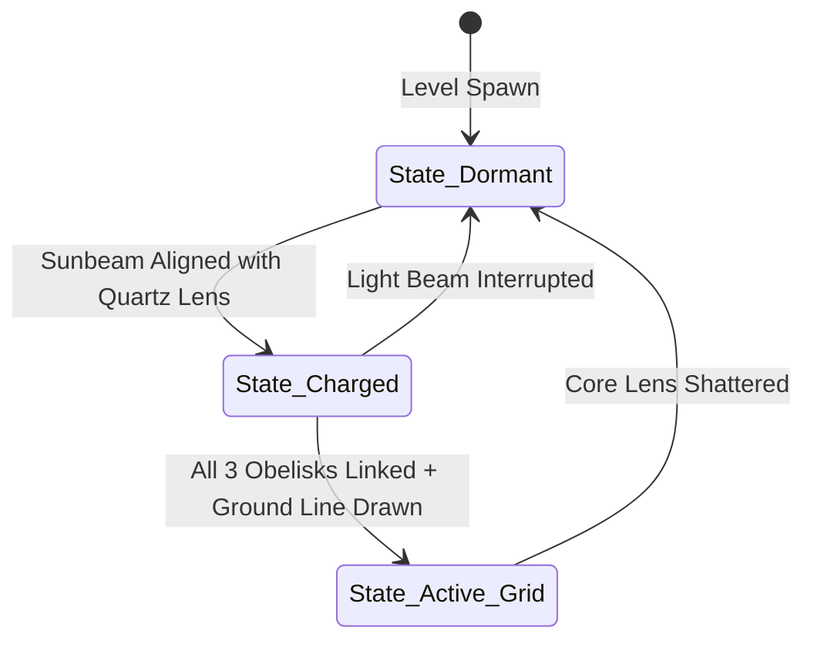

# Object: Lakshmana Rekha Obelisk

*   **Object ID:** `OBJ_LAKSHMANA_REKHA_OBELISK`
*   **Classification:** Static Interactive Puzzle Anchor, Energy Refractor & Boundary Projector

---

## 1. Physical Properties & Material Composition

| Parameter | Specification & Value |
| :--- | :--- |
| **Physical Dimensions** | Width: 1.5 meters. Depth: 1.5 meters. Height: 4.2 meters. |
| **Volumetric Size & Weight** | Bounding Box: `[1.5m, 1.5m, 4.2m]`. Total Mass: 4,000 kg. |
| **Material Composition** | High-density White Sandstone (*Vindhyachal stone*), bound by copper-wire coil conductors and fitted with a massive, dual-convex Solar Quartz Lens (*Suryakanta Sphatika*). |
| **Structural Durability** | Base Core HP: 8,000. Quartz Lens HP: 1,500. |
| **Damage Resistances** | 90% Blunt Impact resistance, 100% Fire immunity. 60% Magic/Spell absorption. |

### Mythological & Lore Context
Designed by Lakshmana using ancient geometric protection principles (*Raksha-Vidhya*), these three obelisks are placed surrounding the Panchavati ashram. Acting as anchors for the solar force, the line connecting them—the legendary **Lakshmana Rekha**—is an absolute boundary. Charged with the power of absolute vow (*Pratigna*), no Asuric or corrupt entity can cross this threshold, serving as the ultimate spiritual shield for Sita during Rama's absence.

---

## 2. Behavioral Mechanics & State Machine

### A. States Description
*   **State_Dormant:** The obelisk lies inactive. The copper wire conduits are cold, and no light is emitted. The player can interact with the mechanical hand-crank at the base to rotate the lens alignment.
*   **State_Charged:** A sunbeam reflected from the hanging copper forest mirrors passes through the *Suryakanta* quartz lens. The copper coils glow bright orange. The obelisk channels a continuous, laser-like **Solar Energy Thread** to the next adjacent obelisk in the grid.
*   **State_Active_Grid:** All three obelisks are charged and linked in a triangular loop. The player uses Lakshmana's dagger to draw a physical groove in the sand connecting the bases. The **Lakshmana Rekha Barrier** activates—a glowing, golden curtain of fire rises from the ground, vaporizing lesser Asuras that touch it.

### B. Interactive Triggers
*   **Optical Crank Trigger:** A 1.5-meter circular interaction zone at the base. Holding the interact key allows the player to rotate the obelisk's yaw axis by 360 degrees to line up the light channel.
*   **Lens Damage Trigger:** The quartz lens has a separate hurtbox. Ranged Asuric flyers target the lens specifically; breaking it drops the obelisk back to `State_Dormant` until repaired.

---

## 3. Audio-Visual & Aesthetic Feedback

### A. Visual Effects (VFX)
*   **Light Channel Beam:** A highly concentrated, glowing orange-gold laser beam (width: 0.1m) connecting the quartz lenses of the charged obelisks.
*   **Barrier Fire Wall:** A shimmering, semi-transparent golden wall of fire rising 3 meters from the ground along the drawn boundary lines, filled with pulsing geometric Sanskrit protection runes.
*   **Lens Bloom:** High-intensity blinding lens bloom at the center of the quartz crystal when actively reflecting sunbeams.

### B. Audio Feedback (SFX)
*   **Charged Hum:** A steady, clean, high-frequency electrical solar hum (center frequency: 2200Hz) indicating active energy currents.
*   **Rotational Crank:** Heavy, clicking stone gear turns and squealing copper-wire tensions.
*   **Barrier Impact:** High-voltage crackling sound, combined with a loud *zap* and vaporizing hiss when enemies strike the barrier.
