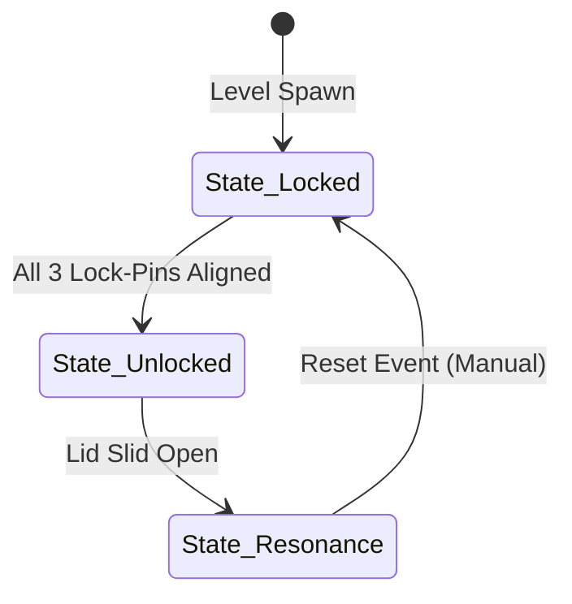

# Object: Pinaka Bow Vault

*   **Object ID:** `OBJ_PINAKA_VAULT`
*   **Classification:** Static Interactive Puzzle Chest & Quest Anchor

---

## 1. Physical Properties & Material Composition

| Parameter | Specification & Value |
| :--- | :--- |
| **Physical Dimensions** | Length: 10.0m. Width: 4.0m. Height: 3.5m (Equipped with 8 massive iron cart wheels). |
| **Volumetric Size & Weight** | Bounding Box: `[10.0m, 4.0m, 3.5m]`. Total Mass: 1,000,000 kg (under active seal pressure). |
| **Material Composition** | Petrified Celestial Iron (forged in the volcanic vents of Mount Kailash), wrapped in dense basalt stone bands and inlaid with pure silver Sanskrit runes. |
| **Structural Durability** | Core Durability: Infinite (completely indestructible by standard physical damage). |
| **Gravity Seal Lock-Pins** | Three active mechanical locking cores, designated as: `PIN_GATI` (Rotation), `PIN_STHIRA` (Stability), and `PIN_AKASHA` (Weight). |

### Mythological & Lore Context
The massive iron chest houses the legendary bow *Pinaka* (Shiva's Bow), gifted by Lord Shiva to King Devaratha (ancestor of King Janaka) after the destruction of Daksha's sacrifice. Heavy enough to require an eight-wheeled iron cart dragged by hundreds of strong men, the bow represents the raw weight of the cosmos. Its storage vault serves as the ultimate test of spiritual lineage in Mithila.

---

## 2. Behavioral Mechanics & State Machine

### A. States Description
*   **State_Locked:** The three gravity seals are active. The vault chest projects an active **Gravity-Well Field** in an 8-meter radius, slowing player movement speed by 75% and preventing the player from pushing or interacting with the chest lid.
*   **State_Unlocked:** The three rotatable *Ley-Line Prisms* have successfully focused sunbeams onto the three floor runes. The *Gravity-Well Field* collapses. The active mass of the chest drops to 0 kg. Young Sita can push the chest aside with a simple hand gesture to retrieve her toy ball.
*   **State_Resonance:** The player slides open the massive iron lid. Shiva's bow, *Pinaka*, is exposed, casting a towering vertical beacon of turquoise spiritual light. The chest emits a continuous kinetic wind wave (pushing players back at a rate of 2 meters per second) until the bow is lifted.

### B. Collider & Physics Configuration
*   **Collision Layer:** `Layer_Static_Obstacle` (locked) transitioning to `Layer_Movable_Prop` (unlocked).
*   **Physics Profile:** Rigid-body asset with locked rotational axes, allowing linear sliding movement only along the X-axis once unlocked.

---

## 3. Audio-Visual & Aesthetic Feedback

### A. Visual Effects (VFX)
*   **Locked State Particles:** Heavy, dark blue volumetric energy vortexes swirling downwards from the ceiling, anchoring the chest to the floor plates.
*   **Unlock Event:** A bright, flashing expansion of white and gold light particles (intensity: 5,000 Lumens) that disperses the blue gravity mist.
*   **Rune Glow:** The silver Sanskrit engravings shift from an active pulsing turquoise (locked) to a steady, soft silver light (unlocked).

### B. Audio Feedback (SFX)
*   **Locked Drone:** A deep, low-frequency sub-bass stone vibration hum (center frequency: 32Hz, representing gravitational mass pressure).
*   **Pin Alignment:** High-pitched crystal bell ring followed by a heavy metallic *clank* as a lock-pin retracts.
*   **Swayamvara Slide:** Colossal, scraping stone-on-stone and iron grinding SFX as the lid is pushed back.
