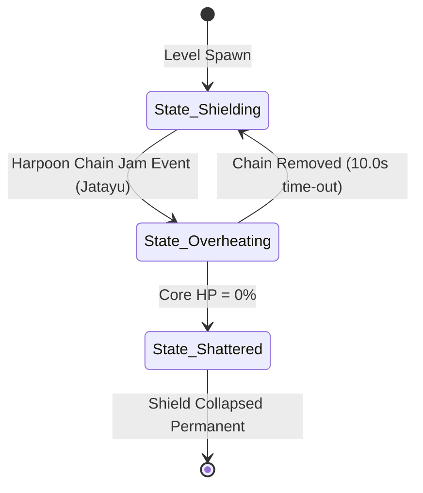

# Object: Pushpaka Shield Core

*   **Object ID:** `OBJ_PUSHPAKA_SHIELD_CORE`
*   **Classification:** Static Interactive Puzzle Anchor, Shield Generator & Destructible Boss Hazard

---

## 1. Physical Properties & Material Composition

| Parameter | Specification & Value |
| :--- | :--- |
| **Physical Dimensions** | Diameter: 3.5 meters (Spherical turbine structure). |
| **Volumetric Size & Weight** | Bounding Box: `[3.5m, 3.5m, 3.5m]`. Total Mass: 6,000 kg. |
| **Material Composition** | Celestial Gold-Brass alloy gearwork, encasing a massive, glowing raw lava-ruby core crystal (*Lanka-Mani*). |
| **Structural Durability** | Base Core HP: 12,000. Core Armor Rating: 90 (High physical defense). |
| **Damage Resistances** | 100% Fire/Heat immunity. 80% Ranged physical weapon resistance. Highly vulnerable to raw kinetic forces (such as being jammed by heavy metal chains). |

### Mythological & Lore Context
The *Pushpaka Vimana*—the legendary flying chariot created by the divine architect Vishwakarma for Lord Brahma—was later gifted to Kubera (the god of wealth) before being stolen by his half-brother, the demon king Ravana. Powered by mercury turbines and celestial heat energy, the fortress utilizes three golden *Shield Cores* located on its wings to project an absolute invincibility barrier, protecting its passenger deck from celestial attacks.

---

## 2. Behavioral Mechanics & State Machine

### A. States Description
*   **State_Shielding:** The core rotates at extreme velocities, emitting a high-pitched turbine whine. Projects a massive golden energy barrier around the main deck of the Pushpaka Vimana. Ravana is 100% immune to damage in this state.
*   **State_Overheating:** Playable Jatayu catches a heavy metal harpoon chain fired by the defensive ballistas and drags it into the core’s rotating gears, jamming the turbine mechanism. The gears halt with violent clashing sounds, the core vents open, and the core armor rating drops to zero. Jatayu can now deal direct physical talon damage to the exposed lava-ruby crystal.
*   **State_Shattered:** The lava-ruby crystal's HP is reduced to 0. It shatters in a massive explosion, permanently disabling the wing shield and dealing 1,000 fire damage to the Vimana hull.

### B. Interactive Triggers & Colliders
*   **Chain Lock-on Point:** A socket on the gear teeth mesh that allows Jatayu to tether the harpoon chain using a quick QTE grapple sequence.
*   **Heat-Sink Vent Hitbox:** Becomes active only during the overheating state, amplifying damage taken from crushing talon strikes by 200%.

---

## 3. Audio-Visual & Aesthetic Feedback

### A. Visual Effects (VFX)
*   **Active Shield Grid:** A highly decorative golden honeycomb grid barrier surrounding the Vimana, pulsing with heat distortion waves.
*   **Overheat Steam Vfx:** High-velocity volumetric white steam jets venting from the core side hatches, layered with bright red heat-distortion fields.
*   **Shatter Explosion:** A massive blast of red fire particles, smoke plumes, and glittering red crystal shards that rain down through the clouds.

### B. Audio Feedback (SFX)
*   **Turbine Whine:** High-pitched, mechanical whistling sound that scales in pitch with the speed of rotation (center frequency: 3500Hz).
*   **Gear Jam:** Loud, metallic scraping and crushing iron clatter sounds, followed by an alarm-like warning siren note.
*   **Shatter Event:** High-amplitude glass explosion, followed by deep thunder rumbles as the energy field collapses.
