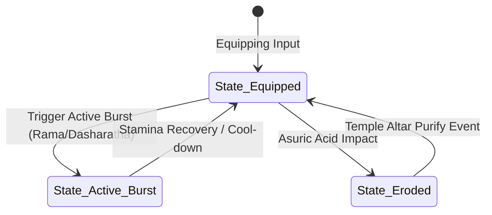

# Object: Royal Solar Torch

*   **Object ID:** `OBJ_ROYAL_SOLAR_TORCH`
*   **Classification:** Equippable Weapon/Utility & Dispel Light Emitter

---

## 1. Physical Properties & Material Composition

| Parameter | Specification & Value |
| :--- | :--- |
| **Physical Dimensions** | Length: 1.2 meters. Head Diameter: 0.15 meters. Shaft Diameter: 0.05 meters. |
| **Volumetric Size & Weight** | Bounding Box: `[0.2m, 1.2m, 0.2m]`. Total Mass: 3.5 kg. |
| **Material Composition** | Refined Temple Gold, hand-engraved with solar sunwheel coordinates. Capped with a raw, facets-cut Solar Sunstone (*Suryakanta* crystal). |
| **Structural Durability** | Base Torch Integrity: 1,500 HP. Flame lifetime capacity: Unlimited (powered by spiritual solar charge). |
| **Damage Resistances** | 100% Shadow/Miasma erosion immunity. 70% Blunt Impact resistance. Vulnerable only to raw Asuric acid sprays. |

### Mythological & Lore Context
Wielded by the rulers of the Solar Dynasty (*Ikshvaku Clan*), this ceremonial royal scepter torch is blessed in the holy fire altars of the Sun God, Surya. It represents the light of righteousness (*Dharma*) piercing the dark veil of ignorance and political corruption. In times of deep internal crisis, the King carries it into the palace vaults to cleanse creeping demonic shadow-remnants from past military campaigns.

---

## 2. Behavioral Mechanics & State Machine

### A. States Description
*   **State_Equipped:** The player holds the torch. The object projects a continuous **Dispel Light Cone** (60-degree sweep angle, range: 10.0 meters) directly aligned with the player's weapon camera vector. Shadow phantoms (*Chhaya-Shatrus*) caught within the light cone are slowed by 40% and take 50 light damage per second.
*   **State_Active_Burst:** The player presses the secondary attack trigger. The torch releases **Surya-Prakash**—a massive, instantaneous 360-degree shockwave of bright solar fire (radius: 8.0 meters). All shadow phantoms within range are vaporized instantly; heavy Asuric commanders are staggered for 3.0 seconds. Consumes 50 player stamina.
*   **State_Eroded:** Hit by demonic acid sprays, the Solar Sunstone gets coated in grease. The *Dispel Light Cone* width shrinks to 20 degrees, and damage output drops by 50% until the player stands near a holy fire altar to cleanse it.

### B. Collider & Physics Configuration
*   **Collision Layer:** `Layer_Light_Weapon`.
*   **Physics Profile:** Trigger-volume capsule colliders mapped to the visual light mesh boundaries, calculating overlapping shadow pawns dynamically.

---

## 3. Audio-Visual & Aesthetic Feedback

### A. Visual Effects (VFX)
*   **Solar Light Cone:** Bright, golden volumetric light beams filled with drifting solar ember particles, using high-intensity rendering shaders.
*   **Active Burst Vfx:** A brilliant sphere of gold light expanding rapidly, followed by thin circular shockwave rings that travel along the ground.
*   **Shadow Evaporation:** Creeping black smoke and tiny purple ashes disintegrating into gold dust when shadow phantoms are touched by the light.

### B. Audio Feedback (SFX)
*   **Idle Flame:** Gentle crackling log and high-pitched crystal humming (center frequency: 400Hz).
*   **Active Burst:** Deep, explosive fire whoosh, layered with a high-pitched resonant crystal bell strike (representing the solar crystal's release).
*   **Shadow Dispel:** Sizzling and whispering steam sounds, accompanied by high-frequency screaming sound bites.
