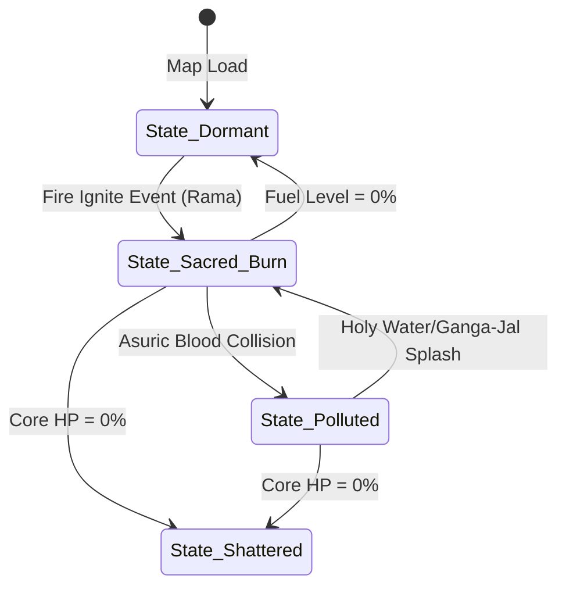

# Object: Vishwamitra's Sacred Altar

*   **Object ID:** `OBJ_VISHWAMITRA_SACRED_ALTAR`
*   **Classification:** Static Interactive Objective, Shield Generator & Quest Anchor

---

## 1. Physical Properties & Material Composition

| Parameter | Specification & Value |
| :--- | :--- |
| **Physical Dimensions** | Width: 6.0m. Length: 6.0m. Height: 2.5m (Sacrificial pit depth: 1.2m). |
| **Volumetric Size & Weight** | Bounding Box: `[6.0m, 6.0m, 2.5m]`. Total Mass: 15,000 kg. |
| **Material Composition** | Vedic Terracotta bricks (*Ishtaka*), bound by sacred clay and cow-dung mortar, layered with sandalwood paste and engraved gold sheets. |
| **Structural Durability** | Base Altar HP: 10,000. Holy Shield Energy capacity: 1,000 points. |
| **Damage Resistances** | 100% Fire immunity. 80% Magic/Spell resistance. Highly vulnerable to organic Asuric pollution (blood/bone impacts), which bypasses physical armor. |

### Mythological & Lore Context
The sacrificial fire altar (*Yajna-Vedi*) at Siddhashrama is constructed by Sage Vishwamitra according to ancient cosmic geometry (*Sulba Sutras*). Serving as a multi-dimensional channel, the altar allows offerings of clarified butter (*Ajya*) and soma to reach the Devas, strengthening cosmic order. Safeguarding its purity against Asuric pollution is the primary duty of Rama and Lakshmana during their training.

---

## 2. Behavioral Mechanics & State Machine

### A. States Description
*   **State_Dormant:** The altar lies unlit. No passive shields are active. The player must approach and perform an ignition ritual (using the Solar Torch or sacred flame arrow) to boot the level.
*   **State_Sacred_Burn:** The holy fire burns bright. Generates a spherical containment barrier (**Tapas-Bala Shield**) in a 15-meter radius. Lesser Asuras attempting to cross the boundary take 150 fire damage and are knocked back. The shield drains fuel at a rate of 2% per second.
*   **State_Polluted:** Asuric flying ghouls succeed in dropping blood or bone waste into the altar. The *Tapas-Bala Shield* instantly collapses. The altar's core HP begins draining at 100 HP per second, emitting toxic green fumes that deal poison damage to the player if they stand nearby.
*   **State_Shattered:** Altar HP drops to zero. The brickwork explodes in dark dust, triggering a catastrophic mission failure cinematic.

### B. Interactive Triggers
*   **Fuel Deposit Trigger:** A 3.0-meter circular box collider. When the player carries a *Sacred Wood Bundle* into this circle and presses the interact key, the fuel bar increases by 25%.
*   **Purification Trigger:** Hitting the polluted altar with a *Ganga-Jal (Holy Water) Flask* projectile instantly cleanses the altar, reverting it to `State_Sacred_Burn`.

---

## 3. Audio-Visual & Aesthetic Feedback

### A. Visual Effects (VFX)
*   **Holy Fire Particle System:** Highly stylized orange-gold flames with upward-rising glowing Sanskrit *Homa* characters (*"OM"*, *"SWAAHAA"*) drifting into the sky.
*   **Active Boundary Shield:** A translucent, shimmering gold geometric geodesic dome representing the *Tapas-Bala* shield, rippling with light ripples when struck.
*   **Pollution Smoke:** Thick, oily, dark-purple and green swirling smoke column that replaces the golden flames during the polluted state.

### B. Audio Feedback (SFX)
*   **Vedi Idle:** Crackling high-quality log-burning SFX, layered with deep, low-frequency atmospheric wind-draft hum (center frequency: 80Hz).
*   **Fuel Deposit:** High-pitched brass chime chord (Raga Yaman major notes).
*   **Pollution Strike:** Hissing sound resembling cold water hitting hot iron, accompanied by deep whispering demonic vocal tracks.
