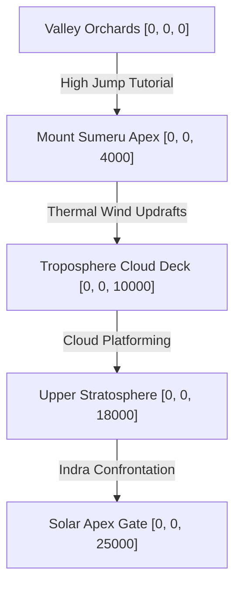

# Scene: Sumeru Stratosphere

*   **Scene ID:** `SCENE_SUMERU_STRATOSPHERE`
*   **Associated Mission:** [Mission0_Hanuman_Prologue.md](../Missions/Mission0_Hanuman_Prologue.md)
*   **Classification:** Vertical Traversal, Sky Dogfight & Storm Arena

---

## 1. Scene Metadata & Climatic Profile

| Parameter | Specification & Value |
| :--- | :--- |
| **Location Coordinate Range** | Base Camp: `[0, 0, 0]` to Stratosphere Apex: `[0, 0, 25000]` |
| **Time of Day** | Early Dawn (5:15 AM to 6:30 AM). Solar elevation shifts from -2° to +12° (Golden Sunrise). |
| **Wind & Aerodynamic Vector** | Ground: 15 km/h (Slight valley draft). Stratosphere: 120 km/h Jet Stream (directional wind-shear vectors at `[1, 0, 0]`). |
| **Atmospheric Moisture & Humidity** | Ground level: 92% (High condensation). Stratosphere level: 8% (Extreme dry frost). |
| **Precipitation & Particulate Density** | Troposphere layer `[8000m to 12000m]`: Heavy ice crystal precipitation and supercooled water vapor. |
| **Visual Range & Fog Volume** | Valley: 500m. Cloud-deck: 15m (dense volumetric fog). Stratosphere: Infinite clear visual tracking. |

### Narrative Situation
Enchanted by the rising sun which he mistakes for a ripe, glowing celestial mango, the child Hanuman escapes the watchful eyes of Mother Anjana. He performs a spectacular, gravity-defying leap from the apex of Mount Sumeru, ascending through layers of the sky. This intrusion into the celestial highway alerts the Deva gatekeepers and sparks an aerial confrontation with Lord Indra.

---

## 2. Audio-Visual & Aesthetic Setup

### A. Lighting Profile & Rendering
*   **Direct Solar Lighting:** 6500K transitioning to a warm 2500K golden sunrise glare. Sunlight intensity scales from 80,000 Lux to 140,000 Lux in the upper atmosphere.
*   **Ambient Lighting:** Blue-gray cloud scatter reflections with warm rose rim-lighting on floating mist edges.
*   **Volumetric Fog:** Niagara dust-motes and gold-dust particle systems driven by wind vector fields.

### B. Camera Setup & Tracking
*   **Ground Sprint Phase:** Standard third-person trailing camera (FOV: 75°, Distance: 4.5m, Height: 1.8m).
*   **Ascent Phase (Vertical Scroll):** Dramatic vertical pull-away camera (FOV: 90°, Distance: 12m, looking downwards to emphasize altitude and scale).
*   **Stratosphere Battle Phase:** Wide panoramic orbital camera with high tracking speed to follow extreme velocity movements.

### C. Soundscape & Acoustic Profile
*   **Core Raga Theme:** *Raga Shankara* (evoking heroism, raw energy, and connection to Lord Shiva).
*   **Acoustic Space:** Wide open sky acoustic model. Sound propagation speeds are decreased at high altitudes, producing a muffled, low-pass filter effect on screams and wind-shears.
*   **Sound Effects (SFX):** Rushing stratospheric wind hum, thunder cracks, celestial conch echoes from Airavat, and high-frequency Vajra sparks.

---

## 3. Level Design Layout & Boundaries

### Traversal Elements
*   **Sumeru Orchards:** Mossy stone structures, high vines, and bouncy palm canopies acting as organic jump-pads.
*   **Thermal Wind Columns (Vayu-Vyuha):** Vertical channels of warm rising air that carry Hanuman upwards when the player holds the glide action.
*   **Condensation Cloud Pads:** Temporary platforms made of solid cloud condensation that hold the player's weight for 3.0 seconds before evaporating, requiring fast parkour.

### Boundaries & Death Zones
*   **Lateral Boundaries:** Bound by localized high-velocity thermal slipstreams that gently bounce the player back into the playable center coordinates.
*   **Thermal Death Plane:** If the player falls past the troposphere layer (`z < 4000m`) during the ascent phase without grappling a vine or wind column, an automated wind rescue cinematic by Vayu triggers, restarting the phase with a minor stamina penalty.

---

## 4. Reusable Object Placement Grid

| Object ID | Target Coordinates | Anchor Type | Interactive Function |
| :--- | :--- | :--- | :--- |
| `OBJ_AIRAVAT_TUSKS` | `[0, 200, 20000]` | Dynamic Pawn Anchor | Used as wall-run surface and grapple swing point during Boss phase 1. |
| `OBJ_VAJRA_CORE` | `[0, 0, 24000]` | Static Interactive Core | Generates lightning fields that must be navigated. |
