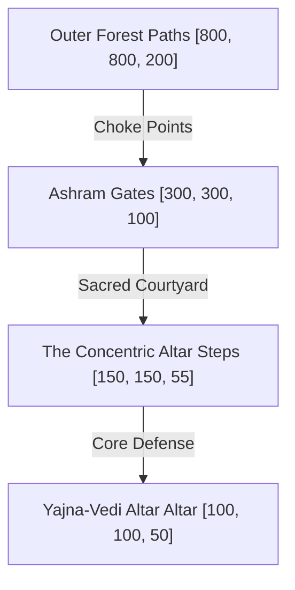

# Scene: Siddhashrama Altar

*   **Scene ID:** `SCENE_SIDDHASHRAMA_ALTAR`
*   **Associated Mission:** [Mission1_Rama_Youth.md](../Missions/Mission1_Rama_Youth.md)
*   **Classification:** Sanctuary Defense, Ritual Altar Arena & Forest Border

---

## 1. Scene Metadata & Climatic Profile

| Parameter | Specification & Value |
| :--- | :--- |
| **Location Coordinate Range** | Altar Center: `[100, 100, 50]` to Forest Boundary: `[800, 800, 200]` |
| **Time of Day** | Late Dusk (5:00 PM to 6:45 PM). Solar elevation shifts from +15° to -5° (Twilight Sunset). |
| **Wind & Aerodynamic Vector** | Woodland draft: 8 km/h. Sudden Asuric gust fields up to 45 km/h during demonic incursions. |
| **Atmospheric Moisture & Humidity** | 65% Humidity (standard woodland condensation). |
| **Precipitation & Particulate Density** | Drifting holy incense soot and glowing fire embers. Volumetric black ash flakes near the altar bounds. |
| **Visual Range & Fog Volume** | Woodland clearing: 120m. Demonic smoke zones: 8m (heavy Asuric particulate block). |

### Narrative Situation
Deep within the sacred forest sanctuary of Siddhashrama, Sage Vishwamitra conducts a massive sacrificial ritual (*Yajna*) to preserve cosmic order. Prince Rama is charged with guarding the ritual altar (*Yajna-Vedi*) from the sky-dwelling demons Tataka and Subahu. The demons seek to desecrate the holy fires with blood and bone carcasses, forcing Rama to maintain absolute vigilance across multiple forest choke points.

---

## 2. Audio-Visual & Aesthetic Setup

### A. Lighting Profile & Rendering
*   **Primary Light Source:** The glowing, holy fire of the *Yajna-Vedi*, casting a rich orange-red flicking light (intensity: 5,000 Lumens, color temperature: 1800K).
*   **Ambient sky light:** Deep indigo twilight dome, casting dark blue fills on forest shadows.
*   **Volumetric Fog:** Thick white incense haze floating near ground layers, contrasting with dark purple smoke plumes rising from demon spawn points.

### B. Camera Setup & Tracking
*   **Altar Guard Phase:** Overhead tracking camera (FOV: 65°, Distance: 8.5m, Height: 4.5m) angled at 45 degrees to allow high situational awareness of multi-directional attacks.
*   **Forest Exploration/Patrol:** Tactical third-person camera with quick shoulder-swapping to track archery angles in dense woods.

### C. Soundscape & Acoustic Profile
*   **Core Raga Theme:** *Raga Yaman* (evoking deep devotional peace, twilight devotion, and protective vigilance).
*   **Acoustic Space:** Dense forest canopy echo chamber. Natural reverb dampening from thick foliage, combined with high-frequency wooden wind-chime vibrations.
*   **Sound Effects (SFX):** Crackling sacred timber logs, rhythmic Sanskrit chanting of sages, low-frequency demonic wing flapping, and the crisp *thwang* of Rama's bow.

---

## 3. Level Design Layout & Boundaries

### Traversal Elements
*   **Sacred Steps:** Concentric octagonal stone rings rising towards the altar, offering high-ground defense multipliers for ranged attacks.
*   **Wooden Archways & Scaffolds:** Elevated straw pavilions that Rama can double-jump onto to secure clear sniping sightlines across the incoming waves.
*   **Thorn Barricades:** Natural briar hedges that slow demon infantry movements by 40% but are susceptible to fire damage.

### Boundaries & Death Zones
*   **Outer Boundaries:** Locked by dense, impenetrable ancient briar-walls wrapped in protective sage barriers (*Tapas-Shakti*). Approaching the barrier inflicts a minor knockback.
*   **The Altar Desecration Zone:** If a demon succeeds in throwing Asuric waste into the central fire altar, the holy fire meter drops. Reaching 0% triggers a mission failure cinematic where the ashram collapses into dark fog.

---

## 4. Reusable Object Placement Grid

| Object ID | Target Coordinates | Anchor Type | Interactive Function |
| :--- | :--- | :--- | :--- |
| `OBJ_VISHWAMITRA_ALTAR` | `[100, 100, 50]` | Static Interactive Altar | Central defense objective. Consumes holy firewood to restore protection shields. |
| `OBJ_SACRED_WOOD_BIN` | `[150, 120, 52]` | Spawn Generator | Yields ritual wood bundles that the player must carry to feed the altar fires. |
