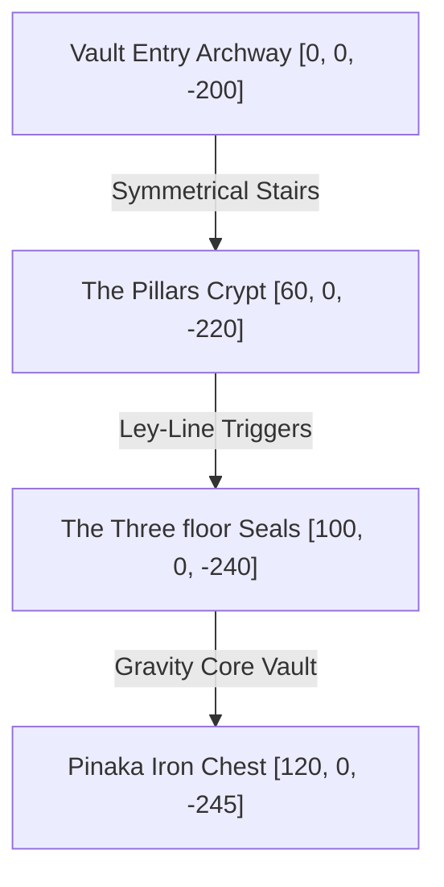

# Scene: Pinaka Sanctuary

*   **Scene ID:** `SCENE_PINAKA_SANCTUARY`
*   **Associated Mission:** [Mission2_Sita_Mithila.md](../Missions/Mission2_Sita_Mithila.md)
*   **Classification:** Subterranean Vault, Ancient Puzzle Hall & Swayamvara Altar

---

## 1. Scene Metadata & Climatic Profile

| Parameter | Specification & Value |
| :--- | :--- |
| **Location Coordinate Range** | Entry Gate: `[0, 0, -200]` to Sanctuary Altar: `[150, 0, -250]` |
| **Time of Day** | Eternal Twilight (Vault interior). Sunlight is routed from the palace towers via dynamic stone mirror columns. |
| **Wind & Aerodynamic Vector** | Still Air: 2 km/h. Localized gravitational wind fields up to 35 km/h when Pinaka's seals are active. |
| **Atmospheric Moisture & Humidity** | 40% Humidity (Controlled dry subterranean microclimate). |
| **Precipitation & Particulate Density** | Zero precipitation. Floating gold-dust particulates and floating marble dust flakes. |
| **Visual Range & Fog Volume** | Clear indoor visibility up to 250m. Minor volumetric light beams highlighting dust particles. |

### Narrative Situation
Deep within the bedrock beneath the palace of Mithila lies the Pinaka Sanctuary. This cavernous white marble hall serves as the vault for Shiva's legendary celestial bow, *Pinaka*. Secured within a massive gravity-locked iron chest, the bow remains unbudged by entire armies of suitors. Here, a young child Sita casually unlocks the ancient earth seals to retrieve her lost ball, and later, the Swayamvara reaches its climax as Prince Rama attempts to string and break the divine armament.

---

## 2. Audio-Visual & Aesthetic Setup

### A. Lighting Profile & Rendering
*   **Primary Light Source:** Concentrated sunbeams funneled through copper palace mirror ducts, creating stark volumetric light columns (5000K, pure white light).
*   **Secondary Light Source:** Glowing turquoise gravity runes along the floor tiles, casting soft blue up-lighting on the marble pillars.
*   **Specular Highlights:** High reflection on polished white marble floors and gold-leaf wall-frescoes.

### B. Camera Setup & Tracking
*   **Puzzle Phase:** Cinematic isometric orthographic camera (FOV: 55°, Distance: 15m, Height: 8m) allowing the player to see all three elemental floor-seals and the central chest simultaneously.
*   **Swayamvara Cinematic Phase:** Ultra-wide theatrical camera angles with heavy screen-shake filters activated when the Pinaka is bent and snapped.

### C. Soundscape & Acoustic Profile
*   **Core Raga Theme:** *Raga Yaman* (during exploration/puzzle phases) shifting to *Raga Bhairav* (epic, divine scale during the bow-stringing climax).
*   **Acoustic Space:** Extreme cathedral-like reverb (RT60: 4.5 seconds). Sounds of stone scrapes, footsteps, and sliding iron chests echo extensively off the marble walls.
*   **Sound Effects (SFX):** Low-frequency hum of gravity seals, metallic chime of active prisms, the thunderous snap of the Pinaka bow, and Parashurama's roaring entrance wind.

---

## 3. Level Design Layout & Boundaries

### Traversal Elements
*   **Symmetrical Stairs:** Twin flights of white marble steps descending from the entry archways, allowing parallel routes for puzzle coordination.
*   **Tuning Columns:** Rotating octagonal stone mirrors that can be spun using manual cranks to direct light beams onto target floor runes.
*   **The Gravity Well:** A circular pit in the vault center surrounding the Pinaka bow chest, which applies a high gravity force (slowing movement speed by 75%) until the seals are aligned.

### Boundaries & Death Zones
*   **Level Boundaries:** Impenetrable white stone walls carved with sacred Mount Kailash runes. Touching them without alignment results in minor kinetic recoil.
*   **Infinite Fall Zones:** None. The level is entirely enclosed within bedrock, eliminating standard falling death hazards.

---

## 4. Reusable Object Placement Grid

| Object ID | Target Coordinates | Anchor Type | Interactive Function |
| :--- | :--- | :--- | :--- |
| `OBJ_PINAKA_VAULT` | `[120, 0, -245]` | Static Interactive Chest | Heavy chest housing Shiva's bow. Weighs 1,000,000 kg until the ley-line prisms are aligned. |
| `OBJ_LEY_LINE_PRISM` | `[100, -30, -240]` | Rotatable Actor | Mirror column used to align light beams with floor runes. |
