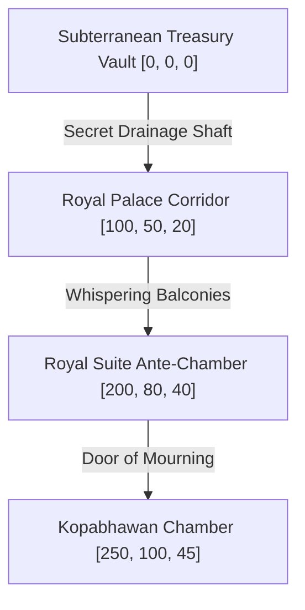

# Scene: Palace Anger (Kopabhawan)

*   **Scene ID:** `SCENE_PALACE_ANGER`
*   **Associated Mission:** [Mission3_Dasharatha_Exile.md](../Missions/Mission3_Dasharatha_Exile.md)
*   **Classification:** Palace Chambers, Dialogue Arena & Subterranean Treasury Vault

---

## 1. Scene Metadata & Climatic Profile

| Parameter | Specification & Value |
| :--- | :--- |
| **Location Coordinate Range** | Treasury Base: `[0, 0, 0]` to Kopabhawan Chambers: `[250, 100, 45]` |
| **Time of Day** | Midnight (9:00 PM to 2:00 AM). Pitch-black night sky with torrential rain storm raging outside. |
| **Wind & Aerodynamic Vector** | Indoor: 0-3 km/h (Stagnant, suffocating air). Corridor draft: 12 km/h near exterior stone balconies. |
| **Atmospheric Moisture & Humidity** | 78% Humidity (Heavy rain air seepage). |
| **Precipitation & Particulate Density** | Drifting black soot particles from extinguished oil lamps. Dynamic screen tear-drop condensation mapping. |
| **Visual Range & Fog Volume** | Closed palace halls: 40m. Vault shadow-zones: 5m (heavy dark volumetric fog occlusion). |

### Narrative Situation
As night covers the royal city of Ayodhya, a silent tragedy unfolds within the palace walls. Having fallen victim to Queen Kaikeyi’s demands (orchestrated by the hunchback maid Manthara), King Dasharatha wanders through the darkened royal corridors. He is tormented by the phantoms of his ancient sins—most notably the accidental shooting of Shravana Kumar. The palace shifts from a place of golden majesty into a dark, claustrophobic prison, culminating in the grief-stricken confrontation in the Chamber of Anger (*Kopabhawan*).

---

## 2. Audio-Visual & Aesthetic Setup

### A. Lighting Profile & Rendering
*   **Primary Light Source:** Extinguished or flickering brass floor-lamps (intensity: 300 Lumens, color temperature: 1500K deep amber).
*   **Ambient Fill:** Stormy cold blue moonlight filtering through open stone jali-windows, casting lattice-like shadow designs on the floors.
*   **Shadow Casting:** Dynamic, elongated shadows cast by structural columns, creating organic stealth hideouts for tracking Manthara.

### B. Camera Setup & Tracking
*   **Palace Traversal/Stealth:** Tight, claustrophobic third-person shoulder camera (FOV: 50°, Distance: 3m, Height: 1.6m) focused close to Dasharatha, emphasizing his shaking frame and heavy breathing.
*   **Kopabhawan Dialogue Battle:** Symmetrical split-angle camera, cutting between close-ups of Dasharatha's despondent expressions and Kaikeyi's cold, unyielding face.

### C. Soundscape & Acoustic Profile
*   **Core Raga Theme:** *Raga Darbari* (evoking heavy, majestic grief, profound royal sorrow, and claustrophobic isolation).
*   **Acoustic Space:** Echoing stone halls (RT60: 2.2 seconds). Dominant sound of heavy rain and wind howling against high wooden doors.
*   **Sound Effects (SFX):** Slow dragging sounds of royal silk robes, the metallic rattle of the royal scepter, heavy thumping heartbeat audio, and water droplets dripping from palace roofs.

---

## 3. Level Design Layout & Boundaries

### Traversal Elements
*   **Palace Corridor Labyrinth:** Long, symmetrical stone hallways lined with heavy silk tapestries and statues, requiring careful stealth movement.
*   **Acoustic drainage vents:** Hidden grates on the floor that the player can stand over to intercept dialogue audio from the rooms above.
*   **The Broken Vault Chambers:** Subterranean vaults filled with scattered chest gold and skeletal phantoms of old military campaigns, acting as the combat tutorial zone.

### Boundaries & Death Zones
*   **Outer Boundaries:** High stone palace walls guarded by Ayodhya Royal Guards who will immediately arrest the player and reset the phase if detected during stealth sequences.
*   **Heart integrity Collapse:** If the player fails to defend against Kaikeyi's arguments, the Heart Integrity meter drops to 0%, triggering a premature cardiac collapse cutscene and restarting the dialogue encounter.

---

## 4. Reusable Object Placement Grid

| Object ID | Target Coordinates | Anchor Type | Interactive Function |
| :--- | :--- | :--- | :--- |
| `OBJ_ROYAL_SOLAR_TORCH` | `[10, 10, 5]` | Player Equippable | Casts a 60-degree cone of light that dispels guilt phantoms and illuminates secret passages. |
| `OBJ_ACOUSTIC_DRAIN` | `[140, 52, 21]` | Static Interactor | Ground alignment grate that unlocks whispered dialogue files when approached. |
