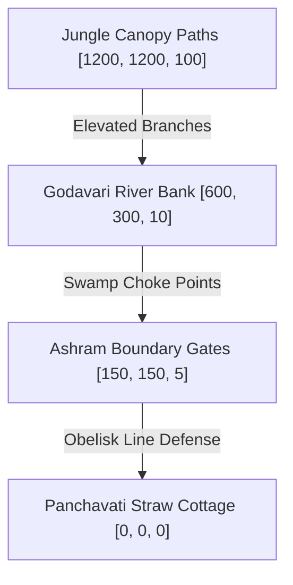

# Scene: Dandaka Wilds

*   **Scene ID:** `SCENE_DANDAKA_WILDS`
*   **Associated Mission:** [Mission4_Lakshmana_Forest.md](../Missions/Mission4_Lakshmana_Forest.md)
*   **Classification:** Forest Wilderness, Horde Battleground & swamp swamp

---

## 1. Scene Metadata & Climatic Profile

| Parameter | Specification & Value |
| :--- | :--- |
| **Location Coordinate Range** | Ashram Center: `[0, 0, 0]` to Swamp Outskirts: `[1200, 1200, 100]` |
| **Time of Day** | Mid Afternoon to Dusk (3:00 PM to 6:00 PM). Solar elevation drops from +45° to +5° (dusk transition). |
| **Wind & Aerodynamic Vector** | Jungle canopy draft: 22 km/h. High turbulence during horde spawns, dispersing toxic spore vectors. |
| **Atmospheric Moisture & Humidity** | 88% Humidity (Dense, humid prehistoric jungle environment). |
| **Precipitation & Particulate Density** | Saturated with glowing purple Asuric spore particles and drifting yellow moss seeds. |
| **Visual Range & Fog Volume** | Standard: 80m. Climactic Curse phase: 3m (90% light-occlusion fog density). |

### Narrative Situation
Deep within the untamed, ancient wilderness of Dandakaranya, Princess Sita resides at the Panchavati ashram. In response to Shurpanakha's mutilation, the demon brothers Khara and Dushana launch a massive retaliatory strike, commanding an army of 14,000 demons. Guarding the ashram single-handedly, Lakshmana must construct a protective solar barrier (*Lakshmana Rekha*) and clear the colossal incoming horde, eventually enduring a blinding, toxic Asuric fog released upon Khara's death.

---

## 2. Audio-Visual & Aesthetic Setup

### A. Lighting Profile & Rendering
*   **Initial Phase:** Saturated jungle green and gold. High-intensity sun rays piercing through giant redwood canopies, creating sharp shadows.
*   **Horde Phase:** Sky shifts to a sickly orange-purple. Glowing red eyes of demon enemies pierce through dark forest hollows.
*   **Climax Curse Phase:** Saturated, highly dense purple volumetric fog (height: 25m). Complete absorption of long-range direct light, leaving only close-range local emissives active.

### B. Camera Setup & Tracking
*   **Horde Survival Phase:** Semi-overhead tactical action camera (FOV: 70°, Distance: 11m, Height: 7m) that zooms out dynamically as enemy density scales, allowing target tracking.
*   **Curse Mist Phase:** Ultra-tight third-person camera (FOV: 40°, Distance: 2.2m) following behind Lakshmana’s head, emphasizing sensory deprivation and panic.

### C. Soundscape & Acoustic Profile
*   **Core Raga Theme:** *Raga Shankara* (war scale, intense percussion, aggressive brass hits, and fast-paced sitar strums).
*   **Acoustic Space:** Enclosed jungle brush acoustics. High-frequency reflections off tree trunks, with heavy wet-swamp dampening on steps.
*   **Sound Effects (SFX):** Buzzing insect swarms, snapping forest branches under giant claws, heavy war drums of the demon horde, and the sizzle of Asuras hitting the Rekha barrier.

---

## 3. Level Design Layout & Boundaries

### Traversal Elements
*   **Jungle Canopies:** Thick, interconnected redwood branches providing a secondary vertical traversal plane, allowing the player to climb and drop down on enemies.
*   **Hollow Banyan Logs:** Ground tunnels offering shelter from flying projectile attacks and acting as tactical funneling zones for horde control.
*   **Deep Mud Zones:** Swamps surrounding the riverbanks that reduce player and enemy speed by 50%, unless executing dashing jumps across dry lily pads.

### Boundaries & Death Zones
*   **Outer Boundaries:** Impenetrable, high thorny hedge walls that deal continuous poison damage upon contact, preventing players from cheesing or escaping the battle arena coordinates.
*   **The Ashram Safe Zone:** The circular area inside the three *Lakshmana Rekha* obelisks. Enemies attempting to enter are instantly repelled and take massive holy fire damage.

---

## 4. Reusable Object Placement Grid

| Object ID | Target Coordinates | Anchor Type | Interactive Function |
| :--- | :--- | :--- | :--- |
| `OBJ_LAKSHMANA_REKHA_OBELISK` | `[50, 50, 2]` | Static Alignment Anchor | One of three stone towers used to align sunbeams and project the ashram boundary. |
| `OBJ_EXPLOSIVE_SPORE` | `[400, 320, 8]` | Environmental Hazard | Ground plant that detonates when struck by fire arrows, dealing massive AoE damage. |
