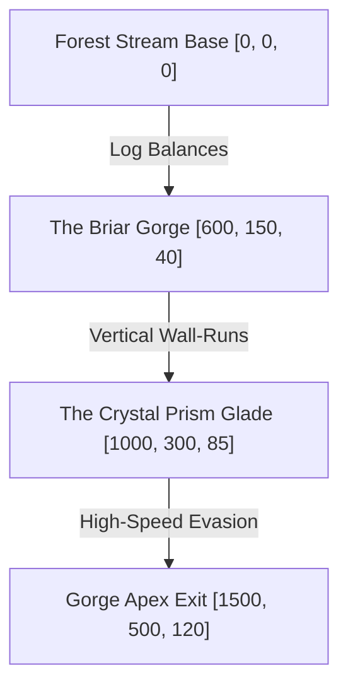

# Scene: Enchanted Canopy

*   **Scene ID:** `SCENE_ENCHANTED_CANOPY`
*   **Associated Mission:** [Mission5_Maricha_Illusion.md](../Missions/Mission5_Maricha_Illusion.md)
*   **Classification:** Enchanted Forest, Evasion Arena & Decoy Glade

---

## 1. Scene Metadata & Climatic Profile

| Parameter | Specification & Value |
| :--- | :--- |
| **Location Coordinate Range** | Forest Stream Base: `[0, 0, 0]` to Gorge Apex: `[1500, 500, 120]` |
| **Time of Day** | Golden Hour Afternoon (3:30 PM to 4:45 PM). Solar elevation at +22°, casting long golden light trails. |
| **Wind & Aerodynamic Vector** | Swirling drafts: 14 km/h. Wind currents carrying golden pollen particles that trace the player's path. |
| **Atmospheric Moisture & Humidity** | 55% Humidity (Auspicious, dry forest biome). |
| **Precipitation & Particulate Density** | Shimmering golden pollen spores and floating white dandelions. Golden mist particles rising from riverbeds. |
| **Visual Range & Fog Volume** | Open canopy: 400m. Soft volumetric golden shafts highlighting atmospheric dust. |

### Narrative Situation
This magical, sun-dappled glade is the stage for the Swarna-Mriga's grand deception. Playable Maricha, transformed into the shimmering Golden Deer, must sprint, leap, and slide through the forest canopy to lure Prince Rama away from the Panchavati ashram. The environment is engineered as a high-speed parkour track, featuring narrow rock arches, balance logs, and ancient crystal columns that Maricha can use to generate illusory clones to evade Rama's seeking arrow shots.

---

## 2. Audio-Visual & Aesthetic Setup

### A. Lighting Profile & Rendering
*   **Primary Light Source:** Radiant golden solar rays (Color Temperature: 3200K, highly warm). Solar flare intensity: 110,000 Lux.
*   **Specular Highlights:** Extremely high on the river bed crystals and Maricha's golden metallic hide, producing shimmering lens flare blooms.
*   **Aura Glow:** Neon-green grass trails that illuminate briefly when stepped on by the Golden Deer.

### B. Camera Setup & Tracking
*   **Parkour Phase:** Dynamic side-scrolling offset camera (FOV: 80°, Distance: 8m, Height: 2m) that tracks ahead of the player to show upcoming obstacles, jumps, and wall-run walls.
*   **Evasion Boss Phase:** Fast-orbiting third-person chase camera with quick zooming to capture Rama's incoming arrows.

### C. Soundscape & Acoustic Profile
*   **Core Raga Theme:** *Raga Yaman* (bright, playful, energetic, using high-pitched classical bamboo flutes, sitar strums, and wooden xylophones).
*   **Acoustic Space:** Open forest acoustic field with soft echoes off nearby cliff rock walls.
*   **Sound Effects (SFX):** Tinkling glass chimes when Maricha sprints, whooshing air drafts, rustling high grass, and the sudden *zip-clink* of Rama's arrows striking tree trunks.

---

## 3. Level Design Layout & Boundaries

### Traversal Elements
*   **Log Balances:** Narrow, moss-covered tree trunks suspended over river ravines that require precise balance controls to maintain top sprint speed.
*   **Wall-Run Cliffs:** Smooth vertical sandstone cliff faces decorated with horizontal golden vines, allowing wall-running and double-leap repels.
*   **Bouncy Flower Pads:** Giant, elastic blue forest lotus pads that launch the player 15 meters into the air, enabling transition to high-altitude branches.

### Boundaries & Death Zones
*   **Level Boundaries:** Deep, bottomless chasms filled with dense thorny bushes. Falling into a chasm results in a physical reset to the last checkpoint with a minor health deduction.
*   **Hunter Sight Lock:** If the player stays within Rama’s tracking targeting circle for more than 5.0 seconds without breaking line of sight behind a tree trunk or activating a decoy, an automatic sniper shot triggers.

---

## 4. Reusable Object Placement Grid

| Object ID | Target Coordinates | Anchor Type | Interactive Function |
| :--- | :--- | :--- | :--- |
| `OBJ_DECOY_PRISM` | `[1000, 300, 85]` | Static Alignment Anchor | Crystal spire that splits the player's model into five decoy clones when charged with Maya energy. |
| `OBJ_BOUNCY_LOTUS` | `[300, 80, 12]` | Environmental Pad | Launchpad that boosts jump heights by 300%. |
