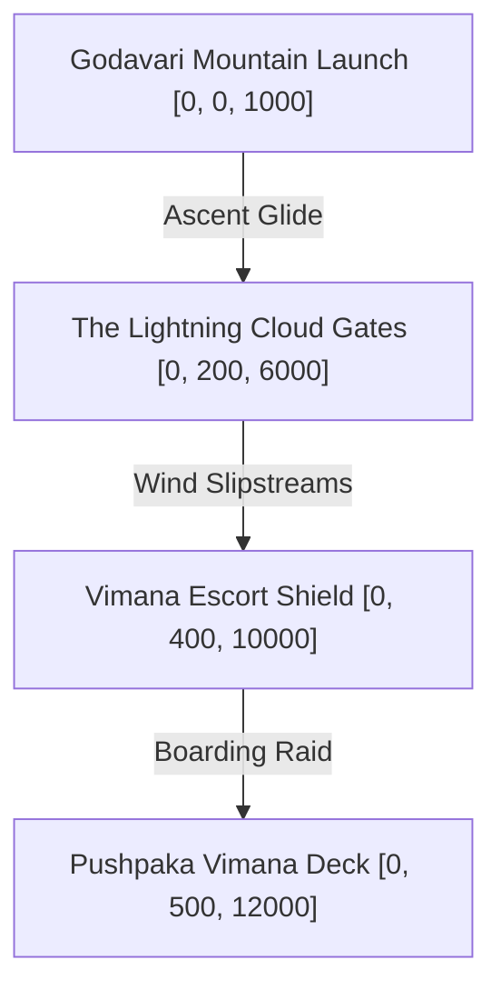

# Scene: Stormy Stratosphere

*   **Scene ID:** `SCENE_STORMY_STRATOSPHERE`
*   **Associated Mission:** [Mission6_Jatayu_Sky.md](../Missions/Mission6_Jatayu_Sky.md)
*   **Classification:** High-Altitude Sky, Aerial Dogfight Arena & Storm Arena

---

## 1. Scene Metadata & Climatic Profile

| Parameter | Specification & Value |
| :--- | :--- |
| **Location Coordinate Range** | Cloudbase: `[0, 0, 1000]` to Stratosphere Apex: `[0, 0, 18000]` |
| **Time of Day** | Stormy Late Afternoon (4:45 PM to 5:45 PM). Sunset sky visible above the storm-deck. |
| **Wind & Aerodynamic Vector** | Extreme Hurricane Winds: 140 km/h. High-velocity cyclonic draft vectors `[0, 1, 0]` inside cloud walls. |
| **Atmospheric Moisture & Humidity** | 98% Humidity inside storm clouds. 15% Humidity above the cloud boundary. |
| **Precipitation & Particulate Density** | Heavy electrical discharge, static lightning sparks, and drifting gold flakes from Pushpaka's sails. |
| **Visual Range & Fog Volume** | Inside cloud walls: 5m (complete visual blackout). Above storm deck: 1200m clear visibility. |

### Narrative Situation
As Ravana speeds south in the flying golden fortress *Pushpaka Vimana* with the abducted Princess Sita, the majestic vulture king Jatayu pursues them. The sky is engulfed in a massive tempest generated by the Vimana’s mechanical core. Jatayu must fly through high-altitude cloud canyons, navigate massive lightning storm gates, dodge turret fire, and board the golden chariot deck for a fatal high-altitude duel against the Lord of Lanka.

---

## 2. Audio-Visual & Aesthetic Setup

### A. Lighting Profile & Rendering
*   **Primary Lighting:** Rapid, dynamic neon-purple and yellow lightning flashes (intensity peaks at 250,000 Lux, frequency: every 2-4 seconds).
*   **Ambient Fill:** Deep charcoal gray and indigo storm clouds. Warm sunset orange rims visible at the far horizon.
*   **Volumetric Fog:** Heavy, roiling, dense cloud sheets driven by a GPU fluid-simulation particle system to create realistic sky canyon paths.

### B. Camera Setup & Tracking
*   **Supersonic Pursuit Phase:** High-speed flight trailing camera (FOV: 95° to emphasize velocity, Distance: 15m, Height: 4m). Features speed-lines and lens distortion effects.
*   **Vimana Boarding Phase:** Hybrid platforming camera with vertical stabilization to counteract the shaking and tilting of the flying chariot hull.

### C. Soundscape & Acoustic Profile
*   **Core Raga Theme:** *Raga Shankara* (war theme, heavy classical taiko-style drumming, frantic string sections, and deep brass conch blasts).
*   **Acoustic Space:** Turbulent open air. Sounds are whipped away instantly by the wind, leaving only high-frequency wind shears and deep chest-vibrating thunderclaps.
*   **Sound Effects (SFX):** Screaming jet winds, static crackles, wood fracturing on the Vimana's deck, metal-shearing talon sweeps, and the cold *shwing* of Ravana's Chandrahasa blade.

---

## 3. Level Design Layout & Boundaries

### Traversal Elements
*   **Thermal Wind Tunnels:** Swirling horizontal wind columns that act as hyper-speed lanes, boosting Jatayu's flight speed by 300% when entered.
*   **Vimana Scaffolding:** Wooden engine outriggers, massive golden sails, and structural bone towers on the flying chariot hull that serve as platforms.
*   **Debris Fields:** Floating chunks of broken golden wings and sails from the Vimana, which Jatayu can land on briefly to recover stamina.

### Boundaries & Death Zones
*   **Level Boundaries:** The edges of the storm-front act as elastic barriers, generating severe crosswinds that blow the player back toward the Pushpaka Vimana.
*   **The Engine Core Exhaust:** Flying directly behind the Vimana's main golden propulsion nozzles (`y < -100m` from hull center) inflicts instant fire damage and pushes the player backwards.

---

## 4. Reusable Object Placement Grid

| Object ID | Target Coordinates | Anchor Type | Interactive Function |
| :--- | :--- | :--- | :--- |
| `OBJ_PUSHPAKA_SHIELD_CORE` | `[0, 500, 12000]` | Static Interactive Core | Golden generator located on the Vimana's wings that projects the invincibility shield. |
| `OBJ_VIMANA_HARPOON` | `[-40, 520, 12010]` | Dynamic Projectile Actor | Kinetic ballista turret that fires chain-harpoons to drag the player into the exhaust. |
