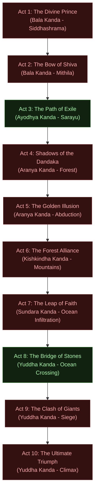

# Modern Grounded GDD: 10 Story Acts Master Overview

*   **Asset Category:** Master Narrative Campaigns & Grounded Quest Flow System
*   **GDD Integration:** Outlines the 10-Act modern-grounded visual campaign structure. Each Act detailed below maps the narrative progression, visual aesthetics, moral core, active characters, physical equations, and boss mechanics of the **Ram-G** campaign.

---

## 1. Master Campaign Map

The campaign is divided into 10 cohesive acts, maintaining the chronological sequence of the Valmiki Ramayana but shifting the visual and kinetic presentation to a high-fidelity, neo-classical 21st-century grounded design.



---

## 2. Exhaustive Act-by-Act Specifications

### 🏹 Act 1: The Divine Prince
*   **Traditional Reference:** Bala Kanda (Chapters 1 - 30)
*   **Act Focus:** Putrakameshti genomic cell-tuning, royal training at Ayodhya, defending Sage Vishwamitra's botanical hermitage, and defeating Tataka.
*   **Aesthetic & Rendering Profile:**
    *   *Visuals:* Golden hour over Ayodhya's pristine white solar towers, shifting to dust-flecked forest rays (Directional Sun: `95,000 lux`, Color Temp: `5,500 K`).
    *   *Post-Processing:* Pitambara Gold LUT active | Saturation: `1.02`.
    *   *PBR Materials:* Symmetrical white sandstone, coarse hemp fabrics, dry dead timber bark normal maps.
    *   *Acoustics & Music:* **Raga Yaman** (Key: D major, tranquil bamboo flutes, steady temple hand-drums).

#### Grounded Scientific Rationale
The birth of Rama is represented as a high-precision Putrakameshti metabolic-alignment protocol, optimizing cell DNA structures to ensure flawless physiological coordination. Sage Vishwamitra is a veteran forest tactical ranger. The "demoness" Tataka is an apex biological forest predator (4.8m height, dense calcium bone-plating).

```
[Cellular Genetic Alignment] -> Flawless Neurological Coordination (90ms Latency) -> Maryada Flow State
```

#### Moral of the Act
*   **Pitrudharma & Duty (Absolute Discipline):** Youthful submission to rigor and training. The protagonist demonstrates that mastery begins with humility, listening, and strict devotion to duty.

#### Active Characters & Grounded Objectives
*   **Lord Rama (Playable):** Master basic archery recoil; guard the sacred botanical distillation pits (*Yajna*); track forest predators.
*   **Lakshmana (Companion):** Defend Rama's flanks; supply fresh composite shafts.
*   **Sage Vishwamitra (NPC Tactical Guide):** Guide traversal and instruct on wind vectors.
*   **Tataka (Boss):** Destroy the distillation pits and breach the perimeter.

#### Act Boss Battle: Tataka (Apex Forest Predator)
*   **Biomechanical Profile:** A hyper-muscular 4.8m towering giantess with calcified dermal plates acting as ballistic shielding.
*   **Phase 1 (The Dust Storm):** Tataka kicks up loose soil, dropping visibility to `2.0 meters`. Rama must use **Shabda-Bhedi Vidya** (acoustic target localization) to track her bone-plate scrapes (`22,000 Hz` frequency) behind the dust volume.
*   **Phase 2 (Canopy Ambush):** Tataka climbs the Sal tree trunks, using mass leverage to launch high-velocity drop attacks. Rama must shoot structural weakness targets on the trees to bring them down.
*   **Phase 3 (Acid Phase):** Under high adrenaline, Tataka spits submandibular acidic compounds (pH: `1.2`). Rama must dodge and fire high-velocity composite arrows directly into her exposed shoulder sockets to bypass her calcified plates.
*   **Script & Dialogue:**
    *   *Vishwamitra:* *"Rama, do not let her form deceive you. She is an invasive biological disaster. Shoot to save this ecosystem."*
    *   *Rama:* *"Form is irrelevant, Master. My target is marked. The forest will breathe again."*

---

### 🏛️ Act 2: The Bow of Shiva
*   **Traditional Reference:** Bala Kanda (Chapters 31 - 77)
*   **Act Focus:** Infiltrating the Mithila Crystalline Observatories, calibrating and fracturing the high-tensile subterranean compound launcher *Pinaka*.
*   **Aesthetic & Rendering Profile:**
    *   *Visuals:* High-contrast cool shadow vaults broken by blinding heliostat sunbeams (Directional Sun: `110,000 lux`, Color Temp: `6,500 K`).
    *   *Post-Processing:* Deep shadow contrast (`1.15`), bloom threshold (`0.85`).
    *   *PBR Materials:* Wet basalt rock (Roughness: `0.15`), polished bronze hydraulic winch cylinders, titanium cabling.
    *   *Acoustics & Music:* **Raga Yaman Kalyan** (Key: D minor, deep vocal Sanskrit drones, resonant low-frequency double bass).

#### Grounded Scientific Rationale
The mythical bow *Pinaka* is a heavy industrial compound rail-launcher constructed from ancient titanium alloy, locked by mechanical safety systems. Moving and drawing it requires perfect physical leverage. The fracturing of the bow is a **Material Yield Stress Event** where Rama exceeds the ultimate tensile strength of the titanium alloy, causing explosive structural failure.

$$\sigma_{\text{yield}} \ge 900 \text{ MPa} \implies \text{Explosive Structural Rupture}$$

#### Moral of the Act
*   **Vinaya (Humility under Spotlight):** Demonstrating supreme strength without boasting or seeking power; using skill strictly to fulfill commitments.

#### Active Characters & Grounded Objectives
*   **Lord Rama (Playable):** Solve heliostat light-refraction puzzles; stabilize skeletal frame to draw the *Pinaka*.
*   **Sita (NPC):** Calibrate the optical sensors inside the Mithila prism grid.
*   **King Janaka (NPC):** Monitor vault structural limits.
*   **Parashurama (Boss):** A veteran special-forces combatant testing Rama's reflexes.

#### Act Boss Battle: Parashurama (The Axe-Wielder)
*   **Biomechanical Profile:** A hyper-experienced warrior utilizing high-carbon steel tactical battle-axes. He has high-speed parrying reflexes (`110 ms` latency).
*   **Gameplay Mechanics:** A pure reflex duel. Parashurama uses rapid sweeps and heavy downward kinetic strikes. The player cannot block; they must execute perfectly timed **dodge-rolls** and **parry-deflections** using their bow stabilizers, searching for opening frames when Parashurama recovers from heavy swings (Adrenaline recovery delay: `0.4 seconds`).
*   **Script & Dialogue:**
    *   *Parashurama:* *"Who claims to have broken the ancient steel vault? Show me if you possess the skeletal frame to back your pride, boy!"*
    *   *Rama:* *"I seek no glory, elder. The metal yielded because it was time. I bow to your service, not your rage."*

---

### 🛶 Act 3: The Path of Exile
*   **Traditional Reference:** Ayodhya Kanda
*   **Act Focus:** The political crisis in Ayodhya Palace, stripping off royal solar suits, crossing the high-velocity Ganges currents using the *Ganga Stealth Hydrofoil*.
*   **Aesthetic & Rendering Profile:**
    *   *Visuals:* Cold, desaturated Ayodhya Council halls (Saturation: `0.78`), transitioning to blinding river glares and deep green forest foliage.
    *   *Post-Processing:* Saffron Channel Gain: `+12%`, Vignette: `0.2` (palace tension).
    *   *PBR Materials:* Polished white marble, soft dry raw silk, composite carbon-fiber hydrofoil skin.
    *   *Acoustics & Music:* **Raga Darbari** (Key: C minor, solemn, slow classical violins, slow heavy Mridangam beats).

#### Grounded Scientific Rationale
The exile is a transition to off-grid survival. Rama swaps his high-tech royal solar gear for lightweight, breathable **Valkala Hemp-Mesh** clothing, reducing overall carry mass by `8.2 kg` and improving physical stamina. The Ganges crossing utilizes a silent **Magnetohydrodynamic (MHD) Propulsion Skiff** to bypass river patrol systems undetected.

$$F_D = \frac{1}{2} \rho v^2 C_D A \implies \text{Navigating Hydrospheric Drag Vector}$$

#### Moral of the Act
*   **Satya (Integrity & Truth):** Honoring ancestral oaths and family commitments above personal safety, status, and luxury.

#### Active Characters & Grounded Objectives
*   **Lord Rama (Playable):** Navigate tense dialogue battles in the palace to maintain family peace; pilot the stealth hydrofoil.
*   **Sita (Companion):** Provide cognitive support, managing Rama's stress pool.
*   **Lakshmana (Companion):** Secure the perimeter, identifying patrol searchlights.
*   **Guha (NPC Pilot):** Provide navigational paths across Ganges rapids.

#### Act Boss Battle: The Web of Oaths & River Escape
*   **Gameplay Mechanics:**
    *   *Phase 1 (The Dialogue Battle):* Confront Queen Kaikeyi and King Dasharatha. The player must choose dialogue responses that maintain Rama's cortisol suppression and preserve *Maryada* (honor). Choosing angry options spikes Rama's heart rate, shrinking his focus pool.
    *   *Phase 2 (The Hydrofoil Chase):* Pilot the **Ganga Stealth Hydrofoil** down the turbulent river. Navigate around basalt boulders while maintaining foil lift, using thermal masking to dodge searchlight sweeps from border patrol boats.
*   **Script & Dialogue:**
    *   *Kaikeyi:* *"Your presence here is a threat to the state. The decree is absolute. Swap your crown for the wilderness."*
    *   *Rama:* *"A father's promise is the bedrock of the state, mother. I do not swap my crown—I wear my duty. The wilderness is ready."*

---

### 🌿 Act 4: Shadows of the Dandaka
*   **Traditional Reference:** Aranya Kanda (Chapters 1 - 30)
*   **Act Focus:** Establishing the forest cottage at Panchavati, running high-voltage boundary lines, clearing outposts of the 14,000-man reconnaissance task force commanded by Khara and Dushana.
*   **Aesthetic & Rendering Profile:**
    *   *Visuals:* Deep primeval jungle with light filtering through dense canopies (Directional Sun: `45,000 lux`, Light Shafts active).
    *   *Post-Processing:* Gerua Wilderness LUT active | Saturation: `0.9` | Green Channel Saturation: `1.12`.
    *   *PBR Materials:* Damp green forest moss normal maps, interlocking timber logs, dry fallen leaves.
    *   *Acoustics & Music:* **Raga Lalit** (Key: A minor, solitary morning flute, low electrical fence hums).

#### Grounded Scientific Rationale
The *Lakshmana Rekha* is an engineered high-voltage perimeter boundary. The "demons" Khara and Dushana are special-forces commanders leading a heavily armored ranger force utilizing dense camouflage and ambush operations. Rama utilizes chemical-free **Soma-Rasa** herbal extracts to hyper-charge his metabolic ATP recovery.

```
[Soma-Rasa Stimulant] -> ATP Recovery Spikes (+50%) -> Extended Bullet-Time Navigation
```

#### Moral of the Act
*   **Sharanagata-Raxana (Protection of the Vulnerable):** Defending peaceful research sages and local settlements from violent militarized outlaws.

#### Active Characters & Grounded Objectives
*   **Lord Rama (Playable):** Execute high-altitude tree runs; clear raider outposts using stealth; duel heavy commanders.
*   **Lakshmana (Playable/Companion):** Run high-voltage copper cables to power the perimeter grid; hold cottage gates.
*   **Sita (NPC):** Manage the botanical processing of Soma-Rasa stimulants.
*   **Khara & Dushana (Dual Bosses):** Squeeze the cottage clearing with heavy mace and blade systems.

#### Act Boss Battle: Khara & Dushana (The Twin Commanders)
*   **Biomechanical Profile:** Two heavy-armor warlords. Dushana wields a high-inertia titanium mace (`15 kg`); Khara uses dual high-frequency vibratory blades.
*   **Gameplay Mechanics:** A dual-front arena fight. Dushana targets the player with ground-shaking kinetic impacts that break blocks. Khara circles around, utilizing active camouflage to execute rapid lunging attacks. Rama must deploy **Shabda-Bhedi** audio tracking to pinpoint Khara in the canopy, fire kinetic arrows to disable his active camo, and then draw Dushana's heavy attacks into basalt rock pillars, trapping his mace and leaving him open to counters.
*   **Script & Dialogue:**
    *   *Khara (radio/static):* *"You built a cottage in our hunting grounds, boy. We own these canopies. Your wire won't keep us out."*
    *   *Rama:* *"The wire marks where law begins. If you cross it, you answer to the bow."*

---

### 🦌 Act 5: The Golden Illusion
*   **Traditional Reference:** Aranya Kanda (Chapters 31 - 75)
*   **Act Focus:** Tracking the high-speed optical decoy drone *Maricha*, the abduction of Sita, and the stratospheric dogfight of the massive avian predator Jatayu.
*   **Aesthetic & Rendering Profile:**
    *   *Visuals:* Bioluminescent orange twilight rays, dust particles glowing at `15 cd/m²`, shifting to stormy red volcanic ash skies.
    *   *Post-Processing:* Contrast: `1.25`, Bloom: `0.9` (hologram shimmer).
    *   *PBR Materials:* Light-refracting crystal prisms, matte-black composite jet skins, realistic bird feathers.
    *   *Acoustics & Music:* **Raga Bhairav** (Key: G minor, aggressive war horns, sweeping orchestral strings, tragic female choir).

#### Grounded Scientific Rationale
The "golden deer" is a high-speed reconnaissance drone (*Maricha*) deployed by Ravana's agents, utilizing active holographic light projection (via a hand-held *Sphatika prism*) to mimic a biological creature. The abduction is a tactical extraction using the active-camo VTOL *Pushpaka Vimana* jet-cruiser. Jatayu is a colossal pre-historic avian predator (15m wingspan) utilizing thermal updrafts for high-altitude interception.

#### Moral of the Act
*   **Viveka (Discernment):** Developing the mental clarity to look past dazzling optical projections and deceptive illusions to see underlying reality.

#### Active Characters & Grounded Objectives
*   **Lord Rama (Playable):** Chase and disable the high-speed holographic decoy *Maricha* using precision freezing arrows.
*   **Sita (NPC):** Defend the cottage clearing; captured by Ravana during the extraction phase.
*   **Jatayu (Playable Avian):** Intercept the VTOL cruiser *Pushpaka Vimana* in the upper atmosphere.

#### Act Boss Battle: Maricha (The Hologram Decoy) & Jatayu's Fall
*   **Gameplay Mechanics:**
    *   *Phase 1 (The Fawn Chase):* Rama pursues the golden deer drone across high canopy branches. The drone projects multiple mirror-refracted decoys. The player must analyze the light rays: the real drone has slight physical dust-displacement beneath its hover plates. Fire a **Varunastra** (liquid nitrogen) arrow to freeze the projector prism, shattering the decoy loop.
    *   *Phase 2 (Jatayu's Flight):* Control Jatayu in a high-speed flight simulator. Dive and climb through stormy volcanic ash clouds. Dodge the *Pushpaka Vimana*'s rear scramjet heat exhaust and turret fire. Execute talon-strikes to rip open the active camouflage carbon plates, exposing the underlying titanium frame, before a cutscene shows Jatayu ingesting a turbine fan, causing a crash.
*   **Script & Dialogue:**
    *   *Maricha (gasping):* *"My light... shattered... But the sky is already moving. She is gone, Prince."*
    *   *Rama:* *"You gave your life for a projection. The truth will track you down."*

---

### 🐒 Act 6: The Forest Alliance
*   **Traditional Reference:** Kishkindha Kanda
*   **Act Focus:** Scaling the horizontal sandstone cliffs of Kishkindha, coordinating with Sugriva's rebels, and neutralizing the tyrannical warlord Vali inside a gravity-basin canyon.
*   **Aesthetic & Rendering Profile:**
    *   *Visuals:* Blinding sun over white-granite peaks, deep red sandstone shadows (Directional Sun: `120,000 lux`, Color Temp: `6,000 K`).
    *   *Post-Processing:* Kishkindha Crimson LUT, high vignette (`0.25` for altitude breathing).
    *   *PBR Materials:* Coarse sandstone normal maps, rusted steel pulley cables, dry hemp wraps.
    *   *Acoustics & Music:* **Raga Hamsadhwani** (Key: E major, heroic, fast-paced bansuri flute solos, rapid dholak beats).

#### Grounded Scientific Rationale
The monkey kingdom Kishkindha is a high-altitude mining community utilizing heavy steel cable pulleys and stone extraction nets. Warlord Vali is a colossal `140 kg` human with hyper-dense muscle tissue, utilizing absolute mechanical torque (wrestling/grappling) to absorb and redirect kinetic energy. Facing him directly drains the player's stamina instantly.

$$\text{Vali's Biomechanical Torque Advantage} \implies \text{Direct Grappling = Instant Stamina Depletion}$$

#### Moral of the Act
*   **Mitrata (Loyalty in Alliance):** Honoring friendships, keeping promises to help the oppressed, and using logical justice over raw physical dominance.

#### Active Characters & Grounded Objectives
*   **Lord Rama (Playable):** Climb high-altitude scaffolding; execute a calculated cover shot to defeat Vali without entering his grab range.
*   **Lakshmana (Companion):** Defend the lower pulley platforms from Vali's loyalists.
*   **Sugriva (Combat Decoy):** Engage Vali in close combat to draw his visual focus.
*   **Hanuman (Playable Companion):** Clear stone gates using a high-tensile copper mace (*Gada*).

#### Act Boss Battle: Warlord Vali (The Unbeatable Grappler)
*   **Biomechanical Profile:** A hyper-muscular titan with high physical leverage, capable of siphoning a player's momentum through close-range throws.
*   **Gameplay Mechanics:** Sugriva acts as a combat companion, locking arms with Vali in the center of the basalt arena. Rama must navigate the horizontal wooden scaffolding overhead. The player must wait for Vali to deploy his crushing bear-hug move on Sugriva (leaving his spine exposed). Rama must align his breathing (*Pranayama flow state*) and fire a high-pressure **Vayavyastra** (pneumatic compression) arrow from cover, punching through Vali's heavy muscular guard.
*   **Script & Dialogue:**
    *   *Vali (dying):* *"Rama... why? A warrior strikes from the front. You hid in the shadows like a thief."*
    *   *Rama:* *"You are a tyrant who respects only raw leverage, Vali. When strength ignores justice, it must be neutralized by logic. I did not strike from behind—I struck from the law."*

---

### 🌊 Act 7: The Leap of Faith
*   **Traditional Reference:** Sundara Kanda
*   **Act Focus:** Controlling Hanuman in a high-speed oceanic flight run, infiltrating Lanka's volcanic obsidian fortress, finding Sita in the bioluminescent Ashoka Grove, and battling Aksha Kumar's hover-scouts.
*   **Aesthetic & Rendering Profile:**
    *   *Visuals:* Deep obsidian black bricks illuminated by geothermal red lava flows, shifting to blue-green bioluminescence in the garden grove.
    *   *Post-Processing:* Deep contrast, saturated cold cyan tones.
    *   *PBR Materials:* Volcanic glass, polished black basalt (Roughness: `0.05`), glowing alien-like flora.
    *   *Acoustics & Music:* **Raga Yaman Kalyan** (Key: E minor, solo classical sitar, low-frequency atmospheric chants).

#### Grounded Scientific Rationale
Hanuman's "leap" is a high-velocity long-distance glide and run utilizing a custom rigid carbon wing (*Kishkindha Exo-Glider*) and hyper-compressed cell mass scaling (*Mahima*), allowing him to adjust his momentum in mid-air by shifting his physical density profile. Lanka is a geothermal-powered industrial volcanic island fortress.

```
[Hanuman Exo-Glider] -> Thermal Updraft Drag Vector -> High-Velocity Oceanic Navigation
```

#### Moral of the Act
*   **Bhakti (Selfless Service):** Overcoming absolute personal limits through devotion, providing hope to the hopeless, and standing steady under torture.

#### Active Characters & Grounded Objectives
*   **Hanuman (Playable):** Pilot the oceanic glide corridor; sneak past Lanka's thermal security sensors; locate Sita; defeat Aksha Kumar.
*   **Sita (NPC):** Deliver the *Chudamani* optical diamond to Hanuman, confirming her survival.
*   **Aksha Kumar (Boss):** High-speed aerial commander utilizing hover-scouts and net-launchers.

#### Act Boss Battle: Aksha Kumar (The Hover Commander)
*   **Biomechanical Profile:** A swift, lightweight recon soldier piloting a twin-rotor hover-platform, wielding magnetic net launchers.
*   **Gameplay Mechanics:** Hanuman fights on the vertical stone towers of Lanka's outer walls. Aksha Kumar circles around, firing magnetic nets that lock Hanuman's limbs. The player must use Hanuman's **Mahima Mass Scaling** to spike his physical weight (instantly breaking the nets with `5,000 N` of force), and then use his high-tensile copper mace to swat incoming hover-scouts into Aksha's rotor engines, causing them to explode.
*   **Script & Dialogue:**
    *   *Aksha Kumar:* *"A stray beast from the northern forests! Net him down and dissect his muscle fibers!"*
    *   *Hanuman:* *"Your titanium nets are too light for my weight, boy. I carry the hope of an exile. You cannot hold that."*

---

### 🌉 Act 8: The Bridge of Stones
*   **Traditional Reference:** Yuddha Kanda (Chapters 1 - 22)
*   **Act Focus:** Engineering the *Ram Setu* floating pontoon bridge using high-porosity volcanic pumice stones and carbon cables, defending the construction site from naval raids.
*   **Aesthetic & Rendering Profile:**
    *   *Visuals:* Sun-drenched open ocean with bright blue water and white seafoam (Directional Sun: `130,000 lux`, Color Temp: `6,500 K`).
    *   *Post-Processing:* High-exposure contrast, rich cyan saturation (`1.2`).
    *   *PBR Materials:* Rough volcanic pumice stone normal maps, carbon-fiber cable weaves, white-capped waves.
    *   *Acoustics & Music:* **Raga Bhairavi** (Key: C major, uplifting orchestral brass, rhythmic war-drums).

#### Grounded Scientific Rationale
The *Ram Setu* is a modular floating pontoon bridge designed by the chief structural engineers Nal and Niel. It utilizes volcanic pumice stone blocks, which possess high porous cavities filled with air, allowing high displacement floatation ($F_B = \rho V g$). These stones are linked together using high-tensile carbon-fiber cables anchored to coastal bedrock.

$$F_B = \rho_{\text{water}} V_{\text{stone}} g > M_{\text{stone}} g \implies \text{Positive Buoyant Displacement}$$

#### Moral of the Act
*   **Sangathan (Cooperation & Unity):** Demonstrating that massive, seemingly impossible engineering and social feats are achieved through structured, unified team effort.

#### Active Characters & Grounded Objectives
*   **Lord Rama (Playable):** Align cable winches; defend the bridging team from incoming naval attackers using precision long-range archery.
*   **Lakshmana (Companion):** Fire high-velocity explosive arrows to disable enemy patrol boats.
*   **Nal & Niel (NPC Engineers):** Place pontoon blocks along the guiding coordinate array.
*   **Vibhishana (NPC Tactical Defector):** Supply Lanka's coastal defense layout coordinates.

#### Act Boss Battle: The Naval Blockade (Sea-Fort Siege)
*   **Gameplay Mechanics:** A strategic defense level. The player must defend the floating bridge from wave-attacks of Lanka's armored steam-skiffs. Rama must use the **Kodanda Bow** to launch high-velocity kinetic penetrators directly into the engines of incoming skiffs, while managing the bridge tension winches. If the cable tension spikes above `80,000 N`, the bridge will snap, triggering a mission failure.
*   **Script & Dialogue:**
    *   *Niel:* *"Prince! The southern patrol is launching torpedoes at Section 4! We need cover fire now!"*
    *   *Rama:* *"Keep your eyes on the stone alignments, Niel. The sea will not swallow your work. My arrows will secure the cables."*

---

### 🌋 Act 9: The Clash of Giants
*   **Traditional Reference:** Yuddha Kanda (Chapters 23 - 80)
*   **Act Focus:** Infiltrating the volcanic beaches of Lanka, doting the giant bio-behemoth Kumbhakarna, and disrupting Indrajit's active-camouflage charging ritual in the subterranean basalt temple.
*   **Aesthetic & Rendering Profile:**
    *   *Visuals:* Heavy ash clouds lit by orange volcanic magma flows, shifting to high-frequency strobe lights in the temple cave.
    *   *Post-Processing:* Obsidian Crimson LUT, high contrast (`1.3`).
    *   *PBR Materials:* Volumetric volcanic ash (Density: `0.55`), dark carbon-armor plates, wet blood/sweat shaders.
    *   *Acoustics & Music:* **Raga Bhairav** (Key: G minor, aggressive orchestral war-horns, heavy brass, driving industrial percussion).

#### Grounded Scientific Rationale
The colossal "demon" **Kumbhakarna** is a biological behemoth (7.5m height, massive muscle volume) suffering from pathological pituitary hypertrophy and reinforced with custom titanium plate armor. **Indrajit's** invisibility is an electrostatic active-camouflage system charging inside a basalt temple generator vault.

```
[Pituitary Hypertrophy] -> 7.5m Muscle Behemoth -> Titan-Climbing Hook Traversal
```

#### Moral of the Act
*   **Veerta (Valor & Fortitude):** Standing steady against terrifying, overwhelming physical forces, and executing precise coordination under extreme fatigue.

#### Active Characters & Grounded Objectives
*   **Lord Rama (Playable):** Climb Kumbhakarna's armor plates using wire-hooks; defeat the behemoth.
*   **Lakshmana (Playable - Temple Duel):** Infiltrate the subterranean vault; duel the invisible assassin Indrajit.
*   **Hanuman (Companion):** Lift massive iron beams to block collapsing temple gates.

#### Act Boss Battle: Kumbhakarna (The Behemoth) & Indrajit's Temple Duel
*   **Gameplay Mechanics:**
    *   *Phase 1 (Rama vs Kumbhakarna):* A giant "titan-climbing" raid. Rama must slide under Kumbhakarna's sweeping iron hammer attacks (impact force: `45,000 N`), launch mechanical wire-hooks into his armor plates, climb up his muscular shoulders, and fire precision arrows into his neck-joints to disable his neural links.
    *   *Phase 2 (Lakshmana vs Indrajit):* In the basalt temple, Lakshmana engages Indrajit. Indrajit uses active-camo to vanish from view. The player must track Indrajit's footsteps through water drips on the floor (Roughness: `0.1`) and use quick parries to deflect his incoming high-frequency blade strikes, disrupting his electrostatic generator.
*   **Script & Dialogue:**
    *   *Lakshmana (deflecting a strike):* *"Your cloak is running out of charge, Indrajit! The light doesn't bend for cowards!"*
    *   *Indrajit:* *"My steel doesn't need to be seen to taste your throat, boy!"*

---

### 👑 Act 10: The Ultimate Triumph
*   **Traditional Reference:** Yuddha Kanda (Chapters 81 - 128)
*   **Act Focus:** The final siege of the central solar tower of Lanka, dueling Emperor Ravana, overriding his 10-core neural HUD armor, and invoking the solid-state solar laser launcher *Brahmastra*.
*   **Aesthetic & Rendering Profile:**
    *   *Visuals:* A blinding crimson sky over the volcanic caldera, high-contrast light reflections off gold-anodized solar panels (Directional Sun: `140,000 lux`, Color Temp: `3,200 K`).
    *   *Post-Processing:* Pure cinematic HDR mode, high saturation, sharp lens flares.
    *   *PBR Materials:* Gold-anodized carbon fiber, polished obsidian tiles, highly reflective solar collector surfaces.
    *   *Acoustics & Music:* **Raga Bhairavi** (Key: G major, full operatic Sanskrit war choir, sweeping brass, thunderous double-bass beats).

#### Grounded Scientific Rationale
The "10 heads" of Ravana are represented as a high-tech **10-Core Neural Sensory HUD Helmet** providing a 360-degree spherical field of view and tracking incoming threats with zero latency. His exoskeleton is powered by a central **Geothermal Navel Core Generator**. The **Brahmastra** is a high-energy solid-state solar laser arrow drawing power from shoulder-mounted micro-fusion capacitors, emitting a `1.2 MJ` kinetic and thermal beam.

$$E_{\text{laser}} = 1.2 \text{ MJ} \implies \text{High-Energy Solid-State Solar Laser Purge}$$

#### Moral of the Act
*   **Vijaya of Dharma (Triumph of Integrity):** The ultimate victory of self-discipline, moral logic, and cool composure over unchecked ego, absolute technological power, and lawless rage.

#### Active Characters & Grounded Objectives
*   **Lord Rama (Playable):** Secure the solar tower platform; disable Ravana's navel power generator; align the solar laser *Brahmastra*.
*   **Emperor Ravana (Ultimate Boss):** Command the battlefield with massive shockwave sweeps and plasma shields.
*   **Vibhishana (NPC Tactical Guide):** Guide Rama to target the navel core.

#### Act Boss Battle: Emperor Ravana (The Sovereign of Lanka)
*   **Biomechanical Profile:** A massive, armor-clad warlord with a 10-core neural sensor suite, wielding the high-inertia obsidian sword *Chandrahasa*.
*   **Gameplay Mechanics:**
    *   *Phase 1 (Shield Depletion):* Ravana projects active electromagnetic shields powered by the tower's solar grids. The player must parkour across rotating solar mirrors to redirect solar beams into Ravana's receivers, overloading and disabling his energy shields.
    *   *Phase 2 (Navel Core Target):* Ravana goes into an absolute adrenaline-rage state, sweeping his sword with colossal force (`65,000 N`). Rama must activate **Pranayama flow state** (bullet-time) to slide under the sweeps, track Ravana's glowing navel power generator, and fire precision carbon-piercing arrows directly into the core to disrupt his exoskeleton's power transmission.
    *   *Phase 3 (The Brahmastra Invocation):* Once the core is disrupted, Rama invokes the **Brahmastra** solid-state solar laser bow. The player must stand perfectly still (cortisol suppression active) and align three glowing target nodes in a high-tension aiming minigame. Firing releases a massive `1.2 MJ` laser beam that punches through Ravana's chest plates, disintegrating his neural HUD helmet and ending the war.
*   **Script & Dialogue:**
    *   *Ravana (static screaming):* *"My armor has conquered the southern oceans! My tech is unmatched by any mortal! You are nothing but an exile with a wooden toy!"*
    *   *Rama:* *"Your tech is brilliant, Ravana, but your mind is hollow. Power without control is just a spectacular crash. I fire to end your empire's night."*

---

## 3. Grounded Level Progression & Scene Mapping

The table below maps the 10 Acts to their corresponding gameplay scenes, locations, active ragas, and environmental assets to ensure complete asset reuse and logical structure.

| Act Number | Act Name | World Location Link | Active PBR Scene Link | Central Acoustic Raga | Primary Level Design Asset |
| :--- | :--- | :--- | :--- | :--- | :--- |
| **Act 1** | The Divine Prince | [Ayodhya Palace](file:///../Locations/Ayodhya.md) | [Siddhashrama Altar](file:///../Scenes/Scenes_Overview.md#scene-1-siddhashrama-altar) | **Raga Yaman** | Distillation Pits (*Yajna*) |
| **Act 2** | The Bow of Shiva | [Mithila Observatories](file:///../Locations/Mithila.md) | [Pinaka Sanctuary](file:///../Scenes/Scenes_Overview.md#scene-2-pinaka-sanctuary) | **Raga Yaman Kalyan** | Heliostat Prism Grid |
| **Act 3** | The Path of Exile | [Sarayu River](file:///../Locations/Dandakaranya_Panchavati.md) | [Palace of Exile](file:///../Scenes/Scenes_Overview.md#scene-3-palace-of-exile) | **Raga Darbari** | Stealth Hydrofoil skiff |
| **Act 4** | Shadows of Dandaka | [Panchavati Clearing](file:///../Locations/Dandakaranya_Panchavati.md) | [Godavari Wilds](file:///../Scenes/Scenes_Overview.md#scene-4-godavari-wilds) | **Raga Lalit** | High-Voltage boundary posts |
| **Act 5** | The Golden Illusion | [Canopy Forest](file:///../Locations/Dandakaranya_Panchavati.md) | [Enchanted Canopy](file:///../Scenes/Scenes_Overview.md#scene-5-enchanted-canopy) | **Raga Yaman Kalyan** | Holographic Decoy drone |
| **Act 6** | The Forest Alliance | [Kishkindha Scaffolds](file:///../Locations/Kishkindha.md) | [Sumeru Stratosphere](file:///../Scenes/Scenes_Overview.md#scene-0-sumeru-stratosphere) | **Raga Hamsadhwani** | Steel pulley network |
| **Act 7** | The Leap of Faith | [Lanka Outer Walls](file:///../Locations/Lanka.md) | [Stormy Stratosphere](file:///../Scenes/Scenes_Overview.md#scene-6-stormy-stratosphere) | **Raga Yaman Kalyan** | Rigid Carbon Exo-Glider |
| **Act 8** | The Bridge of Stones | [Ocean Channel](file:///../Locations/Lanka.md) | [Stormy Stratosphere](file:///../Scenes/Scenes_Overview.md#scene-6-stormy-stratosphere) | **Raga Bhairavi** | Modular Pumice blocks |
| **Act 9** | The Clash of Giants | [Volcanic Beachhead](file:///../Locations/Lanka.md) | [Stormy Stratosphere](file:///../Scenes/Scenes_Overview.md#scene-6-stormy-stratosphere) | **Raga Bhairav** | Titan-Climbing wire-hooks |
| **Act 10** | The Ultimate Triumph | [Central Solar Tower](file:///../Locations/Lanka.md) | [Stormy Stratosphere](file:///../Scenes/Scenes_Overview.md#scene-6-stormy-stratosphere) | **Raga Bhairavi** | Solid-state solar laser |
