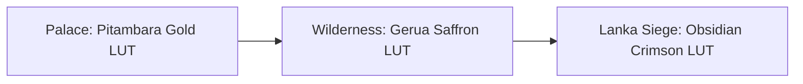

# Clothing: The Grounded Color System & Camera LUTs

*   **Asset Category:** Color Palettes & Post-Processing Look-Up Tables (LUTs)
*   **GDD Integration:** Guides texture dye pathways and real-time engine camera color grading.

---

## 1. Unified Dye Color Palette

The colors worn by characters in **Ram-G** are mapped using high-precision HSL (Hue, Saturation, Lightness) coordinate systems, representing physical and emotional states.

| Color / Dye Name | Hex Code | HSL Coordinate | Biological / Physical Representation | Character Association |
| :--- | :--- | :--- | :--- | :--- |
| **Saffron & Ochre (Gerua)** | `#F28C28` | `HSL(30°, 88%, 55%)` | Natural organic dye; optimal for thermal insulation and solar reflection. | Sages, Rama/Lakshmana/Sita (Exile) |
| **Solar Yellow (Pitambara)** | `#FFD700` | `HSL(51°, 100%, 50%)` | High-visibility solar pigment; reflects maximum light energy. | Lord Rama (Royal State), Sita (Mithila) |
| **Asuric Crimson** | `#A01212` | `HSL(0°, 80%, 35%)` | High-stress color; mimics active oxygenated blood and volcanic heat. | Ravana, Indrajit, Asuric Commanders |
| **Obsidian Black** | `#1A1A1A` | `HSL(0°, 0%, 10%)` | Light-absorbing carbon compound; scatters radar and visual scans. | Ravana (Throne), Stealth Suits |
| **Laxman Green** | `#2E8B57` | `HSL(146°, 50%, 36%)` | Chlorophyll-extract dye; mimics forest canopy shadows for dynamic stealth. | Lakshmana (Exile Accents) |

---

## 2. Dynamic Camera Post-Processing (LUT Integration)

Real-time post-processing Look-Up Tables (LUTs) are deployed in-engine to adjust color grading, mirroring the physical atmosphere of the environments.

### A. Pitambara Gold LUT Profile (Acts 1, 2, and 10)
*   **Engine Camera Grading:** Shadow zones are slightly warmed with a soft gold temperature shift; highlights are brightened to simulate clear solar radiance.
*   **Physical Atmosphere:** Pristine, clean air, high light diffusion, and golden hour sun angles.
*   **Unreal Engine Settings:**
    *   *Global Saturation:* `1.05`
    *   *Global Contrast:* `1.02`
    *   *Color Filter / Temp:* `6,200 K` (warm light)
    *   *Lift:* `(1.0, 0.98, 0.9)`

### B. Gerua Wilderness LUT Profile (Acts 3 to 6)
*   **Engine Camera Grading:** Desaturates artificial palatial golds and purples. Amplifies organic forest greens and warm saffron fabrics. Lowers shadow contrast to emphasize misty riverbed settings.
*   **Physical Atmosphere:** Organic, damp forest mists, high leaf scattering, and twilight transitions.
*   **Unreal Engine Settings:**
    *   *Global Saturation:* `0.9` (slightly muted tones)
    *   *Saffron Channel Gain:* `+12%`
    *   *Green Channel Saturation:* `1.15`
    *   *Bloom Threshold:* `0.8` (soft morning mist scattering)

### C. Obsidian Crimson LUT Profile (Acts 7 to 9)
*   **Engine Camera Grading:** High-contrast grading. Shadows are crushed into obsidian black; crimson glowing embers and molten lava highlights are highly bloomed.
*   **Physical Atmosphere:** Volcanic ash clouds, high airborne particulate, extreme high-temperature geothermal heat-hazes.
*   **Unreal Engine Settings:**
    *   *Global Contrast:* `1.3` (crushed dark tones)
    *   *Global Saturation:* `0.95`
    *   *Bloom Intensity:* `1.25` (intense heat emissions)
    *   *Lift:* `(0.85, 0.85, 0.9)`
