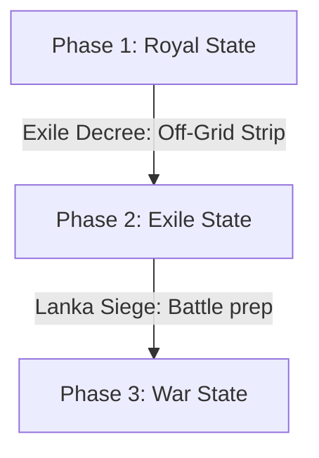

# Clothing: Visual Character Transformations

*   **Asset Category:** 3D Mesh Swaps, Adaptive Material Overlays, and Stat Adjustments
*   **GDD Integration:** Links character cosmetic visual changes directly to physical gameplay stats, armor ratings, and stealth performance across narrative acts.

---

## 1. Grounded Outfit Visual Phases

Character models undergo distinct, logical visual transformations corresponding to their narrative environment and physical trials, strictly avoiding unrealistic robotic/bionic swaps.

### Phase 1: Royal State (Acts 1 - 2 & Act 10)
*   **Visual Direction:** Immaculate, clean-cut modern royal styling. Form-fitting designer garments made of premium raw silk, utilizing clean white, gold, and green dye tones.
*   **Rama:** Pristine white-and-gold long coat with solar-emissive trim lines; polished leather boots.
*   **Sita:** Immaculate golden-terracotta draped silk dress with polished Chudamani hair jewel.
*   **Lakshmana:** Royal emerald-green tailored tunic with silver trim.
*   **Gameplay Modifiers:**
    *   *Armor Rating:* `50` (Standard physical absorption).
    *   *Stamina Regen:* Normal.
    *   *Camouflage Rating:* `10%` (Highly visible in forest environments).

### Phase 2: Exile State (Acts 3 - 5)
*   **Visual Direction:** Simple, weathered, and highly functional. Form-fitting saffron and black organic hemp-mesh compression gear, showing realistic weathering (mud splatters, grass stains, minor tears, and sweat stains).
*   **Rama & Lakshmana:** Saffron-ochre compression shirts, flexible charcoal running flats, and organic leaf-fiber utility sashes.
*   **Sita:** Simple, lightweight white silk drape, showing realistic forest soil weathering around the hem.
*   **Gameplay Modifiers:**
    *   *Armor Rating:* `10` (Minimal physical protection).
    *   *Stamina Regen:* `+10%` (Lightweight materials reduce physical load by `4.5 kg`).
    *   *Camouflage Rating:* `75%` (Blends with forest canopy and foliage).

### Phase 3: War State (Acts 6 - 9)
*   **Visual Direction:** High-intensity tactical combat gear. Reinforced charcoal-indigo Kevlar vests, titanium-alloy knee and elbow stabilization pads, and utility running boots.
*   **Rama:** Saffron-and-indigo Kevlar chest plate, carbon stabilizer arm guards.
*   **Lakshmana:** Matte-green and charcoal combat suit with double blade sheath mounts.
*   **Sita:** Captivity-weathered gray-stained white silk, reflecting month-long confinement under volcanic ash clouds.
*   **Gameplay Modifiers:**
    *   *Armor Rating:* `110` (High resistance to slash and kinetic projectile hits).
    *   *Stamina Regen:* `-5%` (Increased gear mass of `6.2 kg`).
    *   *Camouflage Rating:* `40%` (Optimized for volcanic obsidian ruins).

---

## 2. Dynamic Dirt & Wetness Material Overlay Shader

To visualize physical progression in real-time, character models utilize a unified **Dynamic Weathering Shader** in-engine:
*   **Accumulated Soil Parameter:** Dynamic float controlled by player actions (sliding, falling, crouching). Gradually blends a high-roughness, brown-green dirt normal map over the base clothing texture.
*   **Wetness Parameter:** Floats controlled by water contact (wading in Ganges or Sarayu, rainfall). Increases surface specular values, lowers roughness to `0.05`, and temporarily darkens clothing base colors to simulate wet fiber saturation.
