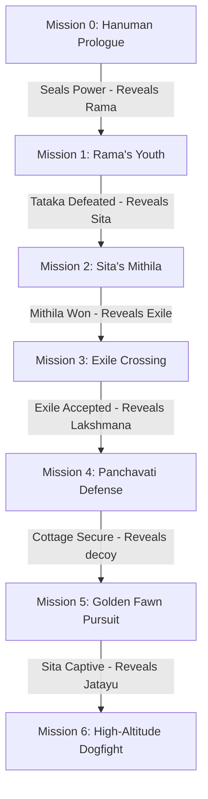

# GDD Missions: Grounded Modern Overview

*   **Asset Category:** High-Fidelity Campaign Level Design & Quest Workflows
*   **GDD Integration:** Outlines step-by-step levels, transition criteria, character introduction loops, and physics-based objectives for all GDD acts.

---

## 1. Grounded Level Progression Flow

Missions follow a highly logical, single-character-focused structure that shows the relationships with subsequent characters, transitioning cleanly once current regional objectives are achieved.

---

## 2. Comprehensive GDD Mission Sheets

### 🐒 Mission 0: Hanuman's Flight Prologue
*   **Narrative Focus:** Kid Hanuman's high-altitude exploration and early energy sealing.
*   **Location:** [Sumeru High Canyons](file:///../Locations/Kishkindha.md) to Upper Stratosphere.
*   **Grounded Physics Concept:** Riding thermal wind draft columns using aerodynamic body posture, managing atmospheric oxygen deprivation.
*   **Basic Step Flow:**
    1.  *Tutorial Glide:* Pilot Hanuman as a hyper-active youth, running along Sumeru's horizontal sandstone ridges.
    2.  *The Thermal Leap:* Launch from the highest vertical cliff, utilizing a massive kinetic jump (`20,000 N`) to enter the lower stratosphere.
    3.  *Solar Pursuit:* Ride dynamic hot-air updrafts, keeping Hanuman's core temperature stable while chasing the sun (solar atmospheric fusion reactor).
    4.  *The Crash (Power Seal):* Exceeding safe altitude limits triggers high-G force blackout and oxygen deprivation (hypoxia). Hanuman suffers a hard kinetic crash, sealing his high-altitude leap abilities until he meets Lord Rama in Act 6.

### 🏹 Mission 1: Rama's Border Clearance
*   **Narrative Focus:** Lord Rama's youth, defending regional borders from marauding feral predators.
*   **Location:** [Siddhashrama Sanctuary Trade Borders](file:///../Locations/Ayodhya.md).
*   **Grounded Physics Concept:** Acoustic sound localization training (*Shabda-Bhedi*), calculated trajectory archery.
*   **Basic Step Flow:**
    1.  *Target Tracking:* Train Rama's auditory cortex (*Shabda-Bhedi Vidya*) to pinpoint hidden targets behind dense forest brush by tracking twigs snapping.
    2.  *Clear the Trade Lanes:* Neutralize swift [wild leopards](file:///../Environment_Elements/Fauna_Modern.md) invading the sanctuary perimeter using carbon-composite arrows.
    3.  *The Tataka Clearance:* Engage the colossal [Tataka](file:///../Characters/Tataka.md). Dodge her explosive charges, use acoustic tracking to locate her during acid spray phases, and fire precision kinetic shafts at her exposed shoulder joints to bypass her bone-plating.

### 🏛️ Mission 2: The Vault of Mithila
*   **Narrative Focus:** Stringing and winching the heavy compound bow of Shiva to win Princess Sita's hand.
*   **Location:** [Subterranean Terracotta Vault](file:///../Locations/Mithila.md).
*   **Grounded Physics Concept:** Light-refraction heliostat puzzles, structural material ultimate tensile limits.
*   **Basic Step Flow:**
    1.  *Heliostat Alignment:* Rotate three massive, ground-mounted [Sphatika Quartz Prisms](file:///../Environment_Elements/Relics_Artifacts_Modern.md) to direct high-intensity solar beams onto the subterranean photo-sensitive door lock.
    2.  *Vault Infiltration:* Traverse subterranean terracotta brick walkways, bypassing high-voltage laser defense grids.
    3.  *The Pinaka Challenge:* Approach the massive titanium [Pinaka Bow](file:///../Weapons/Pinaka.md). Override the hydraulic safety winch pins, align Rama's skeletal shoulder frame to handle `12,000 lbs` of force, and pull the steel cable.
    4.  *Material Yield Event:* Exceeding the titanium limbs' ultimate strength triggers an explosive material failure, breaking the bow and triggering a cavern earthquake.

### 🛶 Mission 3: The Silent River Crossing
*   **Narrative Focus:** Transitioning to off-grid forest exile, escaping King Dasharatha's political boundaries.
*   **Location:** [Sarayu to Ganges River Rapids](file:///../Locations/Dandakaranya_Panchavati.md).
*   **Grounded Physics Concept:** Fluid flow drag, silent marine propulsion.
*   **Basic Step Flow:**
    1.  *Strip the Royal Gear:* Swap Rama's white-gold solar suit for lightweight [Valkala Hemp-Mesh](file:///../Clothing/Materials_Textures.md), reducing mass and increasing stamina.
    2.  *Meet the Ferryman:* Infiltrate the military-patrolled northern river docks, meeting Guha.
    3.  *The Hydrofoil Crossing:* Pilot the silent [Ganga Skiff](file:///../Vehicles/Ganga_Stealth_Hydrofoil.md). Traverse turbulent Ganges currents, steering around rocky rapids while keeping the hull lifted on foils to avoid patrol boat searchlights.

### 🏡 Mission 4: The Panchavati Fortification
*   **Narrative Focus:** Constructing a secure wilderness cottage and setting up boundary defenses.
*   **Location:** [Panchavati River Clearing](file:///../Locations/Dandakaranya_Panchavati.md).
*   **Grounded Physics Concept:** Structural carpentry, high-voltage copper wire boundary grids.
*   **Basic Step Flow:**
    1.  *Resource Gathering:* Chop [Sal hardwood trunks](file:///../Environment_Elements/Flora_Modern.md) using dual steel blades, dragging them to the clearing.
    2.  *Cottage Assembly:* Align timber joints to construct a highly optimized, weatherproof forest shelter.
    3.  *The Lakshmana Rekha Grid:* Run high-tensile copper wire along pre-placed posts, connecting it to a solar accumulator to form the protective electrical boundary grid. Defend the clearing from early Asuric scouts.

### 🦌 Mission 5: The Golden Decoy Pursuit
*   **Narrative Focus:** The pursuit of the golden fawn decoy and the capture of Sita.
*   **Location:** [Enchanted Canopy Forest](file:///../Locations/Dandakaranya_Panchavati.md).
*   **Grounded Physics Concept:** Volumetric light holograms, acoustic frequency mimicry.
*   **Basic Step Flow:**
    1.  *Pursue the Fawn:* Track the [Golden Fawn Decoy](file:///../Characters/Maricha.md). Execute high-altitude leaps across horizontal Banyan branches to keep visual contact.
    2.  *Shatter the Prism:* Fire a precision *Varunastra* arrow at the holographic center-point, freezing and shattering Maricha's hand-held optical Sphatika prism.
    3.  *Vocal Modulator Trick:* Wounded Maricha activates his throat modulator, screaming a perfect acoustic copy of Rama's voice to draw Lakshmana away.
    4.  *The Abduction:* Cutscene displays Ravana's private jet-cruiser *Pushpaka Vimana* landing in a silent hover, overriding Sita's bio-electromagnetic shield, and carrying her off-grid.

### 🦅 Mission 6: Stratospheric Dogfight
*   **Narrative Focus:** Jatayu's valiant stratospheric interception of Ravana's jet-cruiser.
*   **Location:** [Stormy Stratosphere](file:///../Locations/Lanka.md).
*   **Grounded Physics Concept:** Avian high-velocity wing-lash, jet engine ducted fan intakes.
*   **Basic Step Flow:**
    1.  *The Launch:* Launch Jatayu from the highest peaks of Dandakaranya, riding a massive thermal column to reach stratospheric heights.
    2.  *Intercept the Jet:* Chase the supersonic [Pushpaka Vimana](file:///../Vehicles/Pushpaka_Vimana.md). Dodge rear jet scram-exhaust heat-hazes and automated laser turrets.
    3.  *Tear the Chameleon Skin:* Execute high-velocity talon sweeps to physically shred the active light-refractory outer carbon skin, disabling the jet's cloaking.
    4.  *Ducted Fan Ingestion:* Dive directly into the port-side ducted fan intake, sacrificing Jatayu to destabilize thrust and force the damaged cruiser to drop coordinates.
