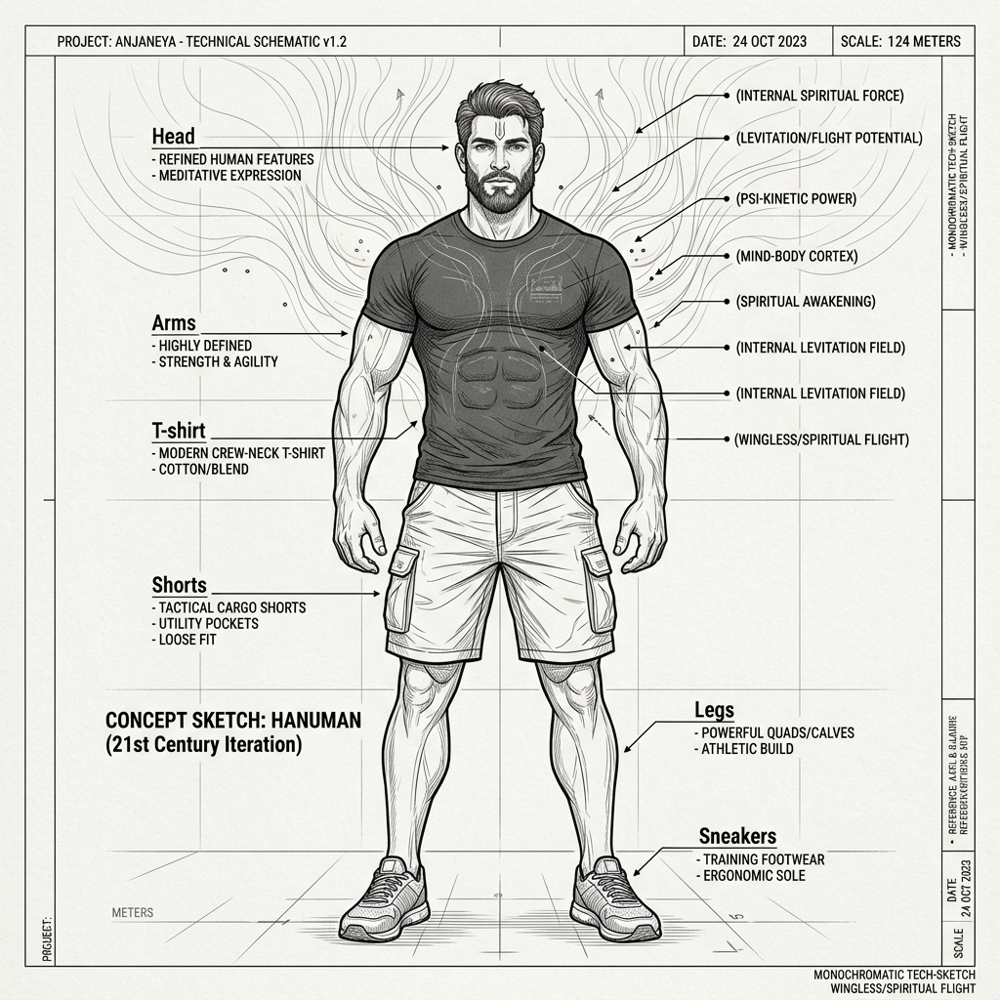

# Hanuman: Technical Concept Sketch & Annotations (v1)

*   **Document Reference:** `Modern_sketch/Characters/Hanuman/v1_Hanuman.md`
*   **Version:** v1 (Contemporary 21st-Century Casual Outfit & Wingless Levitational Build)
*   **Aesthetic Style:** Monochromatic line-art blueprint (thin black lines on a white background).
*   **Embedded Character Drawing:**
    

---

## 1. Character Orthographic Breakdown

This sheet details the extreme biological muscular density and refined human visual aesthetics of Hanuman, completely redesigned for a 21st-century contemporary setting. He is represented as a highly fit, powerful human athlete wearing simple modern clothing, with zero beastly/ape traits and zero mechanical or biological wings.

### A. Front Orthographic View (Athletic Powerhouse)
*   **Refined Human Features:** Hanuman is depicted as a tall, broad-shouldered human athlete standing `2.10 m (6'11")` in height, weighing `135 kg`. His facial features are clean, highly defined, and entirely human.
*   **Modern Wardrobe:** Wearing a simple, comfortable cotton crew-neck t-shirt and loose, durable canvas cargo shorts ([v1_Materials_Textures.md](../../Clothing/Materials_Textures/v1_Materials_Textures.md)). There are no power exoskeletons, cybernetic joints, active energy wings, or combat armor plates. His colossal strength is purely organic and internal.
*   **Tactile Grip Friction:** Zoom callouts highlight specialized dermal friction patterns on his palms and bare feet, enabling natural high-adhesion climbing forces on vertical concrete, brick, or raw stone walls.

### B. Side Profile View (Wingless Levitation Mechanics)
*   **Wingless Traversal:** Unlike previous designs, Hanuman features no biological under-arm membranes, feathers, or mechanical glider-wings. His flight capabilities are represented as pure, gravity-defying bio-spiritual levitation (`Laghima`).
*   **Kinetic Stance:** Shown in a neutral, relaxed vertical profile, hovering slightly above the ground line. Concentric vertical force vectors illustrate the silent manipulation of gravity-density fields around his muscle matrices.

---

## 2. Biological Powers & Focus Annotations

Hanuman's active gameplay traversal overclocks are visual representations of peak cellular compression and mass-density control:

### A. Laghima Focus (Levitation & Silent Flight)
*   **Laghima Density Shift:** Thin dashed vectors pointing upwards away from the body indicate dynamic reduction of his effective physical weight by `90%`. This enables massive, gravity-defying vertical bounds and high-speed silent levitational gliding through air currents.
*   **Acoustic Boundary:** Shows a quiet, concentric acoustic ring around his body, illustrating that his wingless levitation produces zero atmospheric friction sound.

### B. Garima Focus (Mass-Expansion Impact)
*   **Momentum Lock:** Solid down-pointing vectors surrounding his feet during landing show the voluntary locking of his joint matrices, increasing his biological momentum to smash through barricades or crush target defense lines on contact.
