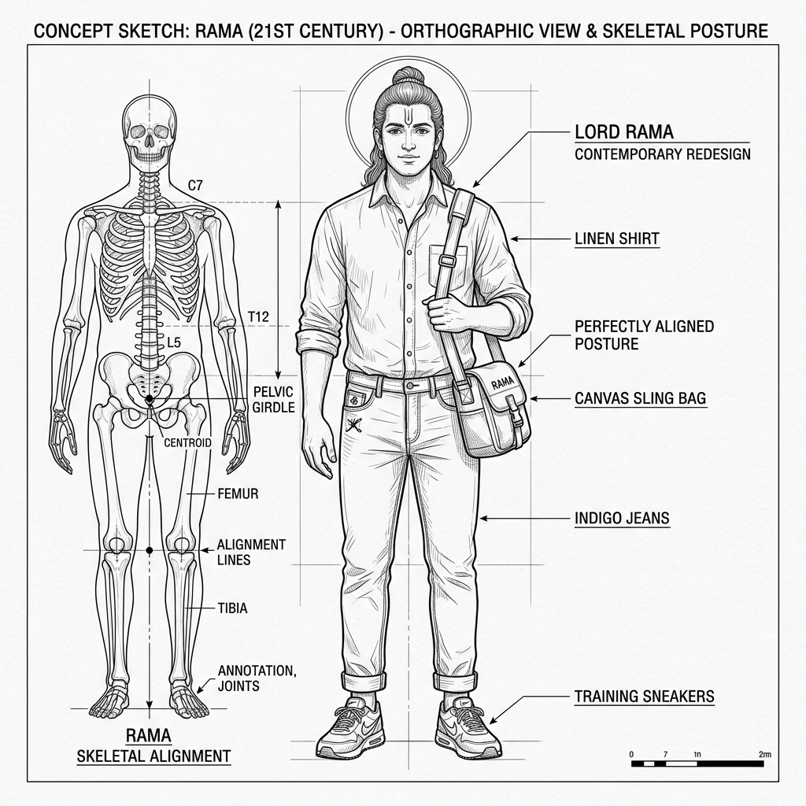

# Lord Rama: Technical Concept Sketch & Annotations (v1)

*   **Document Reference:** `Modern_sketch/Characters/Lord_Rama/v1_Lord_Rama.md`
*   **Version:** v1 (Contemporary 21st-Century Casual Outfit & Stance)
*   **Aesthetic Style:** Monochromatic line-art blueprint (thin black lines on a white background).
*   **Embedded Character Drawing:**
    

---

## 1. Character Orthographic Breakdown

This sheet defines the biological and aesthetic parameters of Lord Rama, completely redesigned to place him in a contemporary 21st-century setting wearing simple, casual everyday clothing. His divine avatar capabilities arise purely from internal bio-spiritual control rather than high-tech weapons or gear.

### A. Front Orthographic View (Centered Stance)
*   **Perfect Kinetic Alignment:** Depicts a serene, square-shouldered frame standing `1.95 m (6'5")` in height. Red vertical laser lines demonstrate a perfectly balanced skeletal stack, projecting straight down to his center of gravity at the sacrum.
*   **Contemporary Wardrobe:** Wearing a casual, high-quality modern linen button-up shirt (sleeves rolled neatly to the elbows) and simple dark indigo selvedge jeans ([v1_Materials_Textures.md](../../Clothing/Materials_Textures/v1_Materials_Textures.md)). No high-tech active camouflage, bulletproof armor plates, or mechanical support braces. His power is entirely internal.
*   **Footwear:** Wearing clean, low-profile modern athletic training sneakers that provide high grip and tactile feedback from the environment.
*   **Canvas Crossbody Sling Bag:** Carries a simple, durable crossbody canvas bag across his chest, used to inconspicuously store his compact, retractable [Kodanda rod](../../Weapons/Kodanda/v1_Kodanda.md).

### B. Side Profile View (Archery Stance)
*   **Skeletal String Loading:** Rama is shown pulling the expanded [Kodanda recurve bow](../../Weapons/Kodanda/v1_Kodanda.md). His draw hand anchors precisely at his jawline, demonstrating perfect skeletal lock where his bones absorb the bow's tension rather than muscle strain, minimizing metabolic fatigue.
*   **Aiming Line:** Dotted lines extend from his right eye parallel to the arrow, highlighting perfect sightline alignment without digital scopes or laser grids.

---

## 2. Biological Powers & Focus Annotations

Rama's unique avatar powers are visualized as pure internal neural and vascular flow states:

### A. Pranayama Flow State (Concentric Streamlines)
*   **Diaphragmatic Control:** Concentric streamlines are drawn entering his chest, representing hyper-oxygenation of his blood. This slows his heart rate down to a stable `45 BPM`, effectively slowing his perception of time (bullet-time focus).
*   **Focus Aura:** Shows a localized heat-haze boundary within a `0.5m` radius, depicting active metabolic thermoregulation.

### B. Shabda-Bhedi Target Mapping
*   **Auditory Localization:** Concentric dashed arcs expand from his temples, representing his auditory cortex mapping targets in pitch-black settings via sound time-difference-of-arrival.
