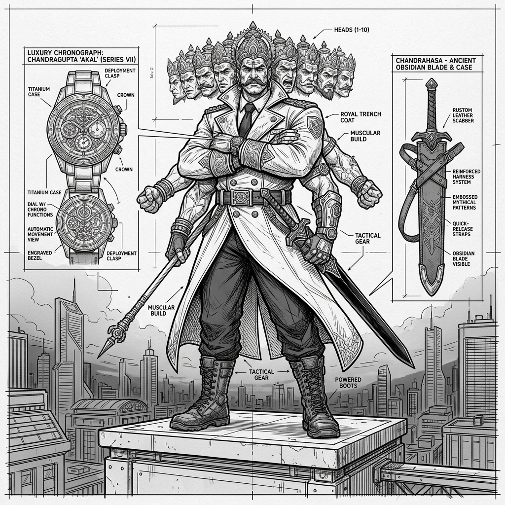

# Ravana: Technical Concept Sketch & Annotations (v1)

*   **Document Reference:** `Modern_sketch/Characters/Ravana/v1_Ravana.md`
*   **Version:** v1 (Contemporary Corporate-Warlord Suit & Solar Plexus Overdrive)
*   **Aesthetic Style:** Monochromatic line-art blueprint (thin black lines on a white background).
*   **Embedded Character Drawing:**
    

---

## 1. Character Orthographic Breakdown

This sheet details the bio-physiology and sharp 21st-century attire of King Ravana, completely redesigned to represent him as a colossal, modern corporate-kingpin/warlord figure. His power is expressed through extreme physical mass, absolute authority, and focused solar-energy combustion, without any robotic exoskeletons or cybernetic visors.

### A. Front Orthographic View (Titan Stance)
*   **Colossal Modern Scale:** Standing at `2.30 m (7'6")` and weighing a powerful `145 kg`. His muscular skeletal build is exceptionally wide, featuring thick shoulders and a dominant posture.
*   **Tailored Trench Coat Suit:** Clad in a highly sharp, tailored 21st-century royal double-breasted business trench coat over dark formal trousers and high-end polished leather shoes. The trench coat stands out in a rich royal blue/black aesthetic (monochromatic lines show sharp creases and clean lapels). Strictly no high-tech combat plating or glowing energy grids. His physical mass and spiritual composure absorb incoming impacts.
*   **Vulnerability Callout (Navel Plexus):** The solar plexus/navel region (Nabhi-Sthana) is highlighted under his vest layers. This is the biological solar battery where he accumulates and locks his massive spiritual energy.
*   **Spiritual Relic Luxury Watch (Wrist Zoom):** On his left wrist is an elegant, high-end chronograph luxury wristwatch. In place of standard digital readouts, it is an antique timepiece that serves as a storage focus for his secondary magical relics.

### B. Side Profile View (Obsidian Blade Chandrahasa)
*   **Sword Stance:** Ravana holds the massive obsidian sword *Chandrahasa*. The sword features a sharp, vacuum-treated high-carbon obsidian blade. In public, he carries it in a custom, premium black leather sword-case.
*   **No Visor Helmet:** His head is completely bare, showing his styled hair and sharp, aggressive, intelligent human features. The cybernetic 10-lens visor helmet has been completely eliminated.

---

## 2. Biological Powers & Focus Annotations

Ravana's active gameplay overclocks are visual representations of concentrated thermodynamic output:

### A. Solar Core Combustion (Radiative Heat-Haze)
*   **Navel Plexus Emission:** Thin, dense heat-wave streamlines originate from his navel, representing a thermodynamic focus state that overclocks muscle torque and movement speeds by `2.5x`.
*   **Thermal Wavefront:** The thermal boundary around his chest is sketched with wavy, double-layered black contours, showing intense convective heat dissipation.

### B. Chandrahasa Sweep (Shockwave Lines)
*   **Cleave Geometry:** A sweeping arc boundary is drawn with thin concentric curves, showing the atmospheric shear and kinetic shockwave produced by the weight of Chandrahasa in motion.
