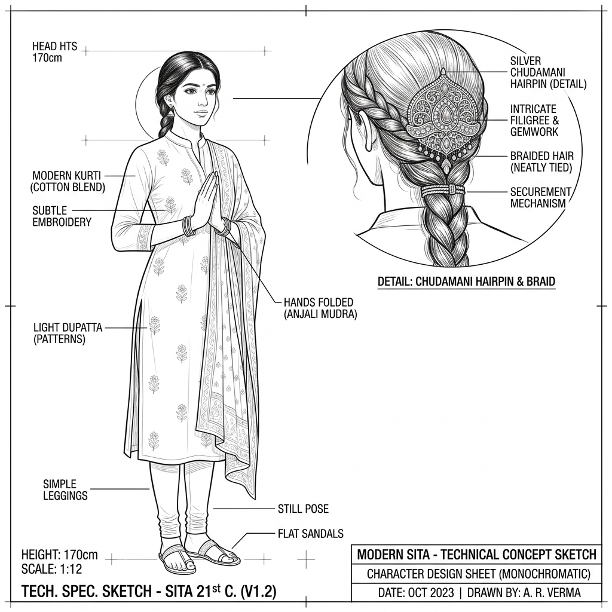

# Sita: Technical Concept Sketch & Annotations (v1)

*   **Document Reference:** `Modern_sketch/Characters/Sita/v1_Sita.md`
*   **Version:** v1 (Contemporary Casual Indian Dress - Cognitive Composure)
*   **Aesthetic Style:** Monochromatic line-art blueprint (thin black lines on a white background).
*   **Embedded Character Drawing:**
    

---

## 1. Character Orthographic Breakdown

This sheet outlines Princess Sita's visual and physical parameters, completely redesigned to place her in a contemporary 21st-century setting wearing simple, elegant modern Indian casual attire, emphasizing her silent strength and high willpower.

### A. Front Orthographic View (Absolute Composure)
*   **Serene Balanced Stance:** Depicts a composed physical outline standing `1.76 m (5'9")` in height. Ground vectors demonstrate zero sway, representing absolute physical and mental alignment under stressful phases.
*   **Modern Indian Attire:** Wearing a simple, elegant cotton Kurti with clean leggings and a lightweight linen scarf ([v1_Materials_Textures.md](../../Clothing/Materials_Textures/v1_Materials_Textures.md)). The cotton fibers fall naturally, providing an organic, comfortable visual. No high-tech active camouflage mesh, glowing wires, or radio transmitters are present.
*   **Chudamani Placement (Detailed Zoom):** Pinned securely in her neatly styled hair is the silver [Chudamani Gem Hairpin](../../Relics/Chudamani_Gem/v1_Chudamani_Gem.md), positioned to capture and refract natural ambient light.

### B. Side Profile View (Autonomic Self-Regulation)
*   **Autonomic Composure:** Annotations map out Sita's cerebral and cardiac systems during intense tactical stress phases:
    *   *Heart Rate Control:* Suppresses adrenal hijack, maintaining a calm `60 BPM` resting pulse even when surrounded by hostiles, achieved through breathing and mental training.
    *   *Willpower Capacity:* Willpower pool set to `350 Joules` (the highest in the GDD character parameters), granting absolute immunity to local psychological debuffs or hostile illusions.

---

## 2. Environmental Interaction & Visual Shading

*   **Natural Concealment:** Sita's capability to remain unseen is purely biological. It is achieved through breathing control (slowing heart rate and chest movement), total immobility, and positioning herself strategically in natural shadow volumes (yielding an `85%` signature reduction).
*   **Purity Field:** Visualizes a clean circular boundary (`0.8m` radius) showing her calm biological energy field, which repels minor insects through steady, balanced thermal dissipation.
