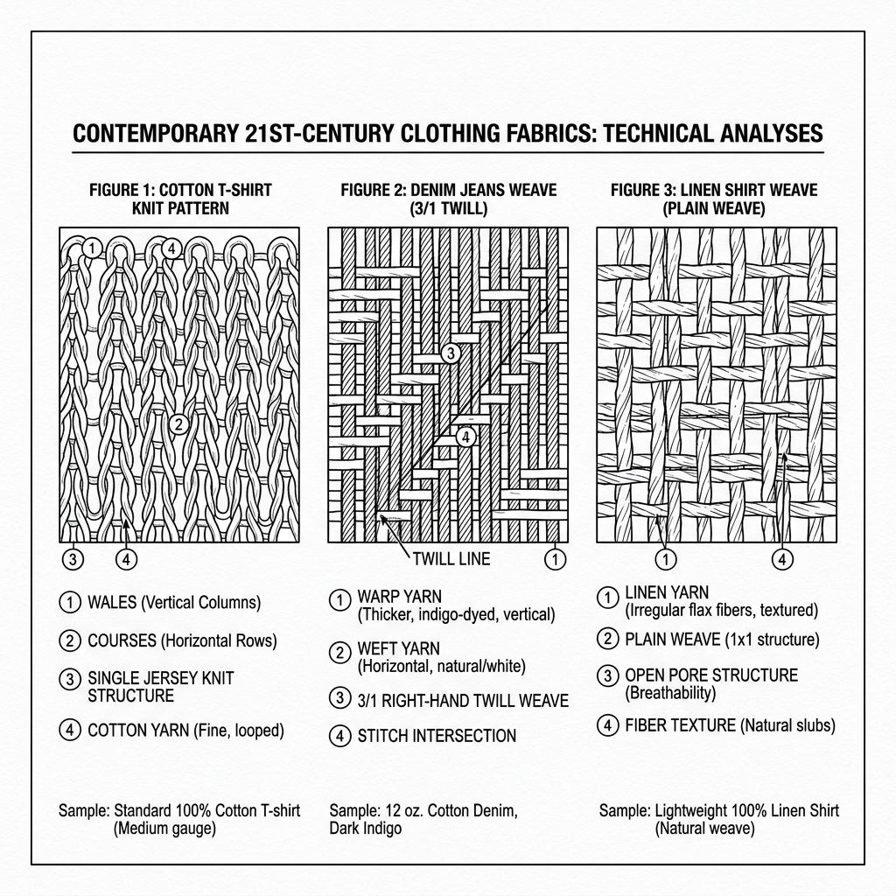

# 21st-Century Clothing Fabrics: Technical Sketch & Annotations (v1)

*   **Document Reference:** `Modern_sketch/Clothing/Materials_Textures/v1_Materials_Textures.md`
*   **Version:** v1 (Contemporary 21st-Century Casual Materials)
*   **Aesthetic Style:** Monochromatic line-art blueprint (thin black lines on a white background).
*   **Embedded Fabric Drawing:**
    

---

## 1. 21st-Century Textile Materials

This sheet defines the physical structural weave properties of the everyday modern fabrics used for the game's contemporary character outfits, prioritizing comfort, natural mobility, and authentic 21st-century visuals.

### A. Organic Ring-Spun Cotton
*   **Aesthetic Principle:** A soft, high-quality, breathable fabric used primarily for casual t-shirts and undergarments. It offers a clean, understated look that fits perfectly into the modern world.
*   **Micro-Weave Structure (Section A Zoom):**
    *   *Fibers:* Long-staple organic cotton fibers twisted tightly into fine yarns.
    *   *Weave Profile:* Single-jersey knit layout showing tiny interlocking loops spaced at `0.3mm` intervals, allowing for multi-directional stretch and breathing.
    *   *Physical Stats:* Mass: `0.16 kg/m²` | Tensile Elasticity: Standard high comfort | Air Permeability: Extremely High.
*   **Visual Annotations:** Double-needle topstitched collar seams and coverstitched hems are annotated as standard durable construction details.

### B. Indigo-Dyed Selvedge Denim
*   **Aesthetic Principle:** A rugged, raw denim weave designed for heavy outdoor utility and classic contemporary style. It serves as the foundation for modern trousers/jeans, providing high durability.
*   **Micro-Weave Structure (Section B Zoom):**
    *   *Fibers:* Ring-spun indigo cotton warp threads combined with natural white cotton weft threads.
    *   *Weave Profile:* Dense `3x1` right-hand diagonal twill weave (`14 oz/yd²`) with a clean red-line selvedge ID edge detail showing no frayed threads.
    *   *Physical Stats:* Mass: `0.48 kg/m²` | Tear Strength: High | Mobility Flex: Excellent via tailored patterns.
*   **Visual Annotations:** Visual callouts highlight copper rivets at key stress points (pocket corners) and heavy-duty contrast thread stitching.

### C. Contemporary Cotton/Linen Blend
*   **Aesthetic Principle:** A lightweight, slightly textured, stylish fabric used for casual collared shirts, lightweight modern Indian dresses (like modern Salwar Suits and Kurtis).
*   **Micro-Weave Structure (Section C Zoom):**
    *   *Fibers:* `55%` pure Belgian linen fibers spun with `45%` soft long-staple cotton yarns.
    *   *Weave Profile:* Plain plain-weave grid layout showing organic, uneven thickness (slubs) at regular intervals, providing a rich, natural surface texture.
    *   *Physical Stats:* Mass: `0.18 kg/m²` | Friction Coefficient: Low | Heat Dissipation: Excellent.
*   **Visual Annotations:** Flat-felled side seams and clean single-needle stitching along the placket are highlighted.
