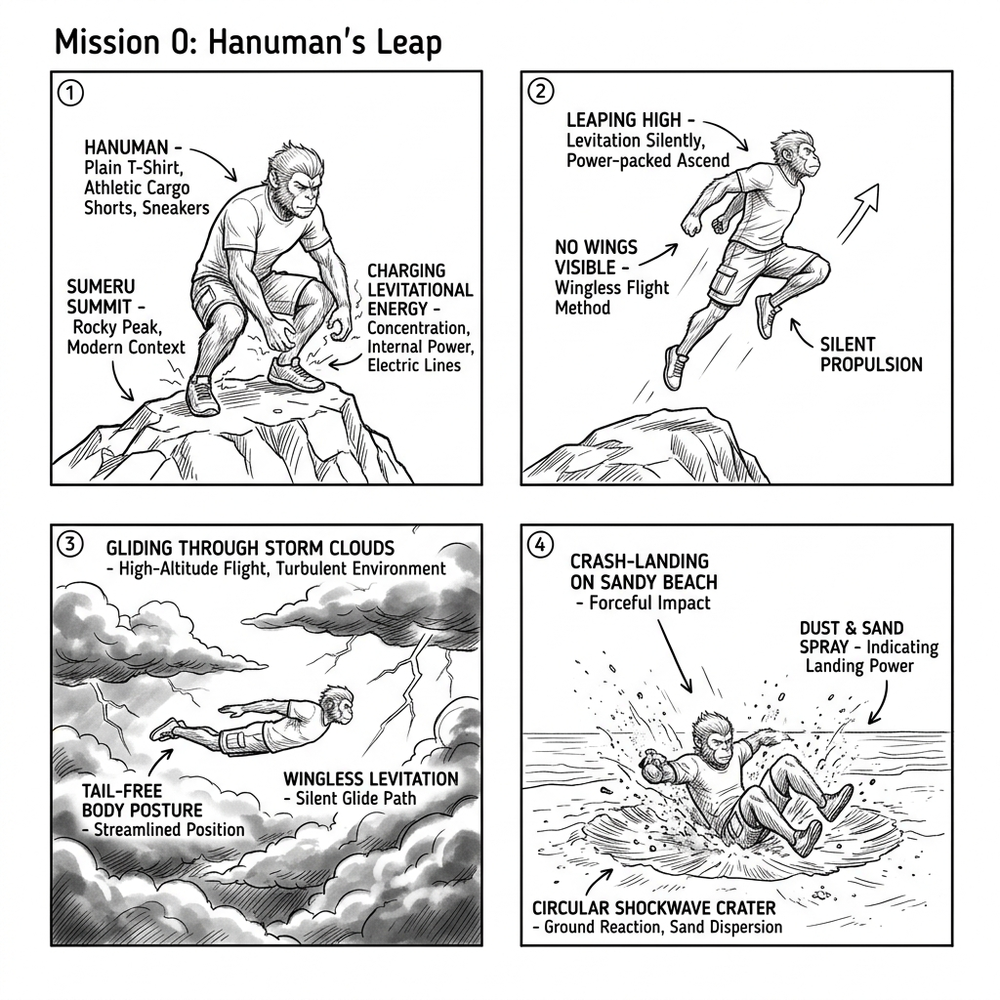

# Mission 0: Hanuman's Leap - Technical Storyboard (v1)

*   **Document Reference:** `Modern_sketch/Missions/Mission0_Hanuman_Leap/v1_Mission0_Hanuman_Leap.md`
*   **Version:** v1 (Contemporary Design - Wingless Levitational Storyboard)
*   **Aesthetic Style:** Monochromatic line-art blueprint showing multi-frame progression.
*   **Embedded Storyboard:**
    

---

## 1. Storyboard Frame-by-Frame Breakdown

This storyboard details the physical flow, control indicators, and biological parameters of **Mission 0: Hanuman's Leap**, completely redesigned to feature a wingless, 21st-century contemporary aesthetic where Hanuman levitates and flies purely through gravity-defying bio-spiritual focus (`Laghima`).

### Frame 1: Sumeru Summit Preparation (Laghima Charge)
*   **Visual Scene Description:** A high-altitude mountain peak (Mount Sumeru). Modern elements include a simple metallic weather station sensor pole in the background. Sparse pine trees stand against cold mountain drafts.
*   **Character Action & Clothing:** Hanuman is crouched at the summit edge. He is wearing a simple crew-neck t-shirt and loose cargo shorts ([v1_Hanuman.md](../../Characters/Hanuman/v1_Hanuman.md)). His thighs are deeply loaded, with callouts illustrating a `98%` kinetic skeletal compression state.
*   **Active Game Mechanic:** The player holds down the spacebar to charge the **Laghima Focus State**. A circular focus gauge contracts around Hanuman, indicating the precise timing to offset his biological mass.

### Frame 2: Wingless Levitational Ascent (Takeoff)
*   **Visual Scene Description:** High atmospheric layers with a curved horizon. Thick storm clouds hang below.
*   **Character Action:** Hanuman is projected upwards at `85 m/s` velocity, rising vertically into the sky. He features zero physical wings, glider fabrics, or tail stabilization structures. He rises purely through a silent, gravity-defying levitation field.
*   **Objects & Materials:** A localized atmospheric displacement ring (concentric dashed lines) shatters loose mountain shale at the launch locus.
*   **Active Game Mechanic:** The camera transitions to a dramatic low-angle view. The player adjusts their flight trajectory by angling Hanuman's core gravity center using the left thumbstick to maintain heading against high-altitude jet streams.

### Frame 3: Stratospheric Levitation Glide (High-Altitude Traversal)
*   **Visual Scene Description:** Swirling stratospheric storm clouds. Lightning flashes illuminate the vapor trails left by Hanuman.
*   **Character Action:** Hanuman is in a streamlined horizontal gliding posture, cutting through high-altitude storm fronts. His t-shirt is pressed tight against his torso from aerodynamic pressure. He is completely wingless, levitating silently.
*   **Active Game Mechanic:** The player navigates through jet streams (visualized as rising thermal streamlines), balancing their core gravity-reduction meter to cross the ocean gap silently without losing forward momentum.

### Frame 4: Coastal Impact (Garima Shockwave)
*   **Visual Scene Description:** A rugged, sandy shoreline with breaking ocean waves, modern concrete sea-walls, and coastal palm trees.
*   **Character Action:** Hanuman hits the beach in a classic three-point landing. His left hand is slammed into the wet sand, and his knees are bent at `90 degrees` to absorb the deceleration vector.
*   **Active Game Mechanic:** Upon landing, the player presses the impact trigger to activate **Garima Mass-Lock**. This instantly restores Hanuman's full biological mass, converting kinetic energy into a powerful shockwave that clears nearby environmental obstacles and hostile border scouts.
