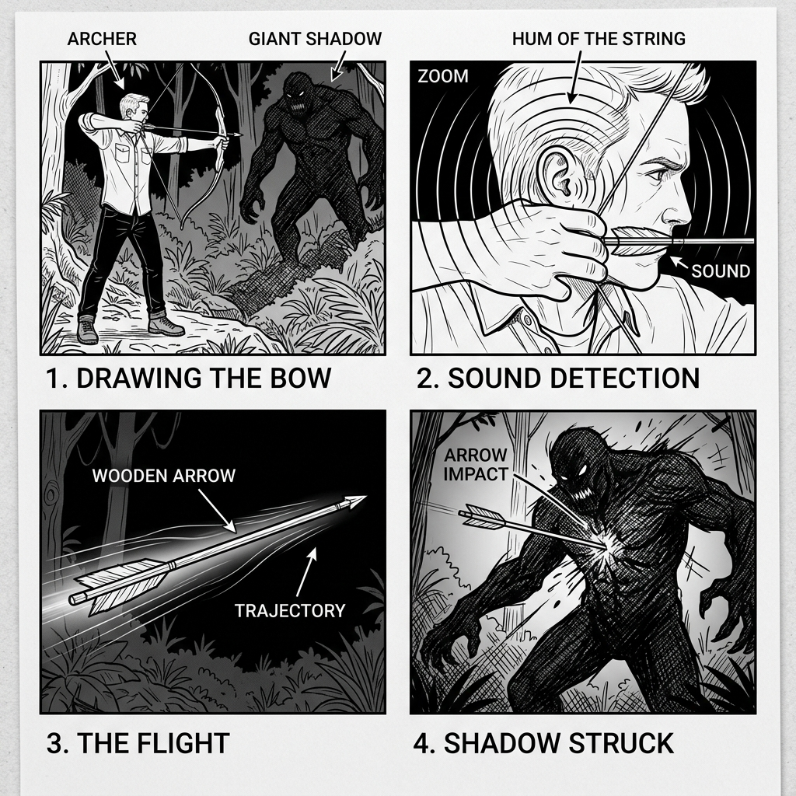

# Mission 1: Border Clearance - Technical Storyboard (v1)

*   **Document Reference:** `Modern_sketch/Missions/Mission1_Border_Clearance/v1_Mission1_Border_Clearance.md`
*   **Version:** v1 (Contemporary Design - Grounded Forest Archery Duel)
*   **Aesthetic Style:** Monochromatic line-art blueprint showing multi-frame progression.
*   **Embedded Storyboard:**
    

---

## 1. Storyboard Frame-by-Frame Breakdown

This storyboard details the combat sequence and physical mechanics of **Mission 1: Border Clearance**, completely redesigned to feature an authentic, grounded 21st-century setting where Lord Rama duels the colossal, purely organic forest giant Tataka inside a pitch-black primeval canopy.

### Frame 1: Target Acquisition (Woodland Silhouette Duel)
*   **Visual Scene Description:** A dense primeval forest canopy (Tataka Forest) filled with gnarled oak trees, hanging ivy vines, and absolute darkness.
*   **Character Action & Clothing:** Lord Rama, wearing his everyday contemporary linen button-up shirt and dark indigo jeans ([v1_Lord_Rama.md](../../Characters/Lord_Rama/v1_Lord_Rama.md)), stands in a firm, grounded archery stance. He has drawn the expanded composite [Kodanda Bow](../../Weapons/Kodanda/v1_Kodanda.md). Looming in the deep background is the colossal, organic, non-sci-fi shadowed outline of the massive forest matriarch Tataka.
*   **Active Game Mechanic:** The canopy is extremely dark. The player must adjust their aiming reticle, searching for visual cues in the foliage to locate Tataka's approach.

### Frame 2: Acoustic Echo Tracking (Shabda-Bhedi Focus)
*   **Visual Scene Description:** Close-up zoom of Rama's ear and temple. Concentric acoustic wavefront arcs expand outwards into the surrounding pitch-black forest volume.
*   **Character Action:** Rama's eyes are fully closed. A series of callout vectors outline his auditory cortex, indicating cognitive spatial sound time-difference-of-arrival (TDOA) calculations.
*   **Objects & Materials:** Distant audio sources (Tataka's heavy footsteps, breaking dry twigs) propagate backwards toward Rama's ears as clean concentric sound wave rings.
*   **Active Game Mechanic:** Clicking the left trigger enters the **Shabda-Bhedi Focus State**. The screen transitions to a monochromatic wireframe, highlighting sound wave rings. Aligning the aim cursor with the sound rings locks the shot.

### Frame 3: Dynamic Arrow Release (Aerodynamic Flight)
*   **Visual Scene Description:** High-speed capture of the arrow mid-flight, slicing through dense leaves.
*   **Character Action:** Rama is shown in the follow-through stance, arms open and fingers relaxed, demonstrating perfect release of the high-tension bowstring.
*   **Objects & Materials:** Streamlines (parabolic air-vector lines) wrap smoothly around the sleek wooden shaft and steel tip of the arrow, showing clean aerodynamic laminar flow without electronic stabilizers.
*   **Active Game Mechanic:** The arrow travels along a parabolic path. The player had to counter-aim for a `15 km/h` upward forest draft vector.

### Frame 4: Kinetic Strike & Critical Impact (Tataka Defeat)
*   **Visual Scene Description:** Tataka is struck in the shoulder. Her colossal, high-mass organic frame tilts backward under the kinetic force.
*   **Character Action:** Tataka's face shows biological shock as her posture breaks.
*   **Active Game Mechanic:** The arrow successfully strikes Tataka's critical shoulder nerve plexus, delivering double damage, depleting her poise meter, and triggering her defeat cinematic.
