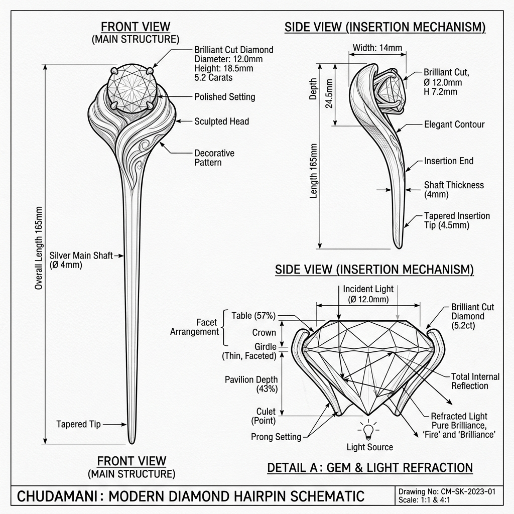

# Chudamani Gem: Technical Concept Sketch & Annotations (v1)

*   **Document Reference:** `Modern_sketch/Relics/Chudamani_Gem/v1_Chudamani_Gem.md`
*   **Version:** v1 (Contemporary Hairpin Design - Pure Light Refraction)
*   **Aesthetic Style:** Monochromatic line-art blueprint (thin black lines on a white background).
*   **Embedded Relic Drawing:**
    

---

## 1. Relic Design Breakdown

This sheet defines the physical and structural specifications of the **Chudamani Gem**, redesigned as an elegant, minimalist 21st-century silver hairpin with a highly polished natural crystal gem, capturing natural beauty and spiritual significance without any electronic or cybernetic components.

### A. Silver Hairpin Frame (Front & Side Elevation)
*   **Sleek Hairpin Shaft:** Constructed from high-purity sterling silver (`92.5%` silver, `7.5%` copper) with a total shaft length of `140 mm`. It features a polished, modern, tapered double-prong layout that secures firmly in standard braided hair or an elegant modern bun.
*   **Decorative Setting:** The head of the hairpin features a contemporary bezel setting holding the central gemstone. The silver setting is engraved with fine, subtle traditional lotus patterns done in a clean, minimalist 21st-century aesthetic.
*   **Tension Spring Grip:** The double prongs have a slight physical inward pre-load tension (`1.5 N` clamping force) to prevent the hairpin from slipping out of the hair during rapid movement phases.

### B. Natural Crystal Gemstone (Exploded Facet Details)
*   **Highly Polished Crystal:** The central gemstone is a rare, flawless, natural crystal diamond cut in a premium round-brilliant configuration, measuring `12 mm` in diameter.
*   **Light Refraction Blueprint (Refraction Diagram):**
    *   *Natural Ray-Tracing:* Light enters through the table and crown facets, refracting at a highly efficient refractive index of $n = 2.42$.
    *   *Total Internal Reflection:* The pavilion facets are cut at precise `41-degree` angles, ensuring that all light entering the gem is reflected internally and projects out of the crown as a high-density, shining silver focus beam without requiring battery-powered LEDs or active projection systems.
    *   *Faceting Index:* Standard `57-facet` symmetry cut, ensuring maximum brilliance (sparkle) under ambient daylight or modern stadium lights.

---

## 2. Interactive Mechanics

In-game, the Chudamani is used as a narrative focus and light-catching mechanic:
*   **Ambient Light Catching:** When Sita stands in shadowy forest regions, the player can adjust her position so the crystal catches a stray ray of sunlight. The hairpin's natural total internal reflection produces a bright silver reflection beam that can be directed to signal allies or illuminate ancient carvings.
*   **Willpower Buff:** The gem acts as a cognitive focal point, stabilizing Sita's autonomic composure and preserving her high Willpower pool against mental stress.
