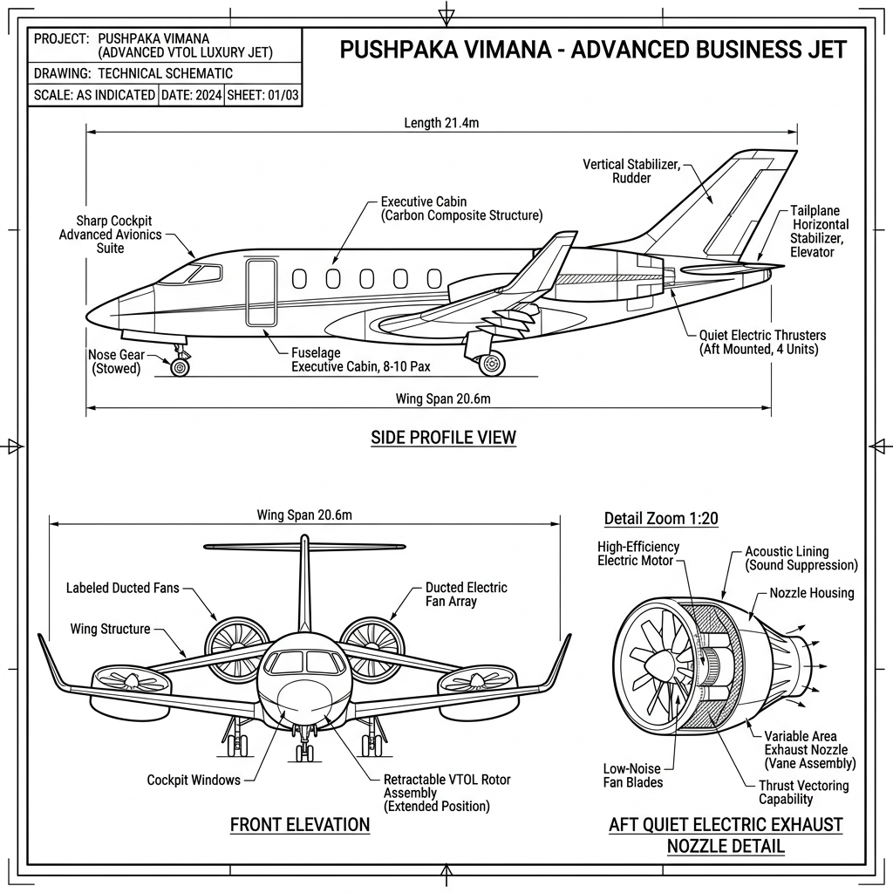

# Pushpaka Vimana: Technical Concept Sketch & Annotations (v1)

*   **Document Reference:** `Modern_sketch/Vehicles/Pushpaka_Vimana/v1_Pushpaka_Vimana.md`
*   **Version:** v1 (Contemporary Luxury Business Jet - Grounded 21st-Century Style)
*   **Aesthetic Style:** Monochromatic line-art blueprint (thin black lines on a white background).
*   **Embedded Vehicle Drawing:**
    

---

## 1. Vehicle Design & Aerodynamics Redesign

This sheet defines the physical engineering, passenger layouts, and clean aerodynamics of the **Pushpaka Vimana**, completely redesigned from a futuristic sci-fi ducted-fan solar military craft into a sleek, ultra-premium 21st-century luxury business jet with quiet, high-efficiency VTOL electric turbine ducted rotors.

### A. Main Elevation (Premium Business Jet Profile)
*   **Sleek Executive Lines:** The exterior profile features the elegant, sweeping lines of a high-end 21st-century private business jet, with a polished white fuselage and dark tinted cabin windows. Fuselage length: `24.5 m` | Wingspan: `21.2 m`.
*   **Ducted-Fan Wing Integration:** In place of standard jet engines, the wings are designed with integrated, flush-mounted circular electric ducted-fan rotors. This allows for vertical takeoff and landing (VTOL) capability, transitioning smoothly into high-speed forward flight.
*   **Quiet Turbine Nozzle:** The tail cone features a specialized, sound-attenuating exhaust nozzle, reducing acoustic signatures during high-altitude cruising.

### B. Contemporary Mechanical Specifications
*   **VTOL Electric Propulsion:** Powered by a quiet, clean, high-performance battery-turbine hybrid electric system. It runs almost silently compared to standard combustion jet engines, maintaining a low acoustic footprint in urban settings.
*   **Speed & Range:** Cruising speed is set to a highly realistic modern sub-sonic standard: `Mach 0.85 (900 km/h)` with a maximum range of `6,500 km`.
*   **Clean Luxury Interior:** The cabin is designed with rotating white leather executive armchairs, clean wooden fold-out desks, and standard 21st-century flight instrumentation.
*   **No Sci-fi Shields:** Strictly no futuristic active light-bending active camouflage plates or plasma energy shields. The aircraft is visually grounded, looking like a highly refined, premium private aircraft of the current generation.
