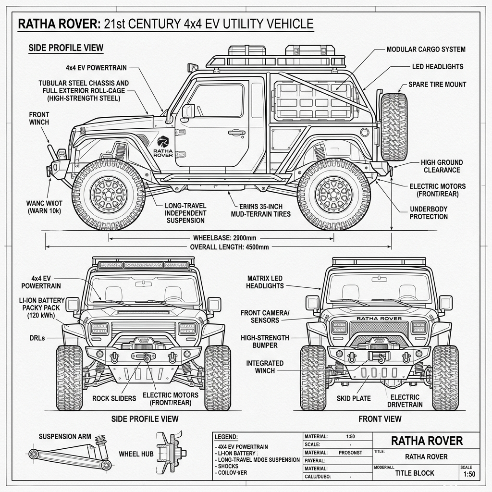

# Ratha Rover: Technical Concept Sketch & Annotations (v1)

*   **Document Reference:** `Modern_sketch/Vehicles/Ratha_Rover/v1_Ratha_Rover.md`
*   **Version:** v1 (Contemporary 4x4 Electric Off-Roader - Grounded 21st-Century Style)
*   **Aesthetic Style:** Monochromatic line-art blueprint (thin black lines on a white background).
*   **Embedded Vehicle Drawing:**
    

---

## 1. Vehicle Design & Chassis Redesign

This sheet details the structural engineering and electrical specifications of the **Ratha Rover**, completely redesigned from a high-tech armored skeletal buggy into a rugged, clean modern 21st-century 4x4 electric off-road jeep, styled to look completely realistic and contemporary.

### A. Main Elevation (Rugged Utility Off-Roader Profile)
*   **Modern Off-Road Styling:** The exterior chassis resembles a premium, rugged 4x4 utility jeep with clean modern lines, simple flat body panels, and a high-strength tubular steel roll-cage. Total length: `4.1 m` | Width: `1.85 m`.
*   **Heavy-Duty Tires:** Fitted with massive, deep-tread `35-inch` mud-terrain off-road tires mounted on simple alloy wheels.
*   **LED Headlight Integration:** The front grill is simple and clean, containing standard dual circular LED headlights and an integrated heavy-duty steel winch bumper.

### B. Contemporary Electrical Specifications
*   **Dual-Motor Electric Drivetrain:** Powered by twin high-torque electric motors (one on each axle) delivering a combined `450 HP`. This setup provides instantaneous torque, perfect for scaling steep mountain trails or traversing sandy terrain silently.
*   **Independent Suspension:** Highly detailed callouts zoom in on the double-wishbone independent front and multi-link rear suspension assemblies, using standard modern coilover shock absorbers.
*   **Zero Sci-fi Armor:** Strictly no futuristic active shielding, digital communications towers, or energy weapons. The dashboard contains a standard 21st-century GPS navigation screen, mechanical steering wheel, and physical gear select levers, keeping it grounded in the present day.
