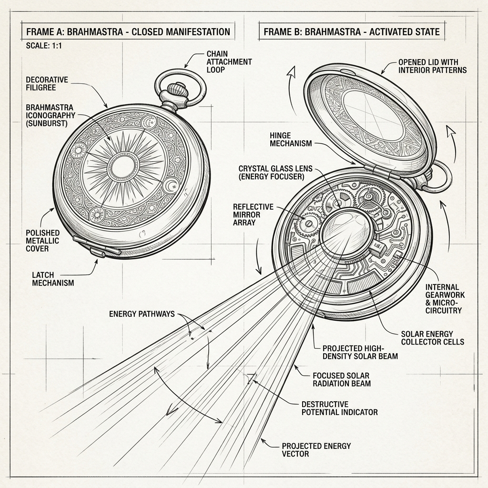

# Brahmastra: Technical Concept Sketch & Annotations (v1)

*   **Document Reference:** `Modern_sketch/Weapons/Brahmastra/v1_Brahmastra.md`
*   **Version:** v1 (Vintage Pocket Watch Design - Pure Magical Solar Beam)
*   **Aesthetic Style:** Monochromatic line-art blueprint (thin black lines on a white background).
*   **Embedded Weapon Drawing:**
    

---

## 1. Weapon Design & Mechanical Redesign

This sheet maps the structure and activation mechanisms of the **Brahmastra**, completely redesigned from a bulky sci-fi shoulder-mounted laser rifle into an elegant, magical 21st-century relic styled as an antique gold pocket watch or medallion.

### A. Closed Mode (Sleek Vintage Medallion)
*   **Aesthetic Profile:** A classic, beautifully crafted `55 mm` circular pocket watch cover plate made of high-purity gold-plated bronze. The front cover is intricately engraved with traditional Vedic solar rays and sunburst patterns.
*   **Casual Portability:** The watch is completely inconspicuous, worn on a simple leather cord around the neck or kept in a standard jeans pocket, fitting seamlessly into a contemporary 21st-century setting.
*   **Completely Passive:** In this state, it shows zero electrical signatures, thermal emissions, or mechanical activity. It is functionally a silent heirloom.

### B. Opened Mode (Solar Ray Refractor)
*   **Lid Release:** Pressing the top crown button springs the cover open, revealing a highly reflective, multi-layered crystal optical lens array in place of a watch face.
*   **Refractor Matrix (Detailed Zoom):**
    *   *Natural Optical Table:* Instead of gears, the internal chamber contains a natural crystalline lattice cut at highly precise angles to align solar light rays.
    *   *Solar Energy Channeling:* When the wielder holds the open watch and aligns their spiritual energy (pranic flow) with the solar lens, the watch absorbs ambient thermal rays and releases an extremely concentrated, high-density optical laser beam directly from the palm.
    *   *Output Intensity:* When fully focused, it produces a pure, silent, light-speed thermal discharge capable of melting iron armor plates on contact (delivering a magical equivalent of `1.2 MJ` of energy).
    *   *No Sci-fi Tech:* Strictly no battery cells, digital charge indicators, electric cooling fans, or copper capacitor coils. The weapon is entirely spiritual and optical.
