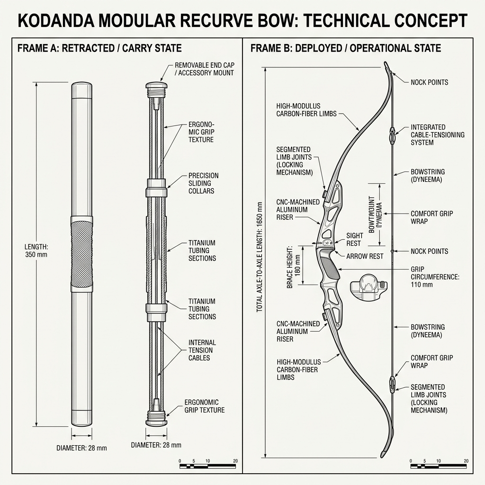

# Kodanda Bow: Technical Concept Sketch & Annotations (v1)

*   **Document Reference:** `Modern_sketch/Weapons/Kodanda/v1_Kodanda.md`
*   **Version:** v1 (Retractable Sleek Recurve Design - 21st-Century Sporting Style)
*   **Aesthetic Style:** Monochromatic line-art blueprint (thin black lines on a white background).
*   **Embedded Weapon Drawing:**
    

---

## 1. Weapon Design & Form Redesign

This sheet outlines the high-performance modern engineering and magical storage configuration of the **Kodanda Bow**, redesigned to fit an authentic 21st-century setting while preserving its status as a divine avatar's primary focus weapon.

### A. Stored Mode (Sleek Retractable Rod)
*   **Titanium Alloy Cylinder:** When inactive, the Kodanda is stored as a highly compact, polished titanium-carbon cylindrical rod measuring `320 mm` in length and `30 mm` in diameter. It looks like a high-end luxury baton or structural pointer, weighing only `0.85 kg`.
*   **Tactile Grip Surface:** The center of the rod features a micro-textured knurled pattern, providing a slip-proof grip. It can be carried in a simple canvas utility bag or secured to a belt with a minimalist clip.
*   **Canvas Crossbody Sling Bag:** Rama carries this compact rod in an everyday, dark grey canvas crossbody sling bag, keeping his appearance entirely casual and unassuming in public settings.

### B. Deployed Mode (Expanded Composite Recurve)
*   **Rapid Spiritual Deployment:** To summon the bow, the character presses the knurled center and expands it outward. Using internal bio-spiritual energy, the rod segments lock together, expanding with a silent flash of light into a full `1.8m` Olympic-grade recurve sporting bow.
*   **Premium Recurve limbs:** The upper and lower limbs are crafted from multi-layered carbon-fiber composite materials, finished in a clean matte-black look. The sweeping curves follow standard modern sporting bows.
*   **Draw Weight & Tension:** Draw weight is set to a heavy `75 lbs` for human-mode usage. With Rama's spiritual strength active, the limb matrices lock, allowing the draw weight to scale dynamically up to `180 lbs` without fracturing the composite material.
*   **Simplistic String:** Uses standard high-density Dyneema cord with zero glowing high-tech energy grids. Aiming is done purely through raw skill and physical eye alignment, bypassing computerized laser sights.
