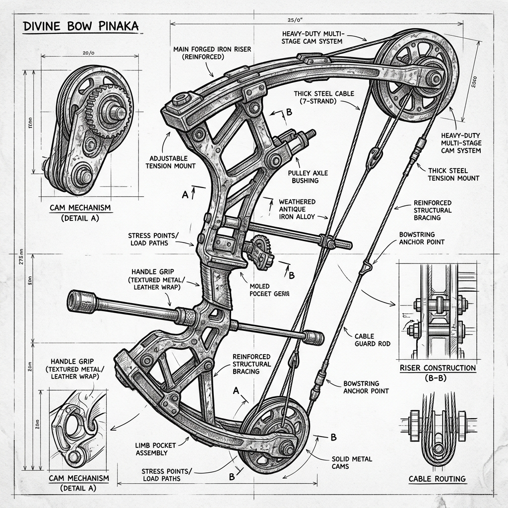

# Pinaka Bow: Technical Concept Sketch & Annotations (v1)

*   **Document Reference:** `Modern_sketch/Weapons/Pinaka/v1_Pinaka.md`
*   **Version:** v1 (Antique Iron Compound Design - Grounded 21st-Century Style)
*   **Aesthetic Style:** Monochromatic line-art blueprint (thin black lines on a white background).
*   **Embedded Weapon Drawing:**
    

---

## 1. Weapon Design & Structure Redesign

This sheet details the mechanical parameters and pure organic/magical nature of the **Pinaka Bow**, redesigned to strip away all futuristic high-tech hydraulic pistons and computers, representing it instead as a colossal, beautifully weathered antique iron-alloy compound training bow that requires supreme divine power to pull.

### A. Main Elevation (Colossal Scale)
*   **Heavy Iron-Alloy Frame:** The bow stands `2.2 m` in height and weighs a colossal `65 kg` of solid, weathered dark-iron and carbonized steel. The riser features elegant traditional engravings with a rough, raw metallic texture.
*   **Heavy Compound Pulleys:** Solid, non-electronic steel mechanical cams (pulleys) are mounted at the limb tips. These mechanical pulleys provide a `65%` let-off at full draw, allowing a master wielder to hold the bow drawn, though the raw draw force is immense.
*   **Thick Steel Cords:** Uses high-tensile braided steel aircraft cable (`3.2 mm` diameter) as the main string assembly, designed to handle massive kinetic force without snapping.

### B. Dynamic Force & Yield Properties
*   **Unpullable Weight:** Under normal physical conditions, the bow requires a draw force of `12,000 lbs` (`53.3 kN`), making it functionally unpullable by any mortal athlete or modern machine.
*   **Magical/Spiritual Scaling:** When a character wielding Pinaka enters a complete bio-spiritual focus state (aligning their neural networks with Shiva's energy), the iron limbs become chemically flexible and responsive. The effective draw weight drops dynamically to a manageable human-scale pressure (`120 lbs`), allowing the character to draw and lock the string.
*   **Zero Electronics:** Strictly no digital HUD scopes, laser aiming grids, or electronic strain sensors. Aiming relies on pure skeletal stabilization and optical focus under natural conditions.
