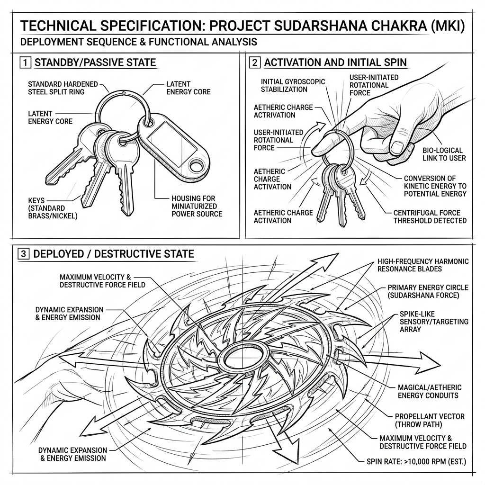

# Sudarshana Chakra: Technical Concept Sketch & Annotations (v1)

*   **Document Reference:** `Modern_sketch/Weapons/Sudarshana_Chakra/v1_Sudarshana_Chakra.md`
*   **Version:** v1 (Everyday Key Ring Design - Spinning Energy Wheel)
*   **Aesthetic Style:** Monochromatic line-art blueprint (thin black lines on a white background).
*   **Embedded Weapon Drawing:**
    

---

## 1. Weapon Design & Transformation Redesign

This sheet details the mechanical design and magical energy activation properties of the **Sudarshana Chakra**, completely redesigned to exist as a simple, ordinary 21st-century key ring that dynamically expands into a massive spinning disc of divine energy.

### A. Passive State (Ordinary Key Ring)
*   **Aesthetic Profile:** Stored in plain sight as a standard, flat circular steel key ring (`30 mm` diameter) looped with normal everyday house and vehicle keys. It looks completely unremarkable, fitting perfectly in a character's pocket or hooked to a belt loop.
*   **Physical Material:** Highly durable tempered carbon-steel with standard spring-tension split rings.
*   **Zero Footprint:** It contains no micro-circuits, LED lights, or motorized parts. It is a completely inert, passive mechanical loop.

### B. Activated State (High-Velocity Energy Chakra)
*   **Finger Wielding (Panel 2 Zoom):** To activate, the wielder slips the key ring onto their index finger. 
*   **High-Speed Rotation:** The wielder flicks their wrist to rotate the ring at high angular velocities ($>1200\text{ RPM}$).
*   **Dynamic Magical Expansion (Panel 3 Zoom):**
    *   *Centrifugal Spiritual Induction:* The rapid physical rotation triggers a rapid conversion of internal bio-spiritual energy.
    *   *Energy Blade Formation:* The tiny key ring expands dynamically, drawing ambient particles to construct a glowing, circular serrated disc of pure spiritual energy measuring `0.6 m` in diameter.
    *   *Razor Edge:* The perimeter features highly focused kinetic shear wave vectors (concentric dashed arcs) that act as a frictionless, high-velocity spinning blade.
    *   *Return Mechanism:* The expanded energy disk is linked neurally to the wielder's brain, allowing it to be thrown to slice targets and return perfectly to the index finger, contracting instantly back into the quiet key ring.
