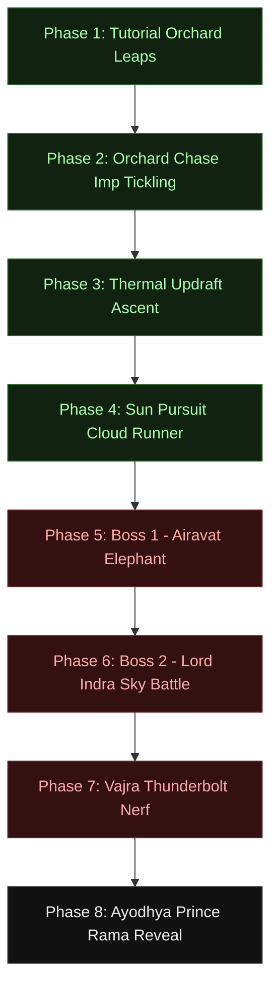

# GDD Mission Sheet: Mission 0: Hanuman's Solar Leap (Prologue)

*   **Document Reference:** `Modern_docs/Missions/Mission0_Hanuman_Leap.md`
*   **Narrative Focus:** Kid Hanuman's high-altitude exploration, celestial boss encounters, and the early spiritual power seal that transitions into Act 1.
*   **Location:** [Sumeru High Canyons / Brahmagiri Valley](file:///../Locations/Kishkindha.md) to Upper Stratosphere.
*   **Aesthetic & Rendering Profile:**
    *   *Visuals:* Radiant daylight over dense Western Ghats valleys, transitioning to high-contrast stratospheric blackouts (Directional Sun: `120,000 lux`, Color Temp: `6,500 K`).
    *   *Post-Processing:* Dynamic Vignette and Color Contrast overrides representing hypoxic vision degradation.
    *   *Acoustics & Music:* **Raga Hamsadhwani** (Heroic, fast-paced solo bamboo flute, rapid Mridangam temple hand-drums).

---

## 1. Grounded Scientific & Biomechanical Rationale

To maintain realistic gameplay immersion, the prologue adapts classical elements into scientifically grounded biomechanics:

### A. Aerodynamic Levitational Gliding (Laghima Glide)
Hanuman does not fly magically. Instead, by compressing his massive leg muscles like high-tension coils and releasing kinetic launch forces of up to `20,000 N`, he enters the stratosphere. During descent, he activates the **Laghima Focus State** (90% biological weight reduction), expanding his chest cavity to catch natural thermal updraft columns.

The lift force generated is governed by the aerodynamic fluid equation:

$$F_L = \frac{1}{2} C_L \rho A v^2$$

Where:
*   $C_L$ = Lift coefficient configured by body posture.
*   $\rho$ = Air density (which decreases exponentially with altitude).
*   $A$ = Aerodynamic reference area of Hanuman's chest/body.
*   $v$ = Forward gliding velocity (clamped programmatically to a maximum of `1,500 units/sec`).

### B. Dynamic Altitude Gravity Scaling
As Hanuman ascends into the upper atmosphere, his gravity scale is dynamically adjusted to simulate the low-density, high-altitude levitational environment:

$$g(z) = g_0 \cdot \left(1 - \frac{z}{z_{\text{max}}}\right)$$

Where:
*   $g_0 = 1.2f$ (Hanuman's baseline child gravity scale).
*   $z_{\text{max}} = 4,000.0f$ units.
*   At heights $z \ge 3,000.f$, gravity scale decays down to a minimum of `0.4f`.

### C. High-Altitude Stratospheric Hypoxia
Exceeding the altitude threshold of `3,000 units` triggers hypoxic oxygen deprivation. Vision and stamina degrade dynamically:

$$\frac{d(\text{Stamina})}{dt} = -15.0 \cdot \Delta t$$

Visual indicators are bound directly to the post-process volume overrides:
- **Vignette Intensity:** Lerps dynamically from `0.15` up to `0.85` as altitude spikes.
- **Color Contrast:** Shifts from neutral `1.05` to a highly distorted, desaturated `1.85` representing imminent high-G blackout.

### D. Somatic Volume Scaling (Mahima & Anima)
By hyper-dilating cellular bone density and skeletal-muscle cells through deep yogic breathing, Hanuman can scale his physical scale by a factor of `7.14x` (toggled by the `ToggleScale` input key):

- **Baseline:** Height: `2.10 m` | Weight: `130 kg` | Kinetic Punch Damage: `15.0`
- **Max Scale:** Height: `15.0 m` | Weight: `12,000 kg` | Kinetic Punch Damage: `1,500.0` (100x multiplier)
- **Thermodynamic Limit:** Under max somatic scale, extreme metabolic ATP conversion causes a high heat shimmer. The spiritual pool is siphoned at `18.0 J/s`, automatically reverting Hanuman to baseline scale upon stamina depletion.

---

## 2. Programmatic Step-by-Step Campaign Flow

The mission transitions sequentially through eight distinct progression states, managed directly by the C++ game mode.

### 🐒 Phase 1: Tutorial - Orchard Leaps
*   **Narrative Focus:** Piloting hyper-active kid Hanuman along Sumeru's horizontal sandstone ridges. Mother Anjana calls out: *"Hanuman! Do not climb so high, child! The sky belongs to the gods!"*
*   **Active Mechanic:** Standard movement training. Double-jumping between low orchard platforms.
*   **Transition Trigger:** Moving `300 units` away from spawn or surviving `10 seconds` triggers Mother Anjana's warnings and launches Phase 2.

### 🍎 Phase 2: Orchard Chase - Imp Tickling
*   **Narrative Focus:** Forest Tyaksha imps are stealing sacred fruits from the palace groves! Hanuman must run them down.
*   **Active Mechanic:** Non-lethal combat. The player uses high-speed dashes and **PerformKidFistsAttack** (playful strikes that apply a `45.0` posture/stagger rating) to knock back imps.
*   **Transition Trigger:** Collecting `5` sacred fruits into Hanuman's Mango Basket.

### 🌪️ Phase 3: Vertical Puzzle - Thermal Wind Updrafts
*   **Narrative Focus:** Hanuman looks up: *"But look, Mother! A giant golden mango in the sky! It is glowing!"* (The solar fusion reactor). Vayu wind echoes: *"Go, son! Leap upon the wind that I blow."*
*   **Active Mechanic:** Vertical platforming. Launching from Sumeru's vertical sandstone cliffs, entering the lower atmosphere, and riding dynamic warm air columns generated by Vayu updrafts.
*   **Transition Trigger:** Achieving a horizontal coordinate $X \ge 4,700.0f$ and vertical height $Z \ge 3,000.0f$.

### ☁️ Phase 4: Sun Pursuit - Cloud Platform Runner
*   **Narrative Focus:** High-speed sprint across stratospheric cloud pads, chasing the rising sun.
*   **Active Mechanic:** Precision platforming. Navigating narrow stepped cloud platforms while combating high-altitude hypoxia stamina drain.
*   **Transition Trigger:** Reaching coordinate $X \ge 6,000.0f$ and descending to $Z \le 500.0f$ into the boss arena gates.

### 🐘 Phase 5: Boss 1 - Airavat Elephant
*   **Narrative Focus:** The colossal, four-tusked white celestial elephant Airavat blocks the gates of Indra.
*   **Active Mechanic:** The Tail Grapple swing system. Hanuman must execute a high-speed grapple (`1,500 units` max range) directly onto Airavat's massive ivory tusks (`OBJ_AIRAVAT_TUSKS`), swinging over his back to snatch the **Golden Mango Key**.
*   **Transition Trigger:** Collecting the Golden Mango Key triggers the sky transition.

### ⚡ Phase 6: Boss 2 - Lord Indra Sky Battle
*   **Narrative Focus:** Lord Indra blocks the solar path: *"Who is this forest child who dares trespass into the solar path?"*
*   **Active Mechanic:** High-speed aerial dodging. The player must glide across floating debris, dodging crackling lightning spears thrown from Indra's hover platform.

### 💥 Phase 7: The Vajra Nerf & Forgetfulness Curse
*   **Narrative Focus:** Defending the solar gate, Indra fires the ultimate thermonuclear **Vajra strike**. Hanuman is struck in the jaw (forming his signature fractured cheek line) and falls unconscious, suffering a memory and power seal.
*   **Active Mechanic:** Scripted biological lock sequence. The C++ game mode triggers the biological siphoning parameters:
    1.  `CurrentStamina` and `CurrentFocus` are instantly drained to `0.f`.
    2.  `CurrentLacticAcid` spikes to absolute fatigue threshold `100.f`.
    3.  `MaxJumpCount` is reduced to `1` (Double-jump locked).
    4.  Tail Grapple range is reduced to `0.f` (Grapple locked).
    5.  `MaxWalkSpeed` is throttled to extreme fatigue cap `250.f`.
*   **Transition Trigger:** Scripted 3-second blackout timer.

### 👶 Phase 8: Ayodhya Reveal
*   **Narrative Focus:** Camera zooms out over the flowing Sarayu river rapids, panning into Ayodhya's glistening white palace solar towers. A divine baby cries: Prince Rama is born.
*   **Transition Trigger:** Level transition loads Act 1.

---

## 3. C++ Programmatic Class Map

Documentation maps directly to the compiled Unreal Engine 5 source code:

| Unreal Engine Class | File Reference | Core Responsibility |
| :--- | :--- | :--- |
| **AMission0GameMode** | [Mission0GameMode.h](file:///c:/Users/vvksi/OneDrive/Documents/Unreal%20Projects/RamG/Source/RamG/Mission0GameMode.h) | Coordinates level states via the `EMission0State` enum; applies the scripted Vajra biological locks; executes diagnostic testing suite. |
| **AHanumanCharacter** | [HanumanCharacter.h](file:///c:/Users/vvksi/OneDrive/Documents/Unreal%20Projects/RamG/Source/RamG/HanumanCharacter.h) | Handles kid character movement, Laghima levitational gliding, somatic scaling, fists combat staggers, and the 1,500-unit tail grapple. |
| **AMission0WorldGenerator** | [Mission0WorldGenerator.h](file:///c:/Users/vvksi/OneDrive/Documents/Unreal%20Projects/RamG/Source/RamG/Mission0WorldGenerator.h) | Procedurally builds the Brahmagiri Western Ghats: spawns 250+ jungle trees, winding rivers, waterfalls, sandstone palace walls, and interactive spring pads. |
| **ASacredFruit** | [SacredFruit.h](file:///c:/Users/vvksi/OneDrive/Documents/Unreal%20Projects/RamG/Source/RamG/SacredFruit.h) | Interactive fruit baskets that increment Hanuman's orchard chase inventory. |
| **AVayuWindUpdraft** | [VayuWindUpdraft.h](file:///c:/Users/vvksi/OneDrive/Documents/Unreal%20Projects/RamG/Source/RamG/VayuWindUpdraft.h) | Generates physics-based upward vector force fields to lift Hanuman during Phase 3. |
| **ATyakshaEnemy** | [TyakshaEnemy.h](file:///c:/Users/vvksi/OneDrive/Documents/Unreal%20Projects/RamG/Source/RamG/TyakshaEnemy.h) | Woodland imp AI characters that flee and stagger under fists combat. |
| **AAiravatBoss** | [AiravatBoss.h](file:///c:/Users/vvksi/OneDrive/Documents/Unreal%20Projects/RamG/Source/RamG/AiravatBoss.h) | Celestial boss containing the `GrappleSocket` tags on its ivory tusks. |
| **AIndraBoss** | [IndraBoss.h](file:///c:/Users/vvksi/OneDrive/Documents/Unreal%20Projects/RamG/Source/RamG/IndraBoss.h) | Boss triggering the stratospheric lightning spear hazards. |
| **ASumeruPhysicsBoulder** | [SumeruPhysicsBoulder.h](file:///c:/Users/vvksi/OneDrive/Documents/Unreal%20Projects/RamG/Source/RamG/SumeruPhysicsBoulder.h) | Physics-enabled rock actors that react to fists impacts and shockwave impulses. |
| **APhysicalSpringPad** | [PhysicalSpringPad.h](file:///c:/Users/vvksi/OneDrive/Documents/Unreal%20Projects/RamG/Source/RamG/PhysicalSpringPad.h) | Mechanical bouncy pads that launch Hanuman vertically into the air. |

---

## 4. Acoustic Profile & Classical Raga Score

### Auditory Specifications
*   **Vocal Range Frequency:** 120 Hz - 240 Hz (Resonant, high-energy child vocals) | Reflects youthful vigor.
*   **Acoustic Theme:** **Raga Hamsadhwani** (Heroic, bright, fast-paced, representing youthful wonder and fearless curiosity).
*   **Musical Integration:**
    *   *Phase 1-4:* Energetic solo bamboo flute melody backed by light temple hand-drums (*Mridangam*).
    *   *Phase 5-6:* Fast-paced double-bass rhythms, epic brass flourishes, and soaring classical violin compositions driving the celestial confrontation.
    *   *Phase 7-8:* Raga melody completely cuts out; a low-frequency electrical drone and solemn Sanskrit chanting fade in as Hanuman crashes.

### Action SFX (Acoustic Mechanics)
*   **Footstep Impacts:** High-frequency, rapid sandaled patter across dirt and stone surfaces; shifting to heavier low-frequency *thumps* during somatic scale increases.
*   **Vajra Roar Shockwave:** Unleashes a highly focused, thunderous `130 dB` acoustic shockwave at a `15-meter` radius, shattering local timber and staggering nearby imps.
*   **Wind Updrafts:** Immersive, whooshing low-end wind rushes as Hanuman rides the updraft columns.

---

## 5. Visual Render & Particle Systems (VFX)

### Material & Shader Settings
*   **Procedural Kid Hanuman Mesh:**
    *   *Torso:* Dark charcoal crew-neck athletic t-shirt.
    *   *Cargo Shorts:* Loose olive/khaki tactical cargo shorts.
    *   *Skin:* Muscular warm brown skin shader using subsurface scattering.
    *   *Grapple Anchor:* Renders a dynamic, neon-blue visual vector thread from his tail component (`TailMesh`) to the grapple socket.
*   **Metabolic Heat Radiance:** During Somatic scaling, an active thermal heat-haze distortion wraps the player skeleton, illustrating extreme ATP exhaustion.

### Environmental Effects
*   **Acoustic Shockwave Spheres:** Roaring triggers 5 expanding orange-red debug rings, visually representing the high-decibel acoustic wave propagation.
*   **Vayu's Gusts:** Updraft columns emit soft, rising white air particles, guiding players to follow the vertical leap lanes.
